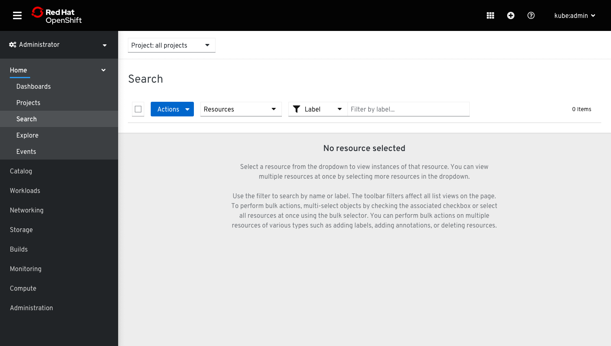
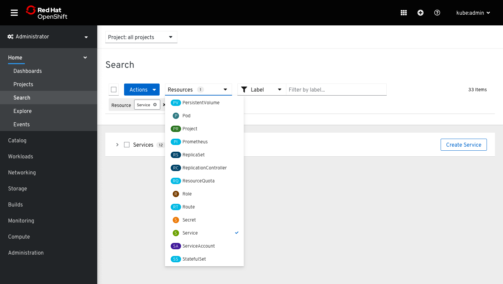
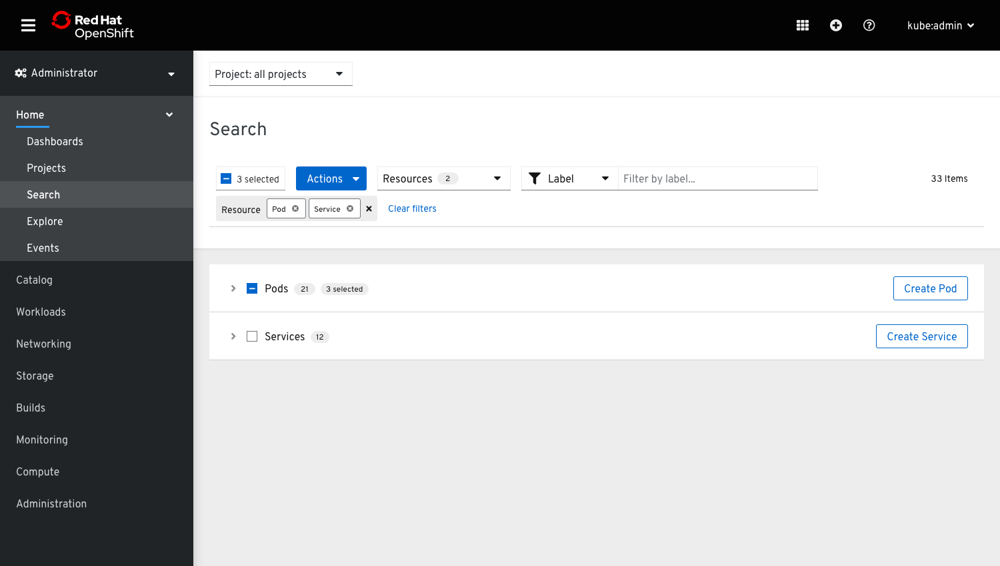
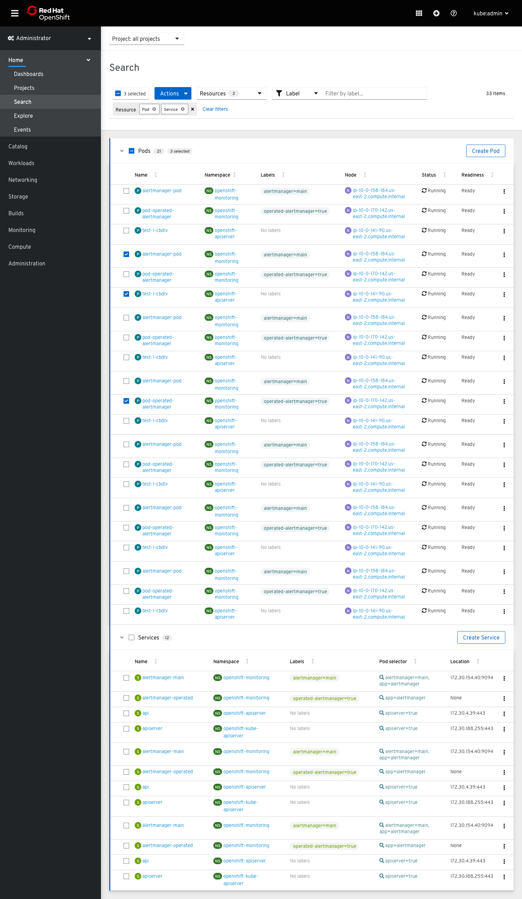
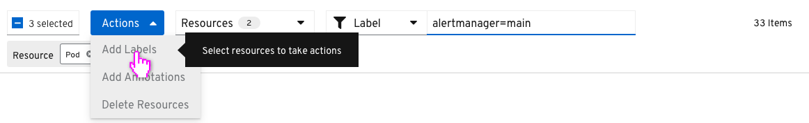
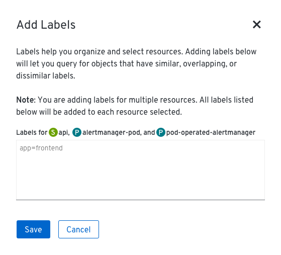
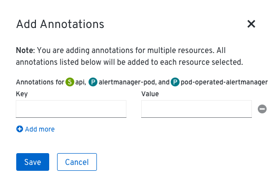
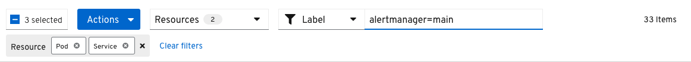
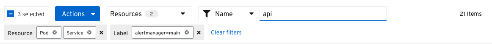
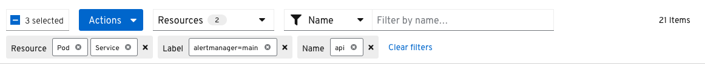

# Search page
The Search page will be updated to have a variety of new features.

## View multiple resources

* The resource selection dropdown will be a filter. When no resources are selected, an empty state will tell users to select resources to get started. It will also describe some of the functionality of the page.

* Users can view more than one type of resource by clicking the dropdown and selecting resource types from the list.
* There will be a max number of resources that users can select at a time, which is yet to be determined.

* Resources will be shown in an expandable data list.
* Each resource will maintain its default columns in the data list.
* Primary Create buttons will be shown at the end of each resource row. If users click Create [Resource], they will be redirected to the default creation page of that resource type. Upon resource creation they will be directed to the resource's Overview. Any applied filters or in progress actions on the Search page will be terminated.
* A badge next to the resource name will show how many items are in the list of that resource. If items in the row are selected, a second badge will read "[x] selected".

## Bulk select resources

* Users can open and close each expandable row as they please.
* Users will be able to multi select items in the list by clicking their associated checkboxes.
* To select all at once, users can use the bulk selector.

## Take bulk actions

* If no items are selected, the bulk actions dropdown will be enabled, but the actions within will be disabled. A tooltip will explain to users that they must select resources in order to take actions.
* The primary bulk actions will be `Add Labels`, `Add Annotations`, and `Delete Resources`. More actions may be added in future depending on the resource(s).
* When taking actions on five resources or fewer, the modal will list out the resource names. When taking actions on more than five resources, the modal will simply list the number (e.g. "Labels for 25 resources.").

### Adding Labels

* The `Add Labels` modal is the same as the `Edit Labels` modal, but notes that any changes will add labels rather than replace.
* Users can add labels in the textbox and click 'Save' to add the labels to the selected resources.
* The new labels will appear in the list and the items will remain selected.

### Adding Annotations

* The `Add Annotations` modal is the same as the `Edit Annotations` modal, but notes that any changes will add annotations rather than replace.
* Users can add annotations and click 'Save' to add the annotations to the selected resources.
* The items will remain selected.

### Deleting resources

* To bulk delete resources, users will be asked to confirm by typing **delete** in a textbox. Then the delete destructive action button will be enabled.

## Filter by name or labels

* The attribute-value filter will allows users to filter by name or label. The filter will filter on the list as users type. Upon hitting 'Enter', filter chips will be added to the second row of the toolbar.
* The filter will be additive, allowing users to filter on both name and label simultaneously.
* If the query has an equal sign in it, it will be grouped as a label. Other queries will automatically filter on name.
* The filter and bulk selector can also be used together.
