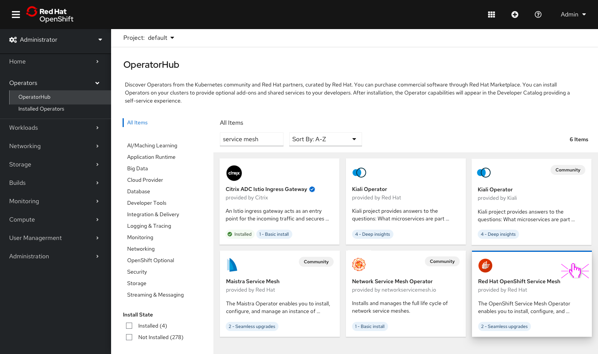
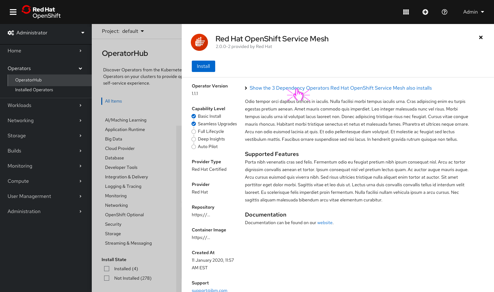
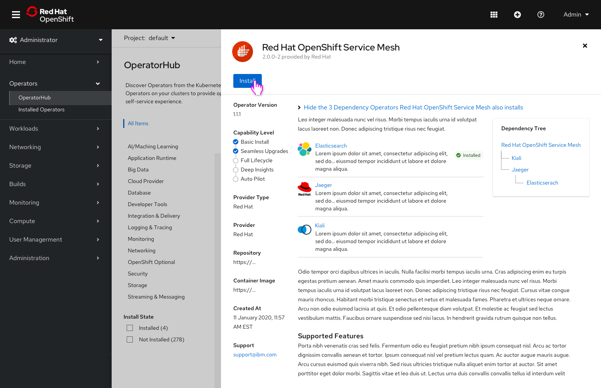
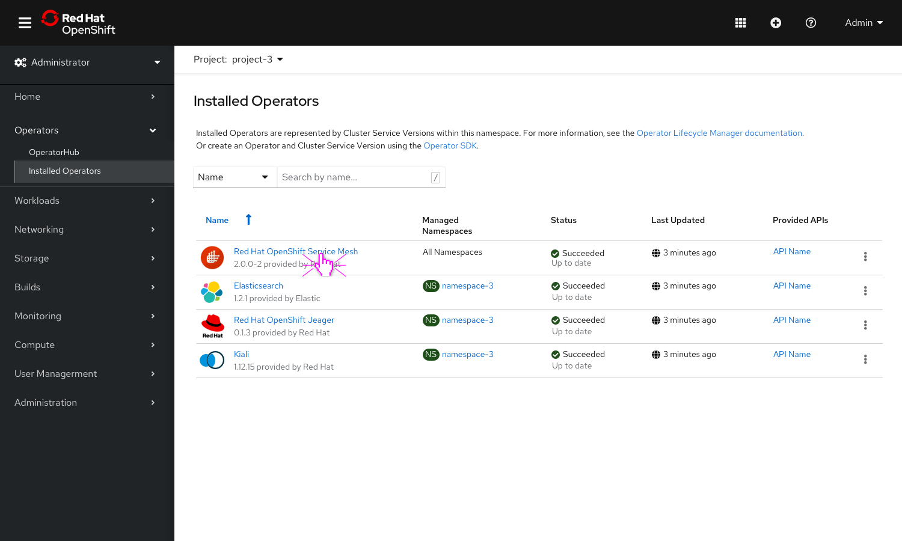
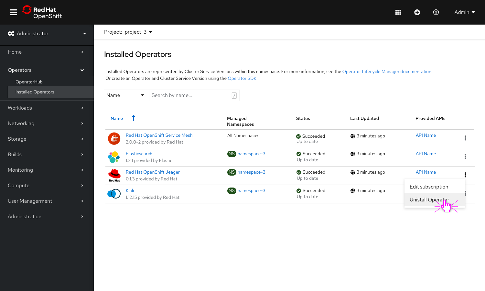
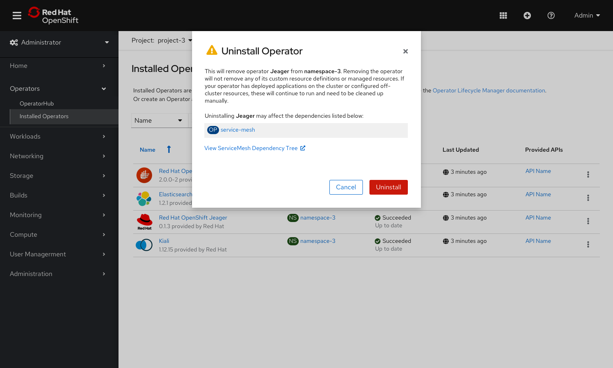

# Surfacing Operator dependencies (Pre- and Post-Installation) 
There are important Operator relationships that both administrators and developers need to be aware of and understand in order to successfully search for, install, upgrade and troubleshoot inside the console. 

Ultimately the goal of this work is to begin to surface dependency relationships in a way that customers can easily understand and take action on when necessary. 

The designs below attempt to address things like:
1. How can I quickly troubleshoot an operator with dependencies? Is this operator status failure also affecting other operators?
2. What will happen if I delete an operator that another operator is dependent on?
3. I only installed one operator, but I see that 5 additional operators are installing.

## Examples of OLM dependency use cases
- The two basic use cases:
    1. **Direct dependency**: the Operator is dependent on other Operators in order to work. This is an actual dependency case (i.e. installing ServiceMesh also gets you Jaegar, Kiali, and Elasticsearch and all are required in order for ServiceMesh to work).  
    2. **Package dependency**: the Operator “enables” a bulk installation of Operators so you can use those set of Operators and don't have to install them individually (but are not dependent on one another to work). The Cloud Pak case (i.e. install Cloud Pak for Integration also gets you a set of IBM Operators, but you don't necessarily need them all for one to work).

This dependency relationship is further complicated by the fact that dependent Operators can run as a stand alone Operators. 
- Ex. When Kogito is installed, Infinispan, Keycloak, Strimizi are installed as well - but Infinispan, Keycloak, Strimizi can also run independent of Kogito.

## Surfacing Operator Dependencies on Expanded Details (Pre-Installation)

The primary goal we are trying to solve (with this first round of designs) for the pre-installation workflow is to surface the operators that will also be installed and highlight the operator relationships to one another. 

- Click on the Red Hat OpenShift Service Mesh operator to view details.

- We have added a list of dependencies that you can expand at the top of the side panel view.

- Clicking on the **Show...** link will reveal the operators that Service Mesh will also install.
- Any operator that has already been installed will have an identifier (ex. the installed badge) and will not be installed again.
- A dependency tree was added to further detail the relationships between the operators.

## Surfacing Operator Dependencies on Operator Details (Post-Installation)

The primary goal we tried to solve with this first round of designs for the post-installation workflow was to surface the relationships of operators to one another. Understanding these relationships becomes valuable when troubleshooting or uninstalling an operator with dependencies.

- Clicking on the **Service Mesh** operator will navigate users to the details page.

- We added a new **Operator dependencies** field on the **Operator details** under the ClusterServiceVersion overview. 
- The dependency tree will appear under this new field and each operator will link directly to their corresponding details.
- If any failure occurs on a operator in the tree, a badge will appear. If an operator’s status has failed, they can easily see what other operators that may be affected and work their way up the tree.

Note: This new field will appear on all of the operators corresponding detail pages listed in the tree.

## Uninstalling an operator with dependencies 

In order to account for the scenario where a user uninstalls an operator with dependencies, we wanted to make sure they understood the implications of doing so. For example: 
- ServiceMesh requires Jaegar + Kiali, uninstalling ServiceMesh won’t break Jaegar or Kiali; however, uninstalling Jaegar will cripple ServiceMesh.

- Click on kabab menu on the right to uninstall Jeager. 

- When uninstalling an operator with dependencies, any dependencies that may be affected will be provided as well as a link to the dependency tree.

Note: This design is our first attempt at surfacing operator dependencies in the console. We plan on building on this work in the future. 
