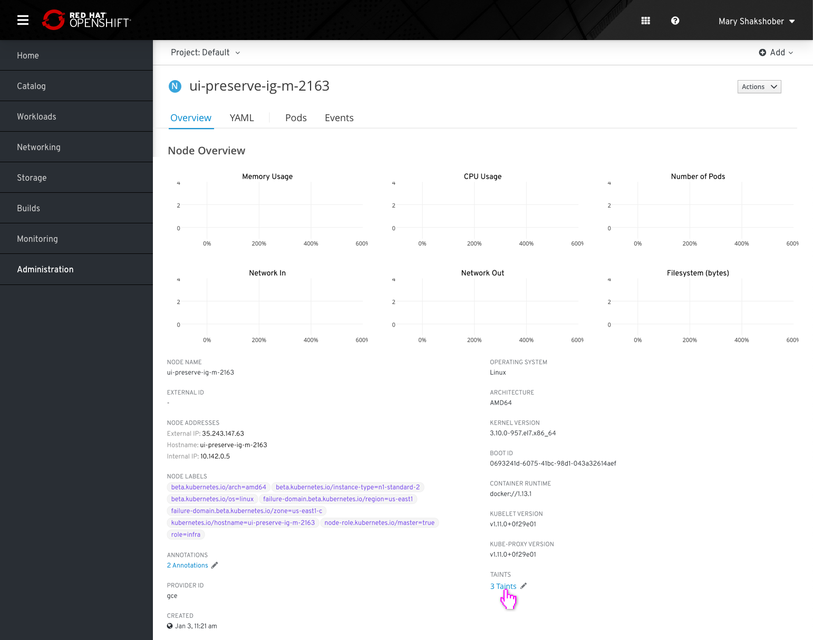
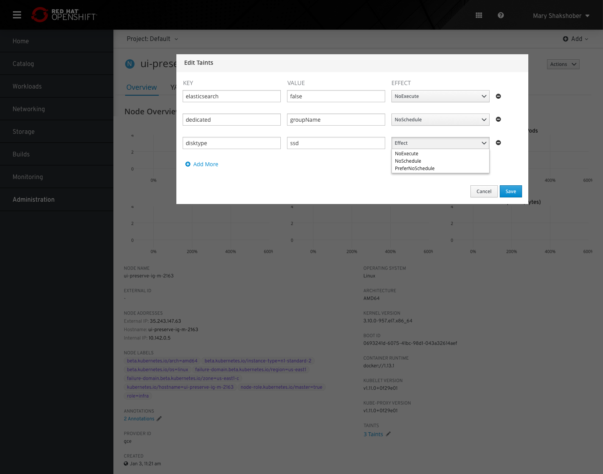
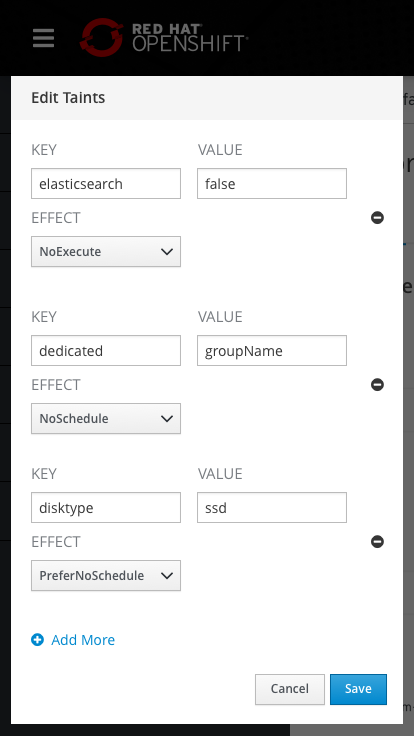
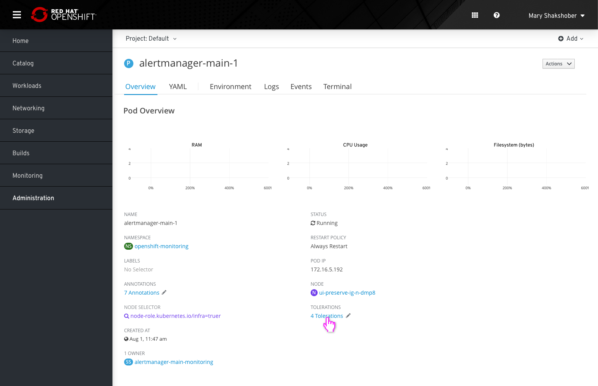
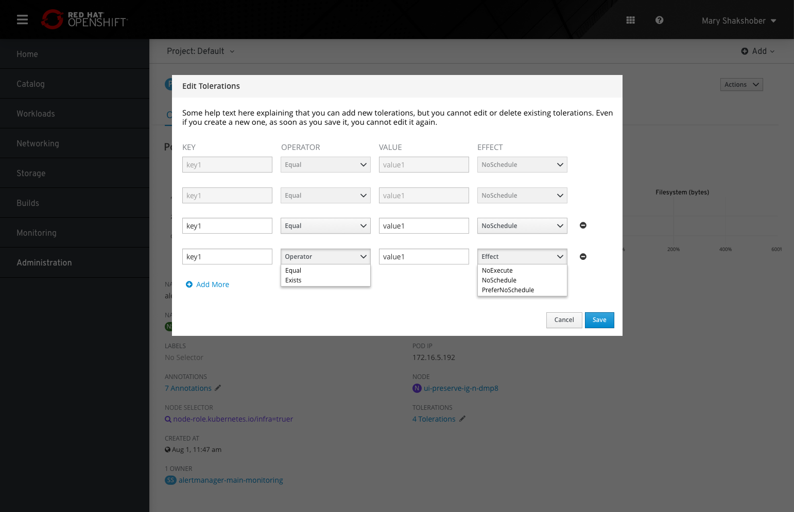
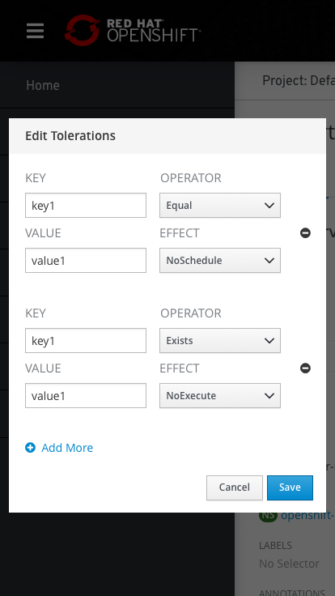

# Taints and Tolerations

## Taints

* Nodes details pages should include a section for `TAINTS`. The number of taints will be listed in this section and will be stylized as a link with a pencil icon to the right.
* Clicking the link or pencil will open a modal where users can add, remove, and edit taints.
* The modal will allow users to edit three variables: `KEY`, `VALUE`, and `EFFECT`.
* Clicking 'Add More' will add a row at the bottom of the list.
* Clicking the remove icon on the right side of a row will remove the row.
* After adding, removing, or editing variables, users must click 'Save' at the bottom of the page to apply changes.

### Mobile view

## Tolerations

* Pods details pages should include a section for `TOLERATIONS`. The number of tolerations will be listed in this section and will be stylized as a link with a pencil icon to the right.
* Clicking the link or pencil will open a modal where users can add tolerations.
* **Note**: Existing tolerations cannot be edited or deleted. Once a new one is created and saved, it cannot be edited or deleted, and will be shown in a `ReadOnly` format.
* The modal will allow users to edit four variables: `KEY`, `OPERATOR`, `VALUE`, and `EFFECT`.
* Clicking 'Add More' will add a row at the bottom of the list.
* Clicking the remove icon on the right side of a row will remove the row. Users will only be able to remove the row if it has not yet been saved. The remove action is not available for already existing tolerations.
* After adding, removing, or editing variables, users must click 'Save' at the bottom of the page to apply changes.

### Mobile view

