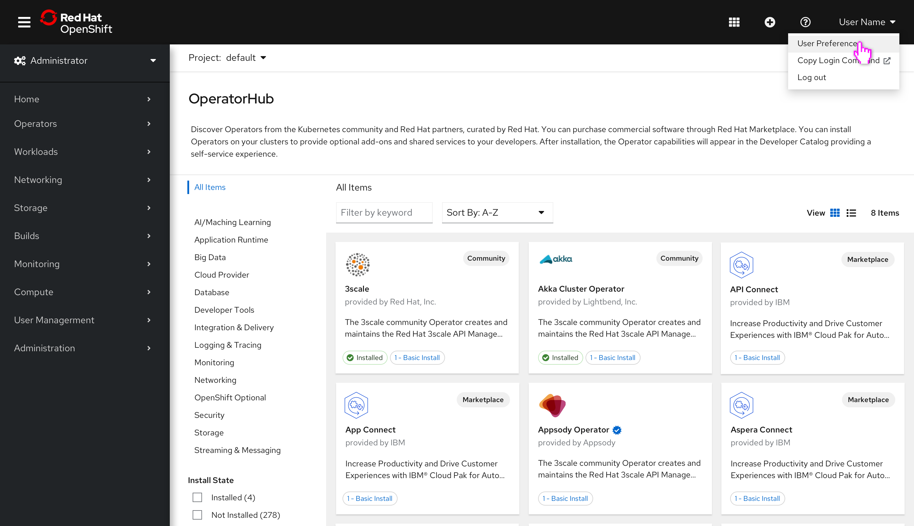
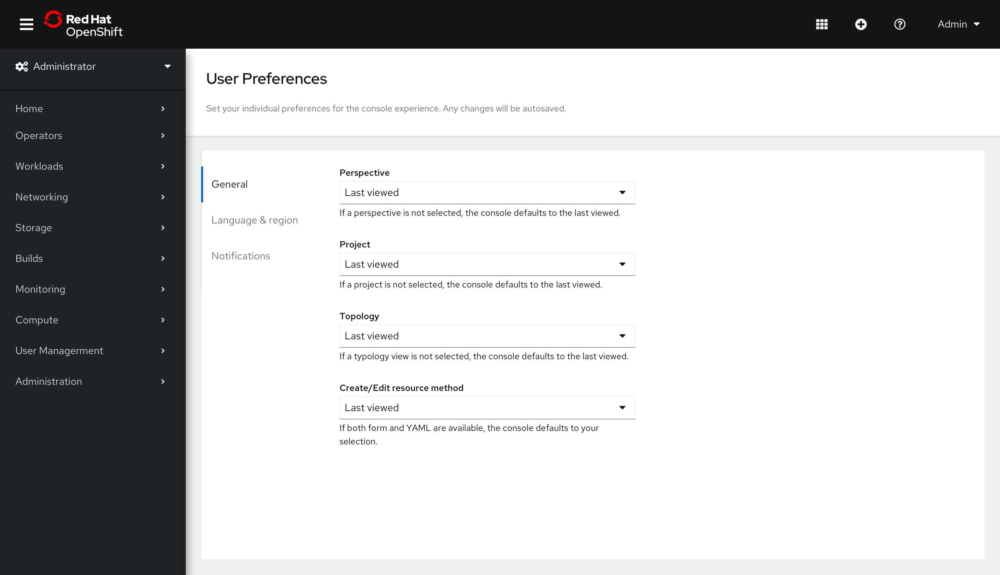
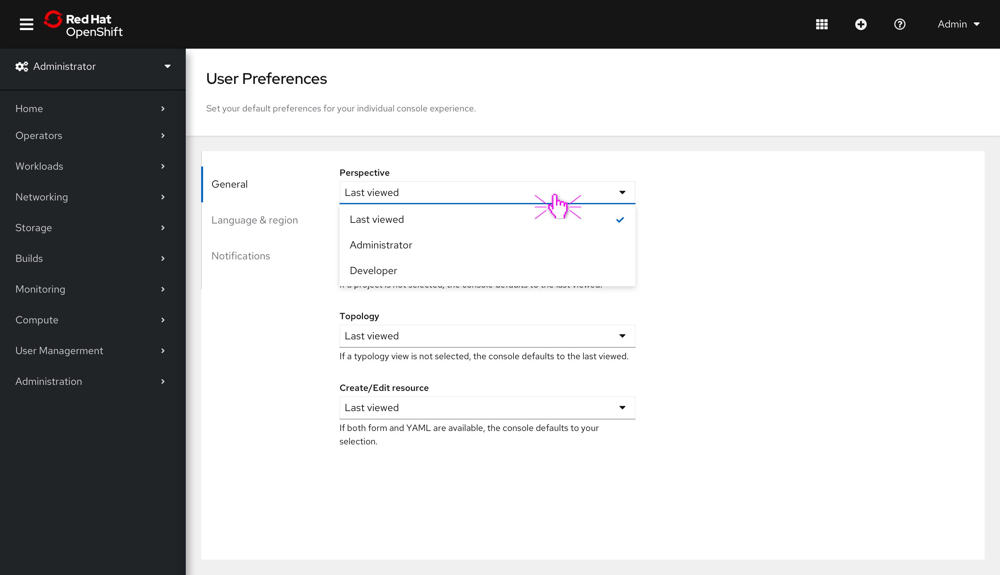
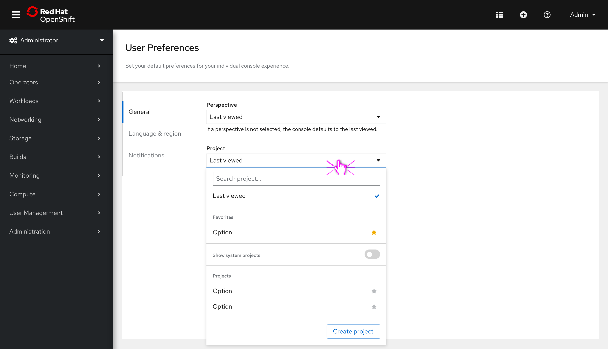
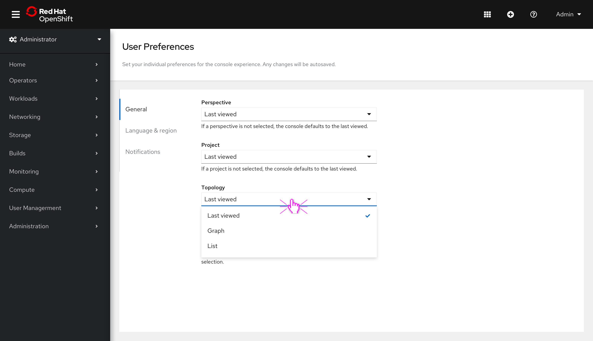
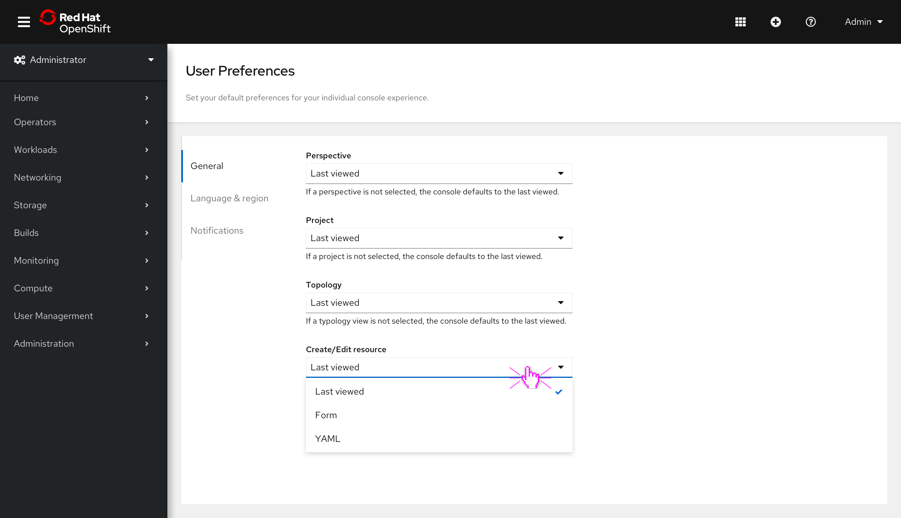
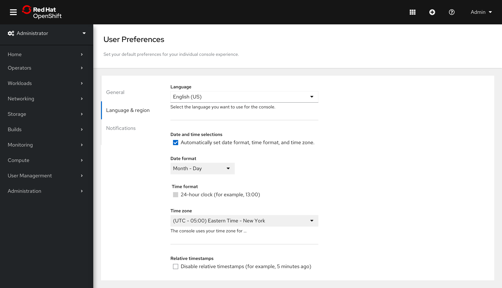
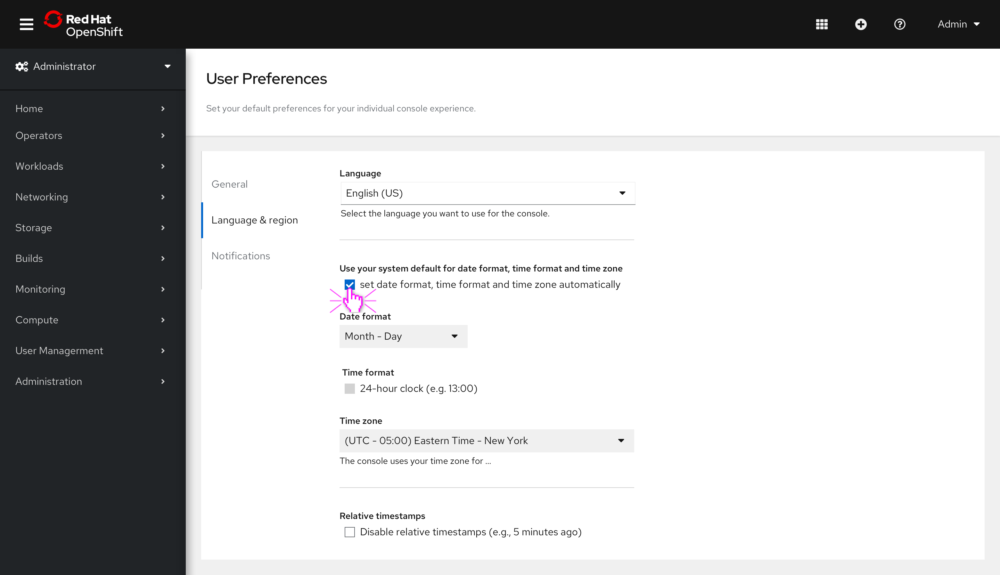
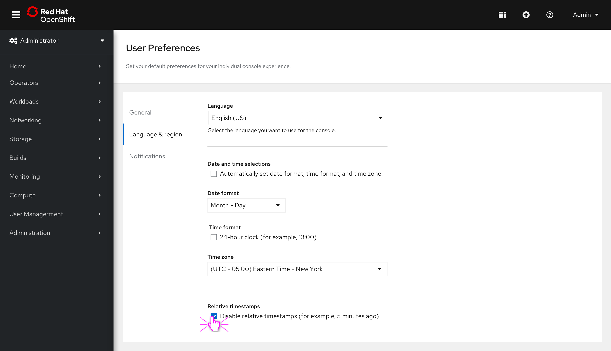

# Adding User Preferences to OpenShift Console

We are finally adding user preferences to the console in 4.9. This enhancement will allow individual users to set preferences across the console, providing a customizable experience.

In 4.9 user preferences will consist of two tabs:
1. General preferences
2. Language and region preferences

All changes in user preferences will be autosaved.

## Accessing user preferences

- To access user preferences, navigate to the user dropdown in the masthead and click on **User preferences**.

## General preferences

- General preferences will enable users to customize defaults for the **Perspective**, **Project**, **Topology**, and their preferred way to **Create/Edit resources**.

- Setting a **Perspective** will allow users to select a default view for when they log in.
- RBAC may detect a perspective for the first log in, but the console will default to **Last viewed** until an alternative selection is made.
- Choices for this preference include **Last viewed**, **Administrator**, and **Developer**.

- Setting a **Project** will allow users to select a default project for when they log in. 
- The console will default to **Last viewed** until an alternative selection is made.
- Choices for this preference are controlled by RBAC.

- Setting a **Topology** preference will allow users to select a default view which will be applied across the console. 
- RBAC may detect a default view for first log in, but the console will default to **Last viewed** until an alternative selection is made.
- Choices for this preference are **Last viewed**, **Graph**, and **List**.

- Setting a preferred way to **Create/Edit resources** will allow users to select a default which will be applied across the console whenever both choices are available.
- The console will default to **Last viewed** until an alternative selection is made.
- Choices for this preference are **Last viewed**, **Form**, and **YAML**.

## Language and region preferences

- Language preferences were added in 4.7 and have now been located to the **Language and region tab**. In addition, users can customize their preferences for **Date format**, **Time format**, **Time zone** and **Relative timestamps**.

- The console will default to setting the **Date format**,  **Time format**, **Time zone** automatically. 

- Deselecting the check box under **Date and time selections** will enable the fields for **Date format**,  **Time format**, **Time zone** and users can then select their preference.

- Lastly, we are providing the ability to disable **Relative timestamps**.

## More to come

 We are taking a phased approach to adding preferences, so be on the look out for more functionality in the future. Areas that are top of mind include adding the ability to customize the alerts that appear in the notification drawer.
