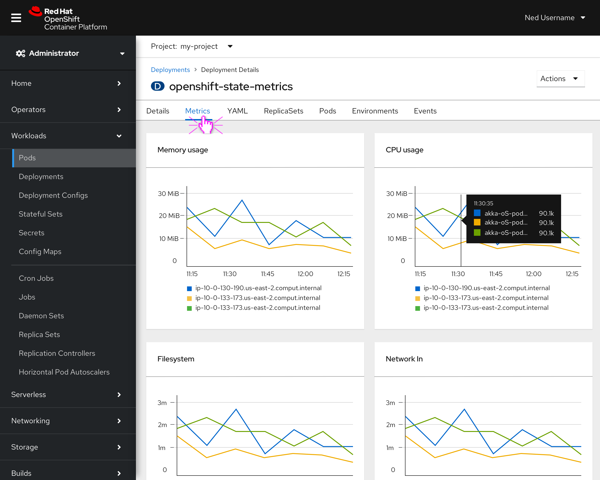

# Workloads Metrics tab

# Background

When moving to OCP 4 the metrics charts for Deployments, Deployment Configs, StatefulSets, DaemonSets, ReplicaSets, and ReplicationControllers were removed from the details pages. There has been feedback to reinstate these charts as they give users the ability to review activity at a glance and drill down to get additional information.

## Goal

The goal is to bring the utilization charts back into the OCP console while improving the functionality and user experience.

The following charts will be restored:
* Memory usage
* CPU usage
* Filesystem
* Network In
* Network out 

## Designs for 4.x release

The utilization charts will receive the following revisions:
* The charts will be moved into their own **Metrics tab** and use a format more inline with the monitoring pages. Moving these charts off the details page allows more space for things like HPAs in the future.  
* Updating the tooltip format to be consistent with Monitoring.
* Clicking on the data in these charts will follow the same path as what is done in console at this time. 
* Using multi-line charts will show activity from multiple pods in a Deployment to help show comparisons and lower performing assets

