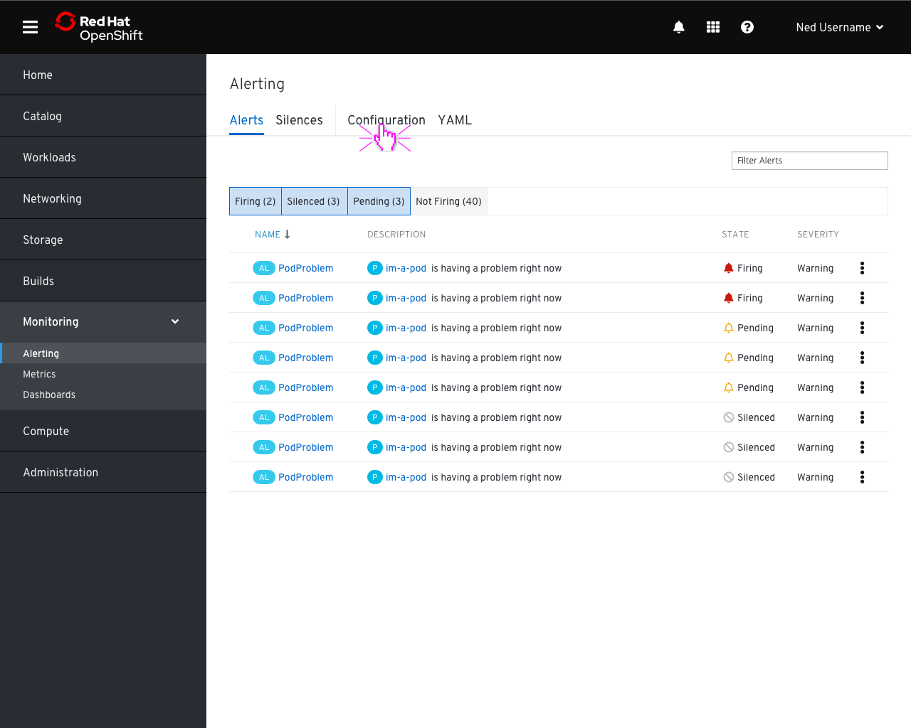
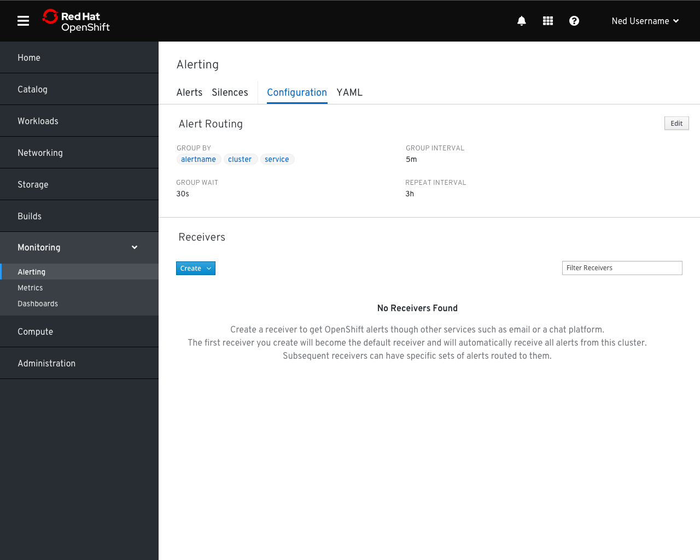
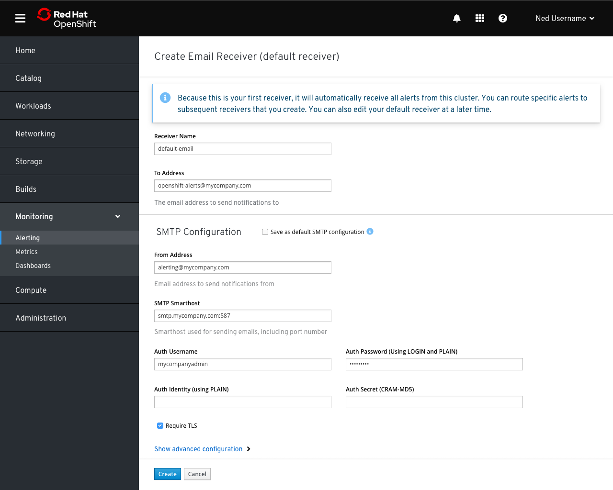
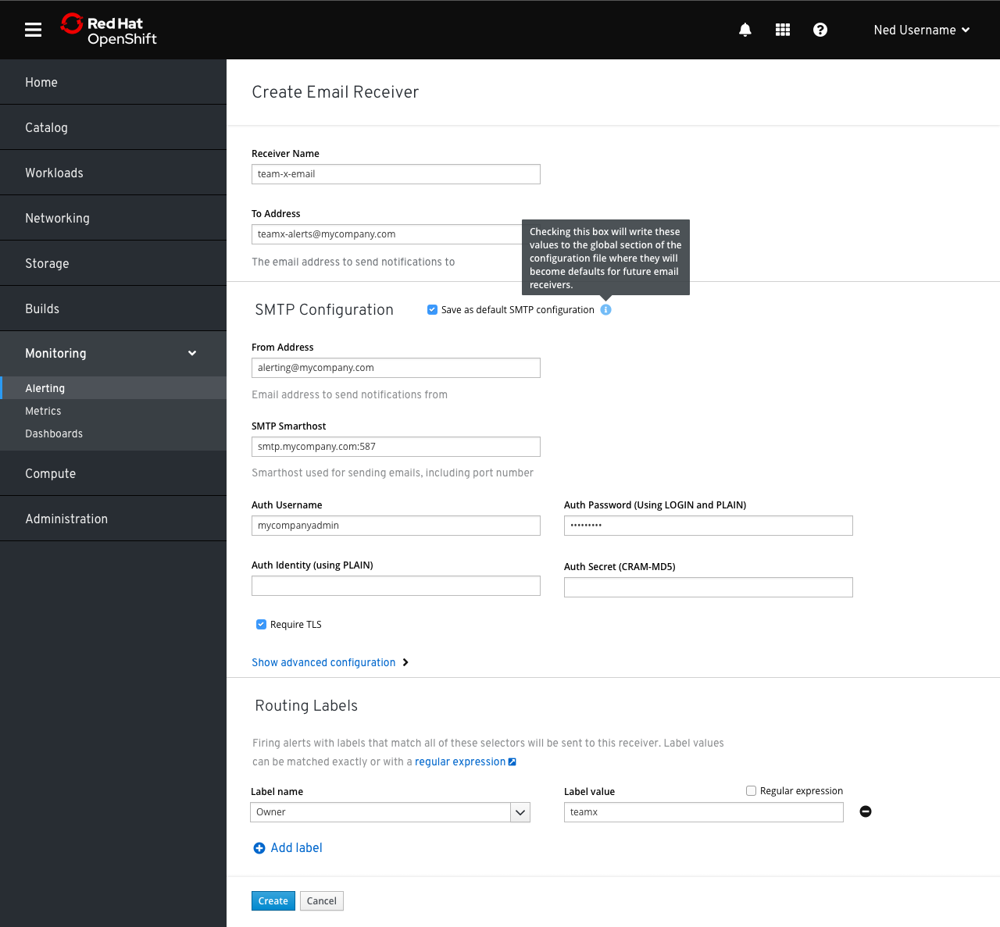
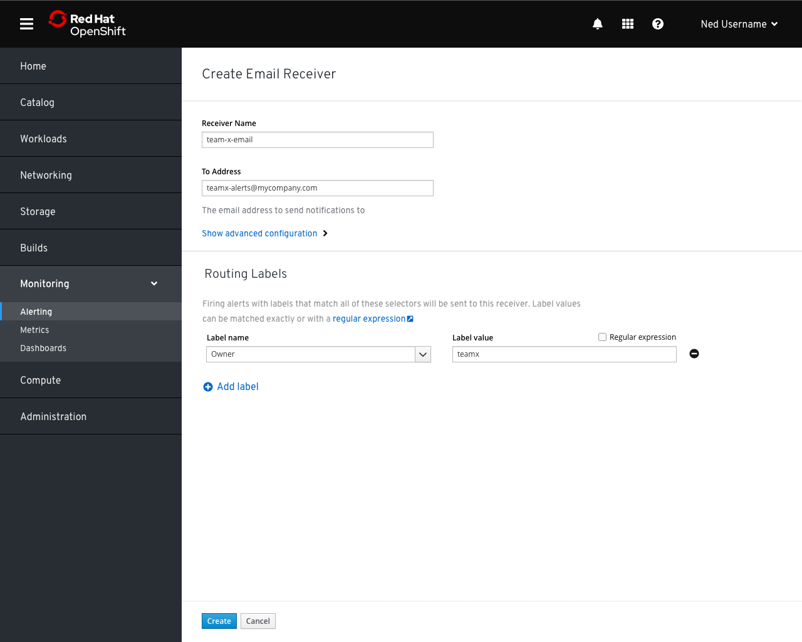
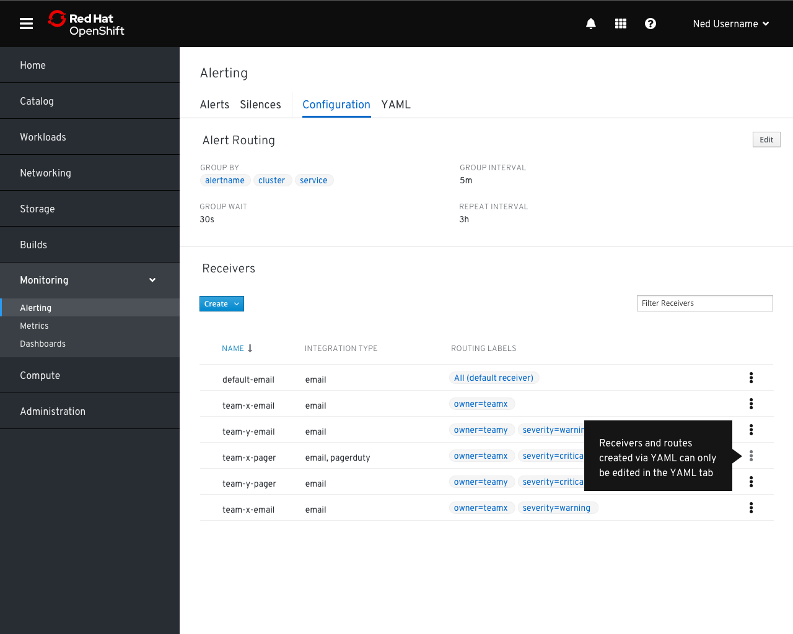
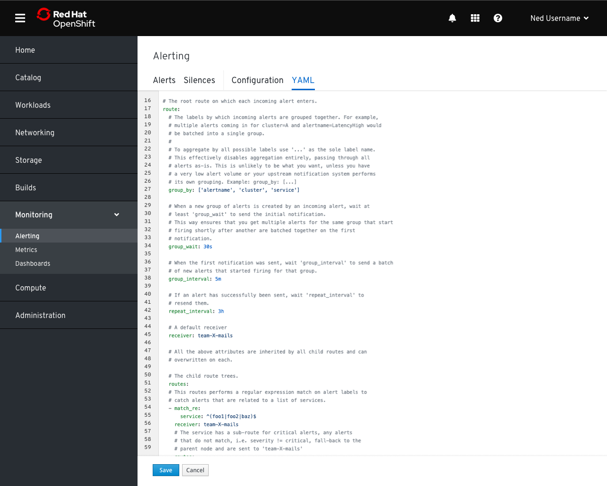

# Alertmanager Configuration

- To consolidate all admin-level alerting functions together, `Alerts` and `Silences` pages could be combined onto the same page as tabs with the `Configuration` and `YAMl` pages

- The `Configuration` tab would show some basic grouping information from the default route section of the YAML and a list of receivers for the cluster.

- Clicking the “create” dropdown would enable users to create a receiver based on an integration type.
- We could provide the entire list of integration types here, or just a subset as time allows.
- Users would only be able to create receivers with a single type of integration. More complex receivers could be created from the `YAML` tab.

## Creating the default receiver

- The create receiver form would expose basic required information for the given integration type.
- If there is no information in the `global` section of the config YAML for a given receiver type, possible global fields are added to the form with the option to write them to the `global` secton. If the "Save as default..." box is not checked, they are simply added to the receiver itself.
- Optional fields appear if the user clicks the `Show advanced configuration` button.
- If no receivers have been created, no other fields are available as this receiver must become the default receiver for alerts.

## Creating subsequent receivers

- Once a default receiver exists, subsequent receiver creation forms will have a `Routing Labels` section that enables users to create a very basic routing rule for the receiver at the same time.
- The routing rule would be a direct child of the default route and would simply match all labels specified in the form.
- This would **NOT** enable users to create nested routes. That would need to be done through the Configuration YAML editor.

- If global configuration fields have previously been defined for a given receiver type, those settings are automatically filled in and hidden under the `advanced configuration` section with other optional fields.

- Receivers created in the YAML and any associated labels would be displayed on the `Configuration` tab, but they would not be editable through the form. Similarly, deleting would not be enabled from this screen because removing a given receiver and associated routes might disrupt a complicated tree.

- The `YAML` tab would contain the Alertmanager configuration YAML and would enable users to create receivers and routing rules as well as editing other values such as grouping rules.
