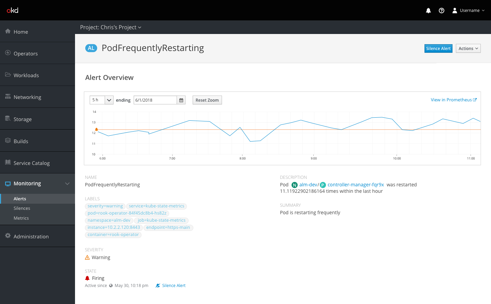
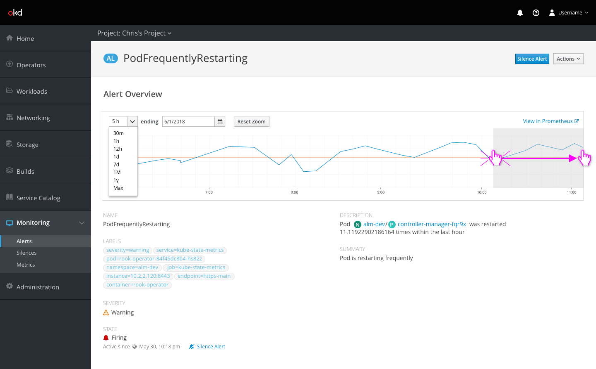
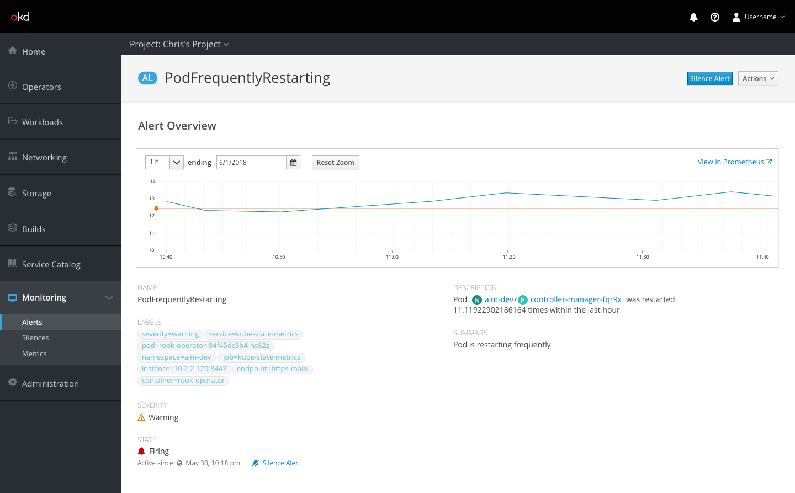
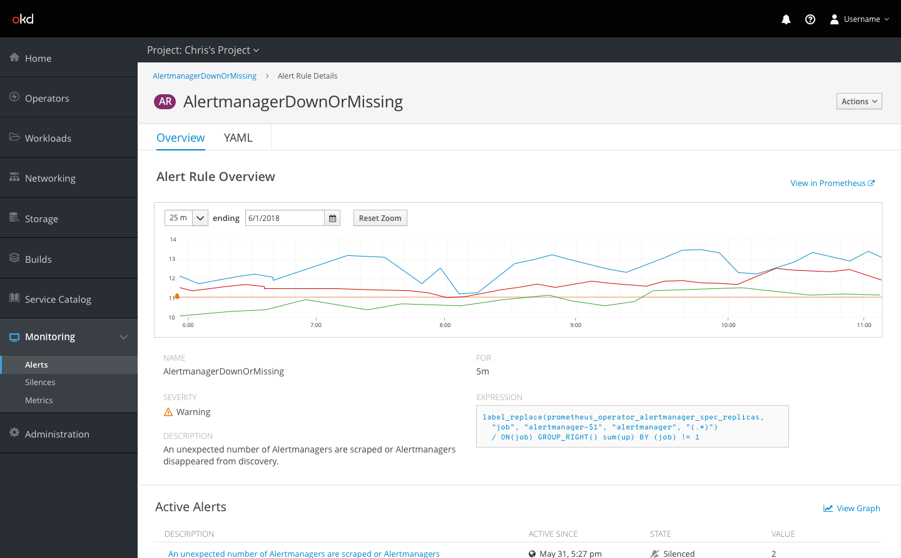

# Alerts

## Alert Metrics

- Initially the chart should be zoomed to a time period that at least includes the `for` attribute of the corresponding alert rule, but preferably 3-5 times that period as loading times allow. For instance the above chart shows the last hour where the metric crossed the alert threshold as well as an additional 4 hours of history
- An orange line with an alert icon (if possible) shows the firing threshold for the alert
- Clicking on the `View in Prometheus` link takes the user to the query UI pre-populated with the relevant query for the alert

- Clicking and dragging on the chart should zoom in so that the selected area fills the chart view
- The zoom level of the chart can also be changed by typing a specific time period into the combobox or selecting from a number of preset time periods.

- Zooming can also be done by typing or selecting a new time period above the chart
- Clicking the `Reset Zoom` button should reset the scale of the chart to the default based on the alert

## Alert Rule metrics

- Alert Rule details pages contain a similar graph, but with multiple lines representing all the active alerts for that rule
