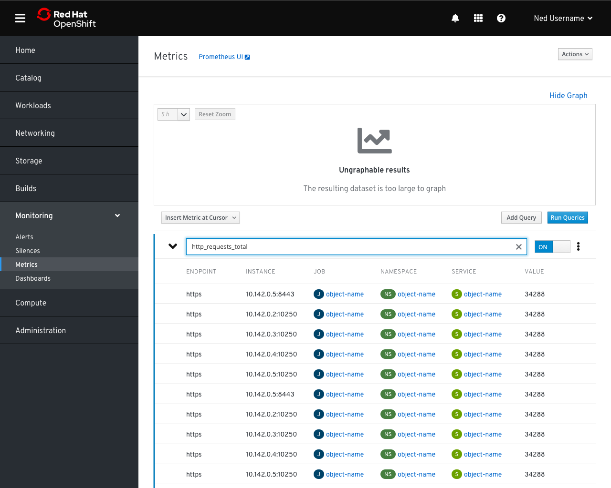
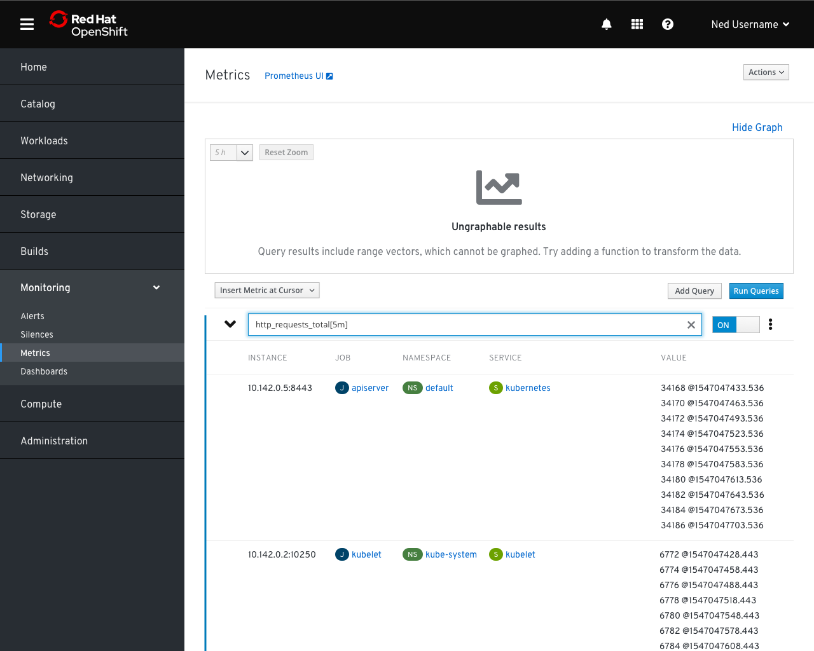
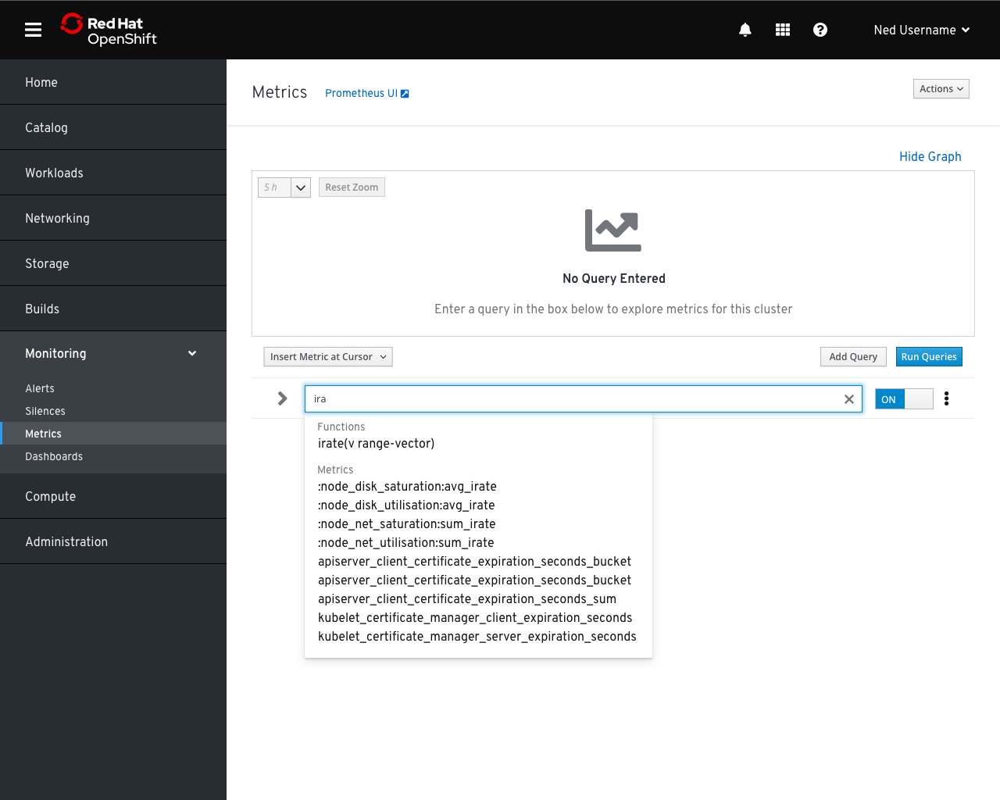
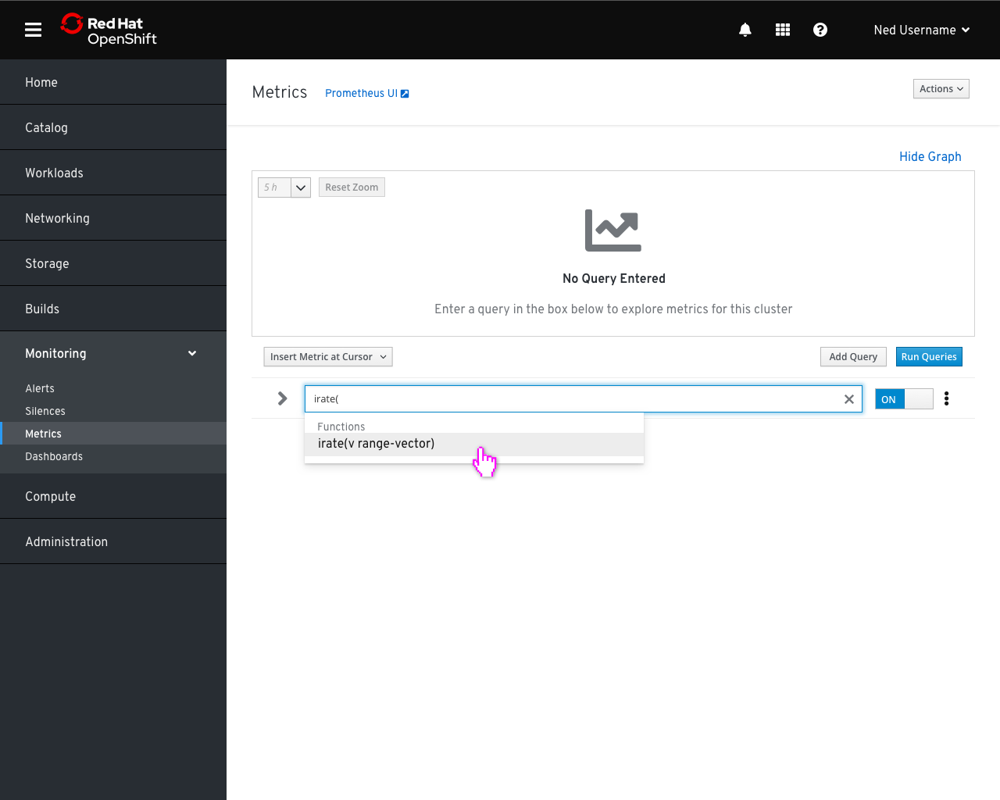
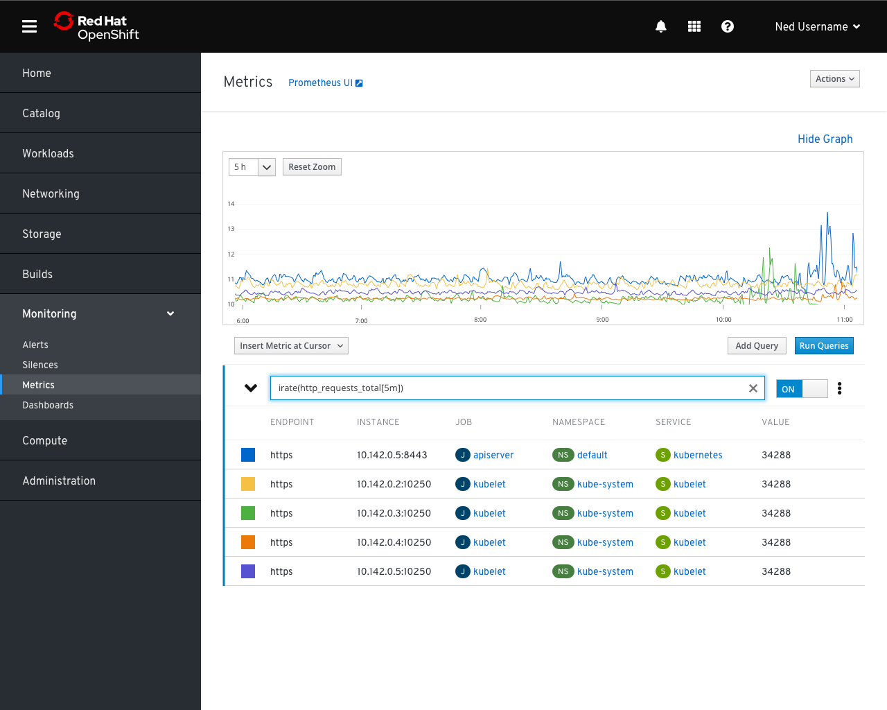
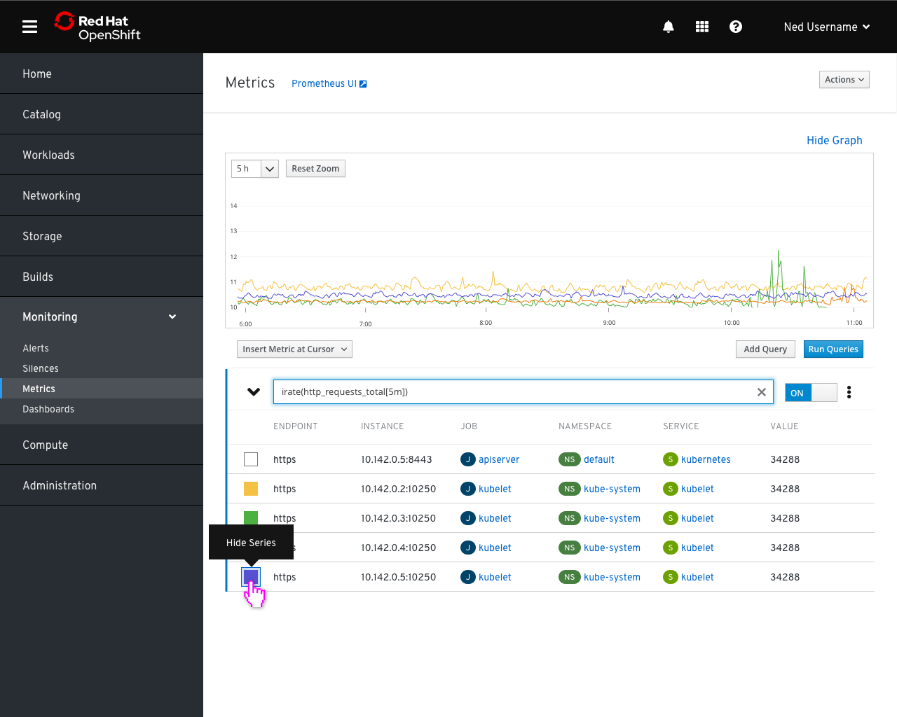
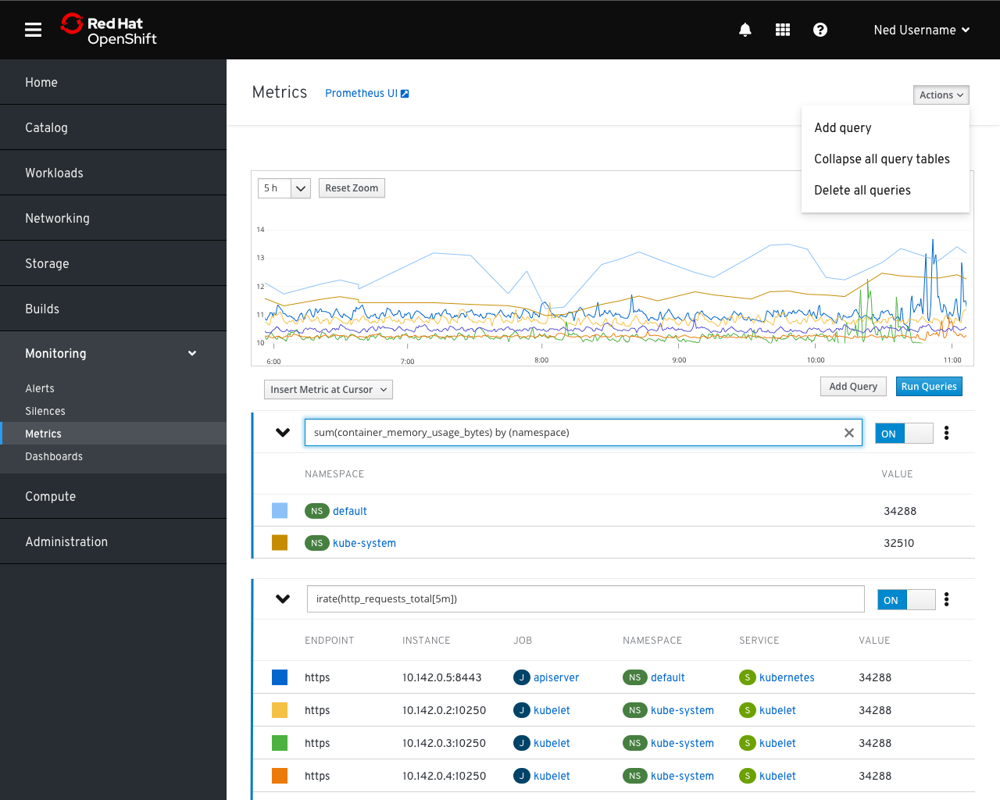
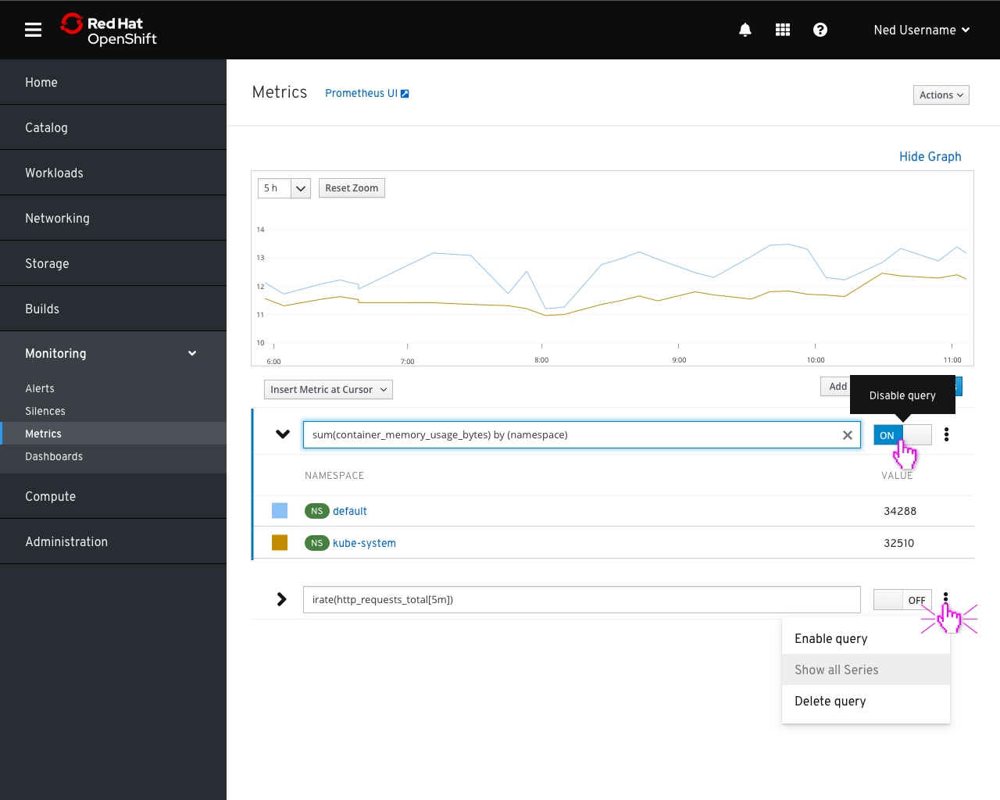
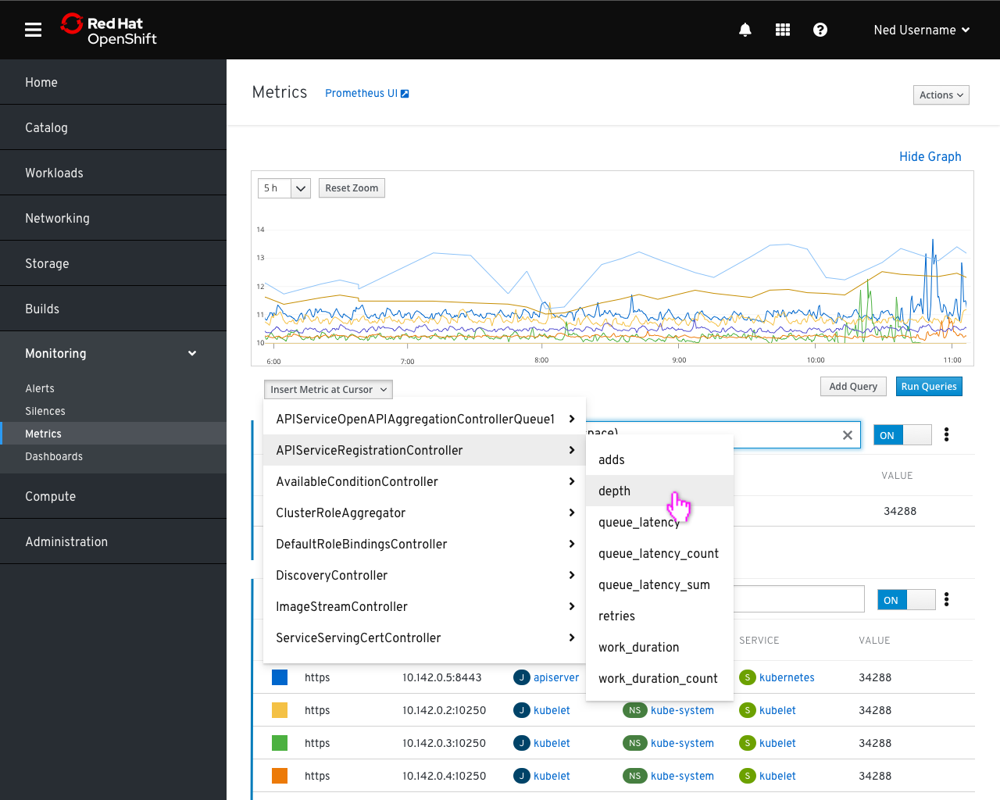

# Metrics

- Navigating to the metrics page presents users with an empty query field and a prompt to enter a query in the box

- If a query cannot be graphed, the results should still be shown in the table below, but the graph field will be populated by an error message until the issue is resolved or the offending query is switched off.

- In some cases, we could make specific suggestions about how to improve a given query such as by adding a function

- As the user types, matching metrics and functions appear in a list below. Selecting or clicking on one will fill it into the query field

- Results are narrowed as the entered text gets more specific

- When a valid query is entered, results are graphed and displayed in a table below the query.

- Clicking on a result row will toggle the visibility of that series in the graph. Hidden rows will have their legend color block replaced by an outline until they are turned back on by clicking the row again

- Multiple queries can be graphed at the same time by using the “Add query” action.
- Clicking on the caret by a query will hide and show the table associated with the query
- The option to collapse all query tables is available in the actions menu to help reduce noise from large result sets

- Toggling a query off will hide all of its series from the graph
- Queries that are turned off will not be run when the `Run Queries` button is pressed or the page is refreshed

- The metrics dropdown contains a list of all available metrics grouped by their source. Clicking on a metric inserts it into a query field at the current cursor position
- This could also be a good place to add a “copy to clipboard” option to copy the metric name
