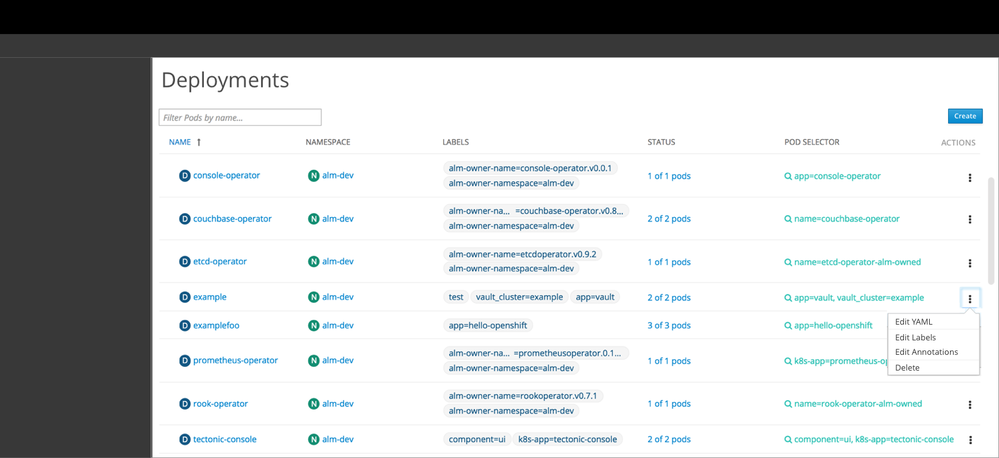
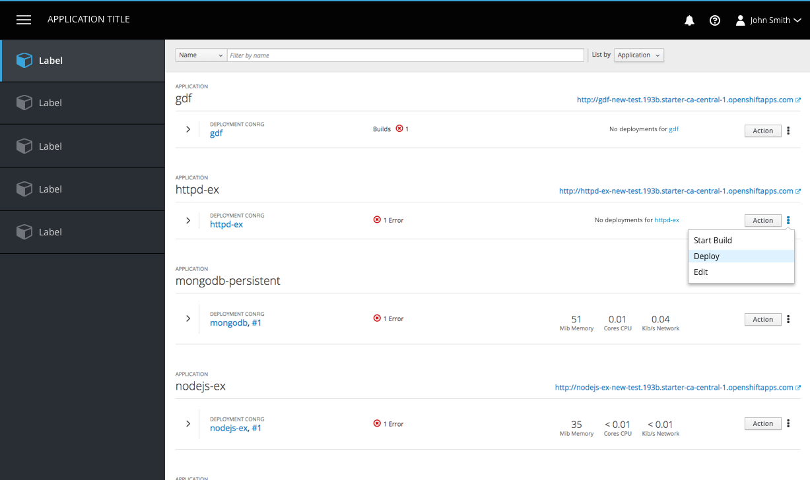
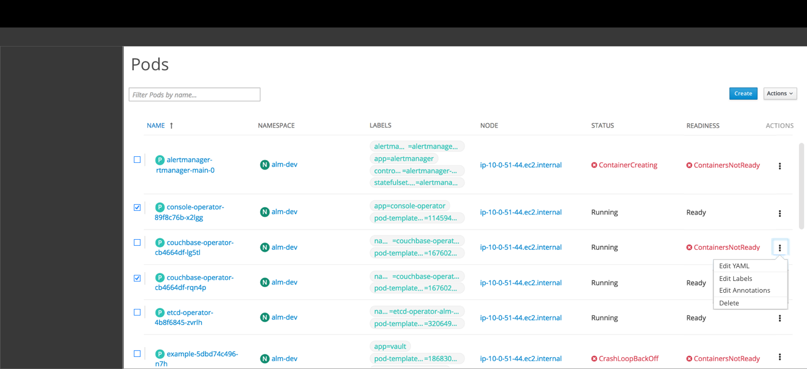

# Actions - Future

## Summary Pages
**List View Actions**

* All summary pages should have a primary Create button, located in the upper right corner of the page.
  * Button text should read “Create” rather than “Create [Object]”.
* Actions should be in kebabs in a list view, located at the end of a row.

* (Optional) If space allows and there is a primary action, that action can be pulled out of the kebab and displayed as a button to the left of the kebab as a primary or secondary button.

* If a summary page needs to support bulk actions, an actions dropdown should be added in the top right toolbar area and checkboxes should be added to each row in the list to allow for multi-select.
* See [list view](https://www.patternfly.org/pattern-library/content-views/list-view/) for more on list behavior and visual treatment.
* If there is a need for selecting all items, the [bulk selector](https://www.patternfly.org/pattern-library/forms-and-controls/bulk-selector/) should be added to the toolbar and used for selecting and deselecting all items.
