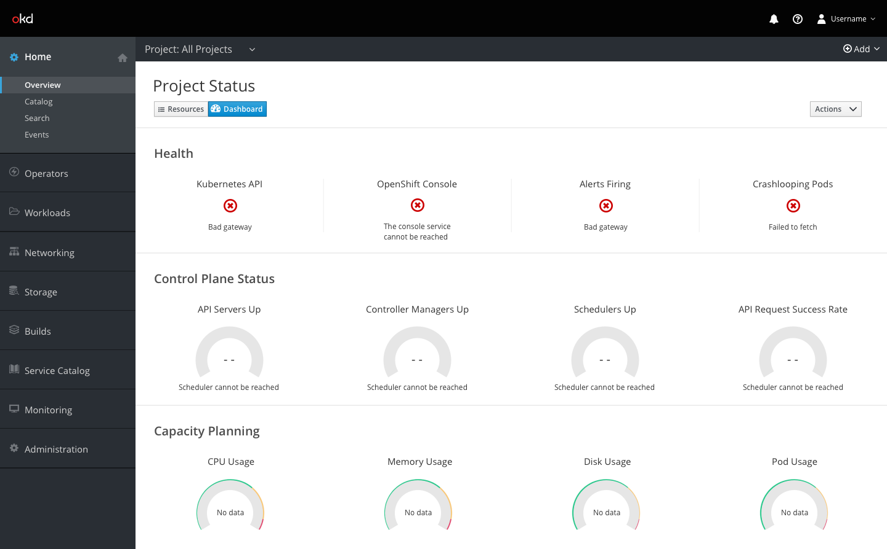

# Dashboard Errors

## General
* When 'All Projects' is selected in the project selector, the [dashboard](http://openshift.github.io/openshift-origin-design/web-console/4.0-designs/dashboard/dashboard) displays `Health`, `Control Plane Status`, and `Capacity Planning` statuses.

### Errors

* When Health information cannot be displayed, the pficon-error-circle-o is shown in place of the status. Users can see the reason for the error below the error icon. Common reasons are  `Bad gateway`, `The console service cannot be reached`, and `Failed to fetch`.
* When gauge information cannot be displayed due to scheduler issues, the gauge is entirely greyed out and `- -` is shown where the gauge percentage is usually displayed. The message `Scheduler cannot be reached` is displayed below the gauge.
* When gauge information cannot be displayed because there is no information to show, the inside of the gauge is greyed out but the outer ring is still shown. Where the gauge percentage is usually displayed, the message `No data` will be shown.
