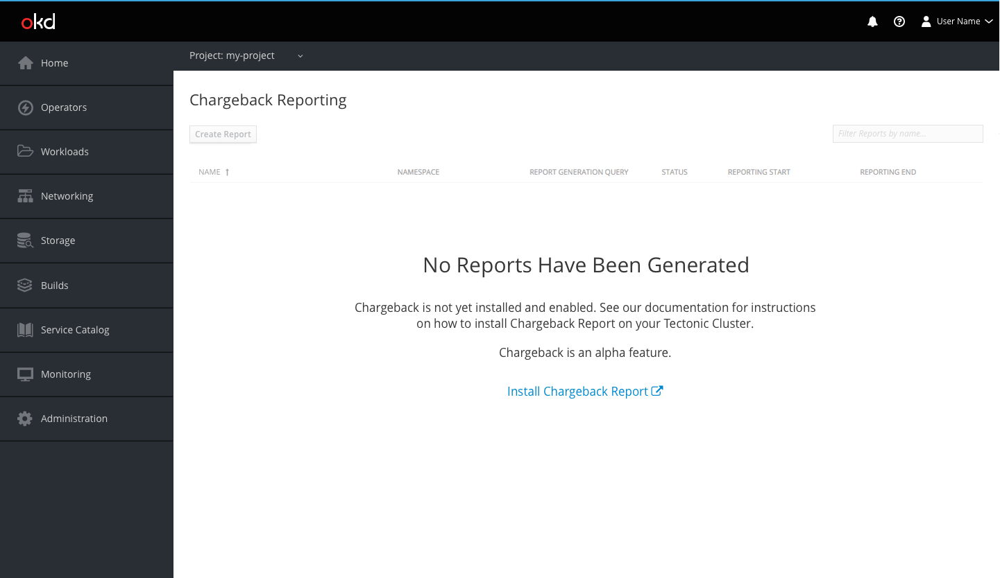
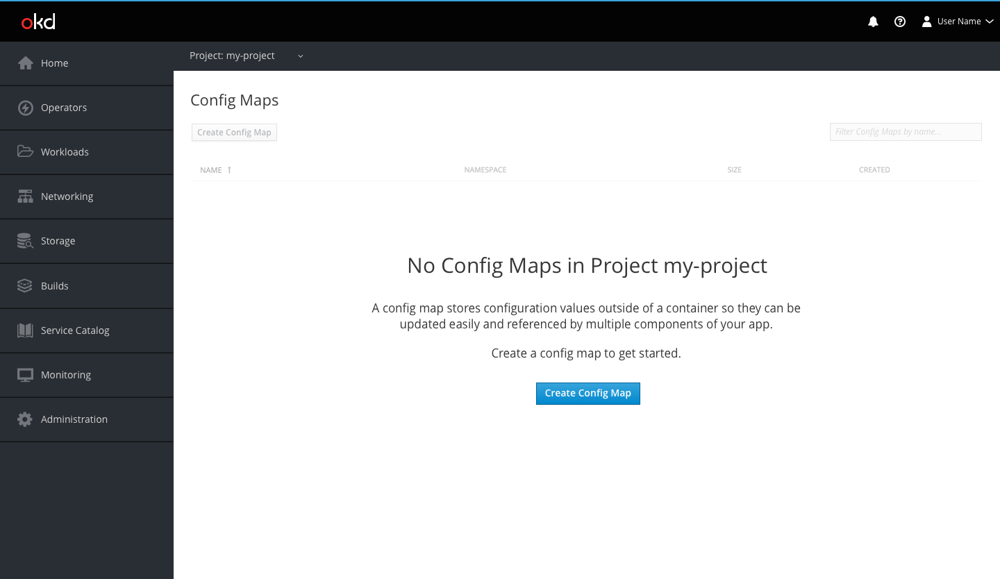
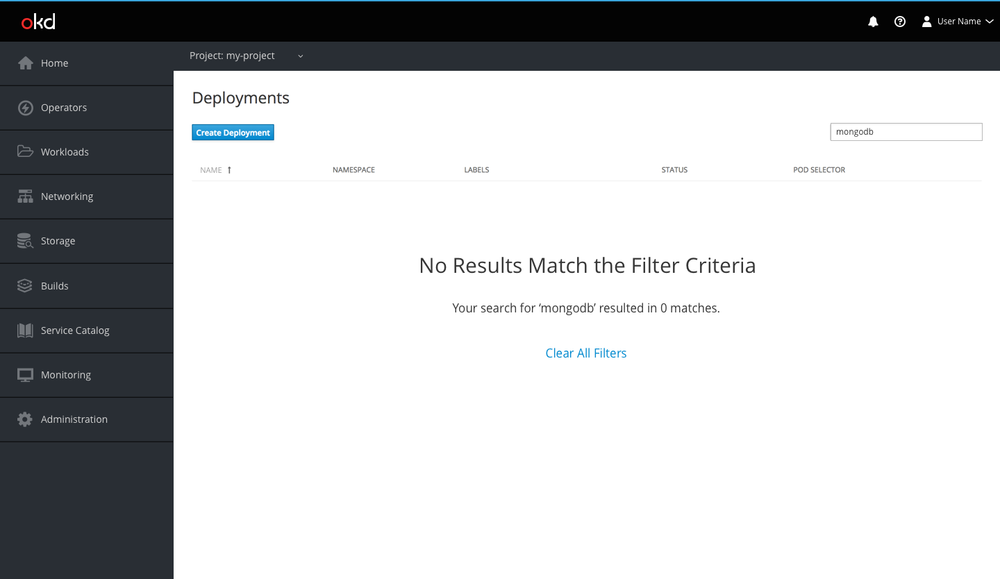
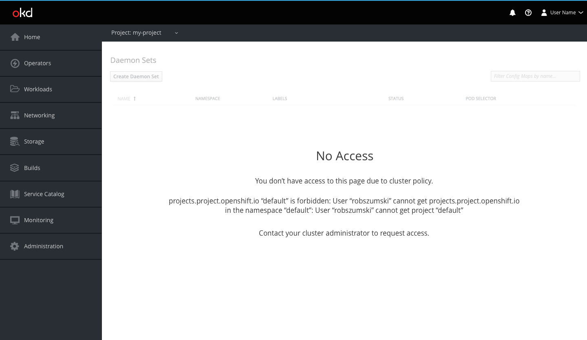
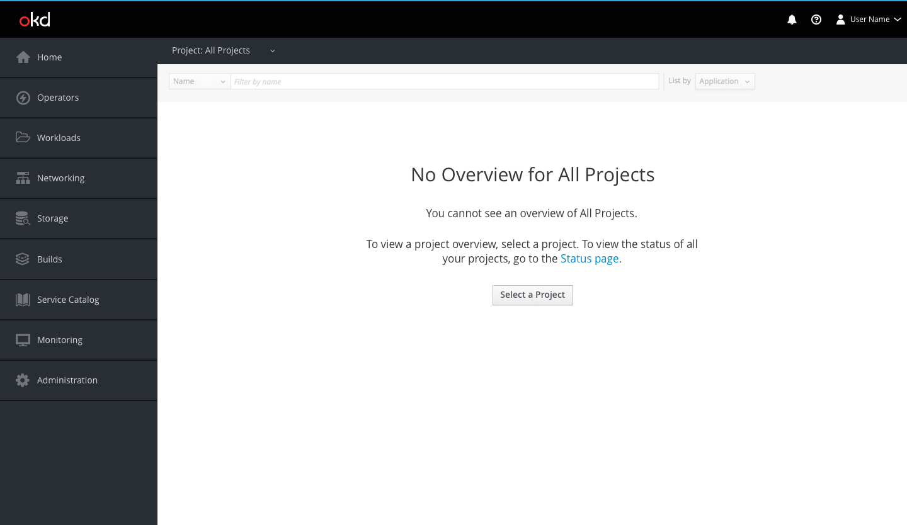

# Empty States

## Description
* The empty state pattern should be used in the following cases:
  * When a page is empty because a feature is not installed
  * When a page is empty because nothing has been created yet
  * When a page is empty because an applied filter results in a null set
  * When a page is empty because the user does not have access to any resources
  * When a page is empty because the user does not have the correct project selection

## Design
* The empty state pattern should be beneath the toolbar
* The toolbar should be greyed out
  * Page elements such as buttons and text fields should also be in the disabled state
  * Exception: the toolbar should remain active in instances where an applied filter results in a null set
* The empty state pattern should be used without an icon
* The empty state pattern should use a large primary button for the call to action
  * Exception: external links and “Clear All Filters” should be links rather than buttons, and pages where users have restricted access do not require a CTA
* The empty state content should generally describe to the user why the page is empty and what they can do to populate the page
  * Empty state descriptions on object pages where nothing has been created yet should include information on what the object is and how it is useful to the user
  * Exception: the filter empty state description is optional depending on the type or number of applied filters

A feature is not installed

Nothing has been created yet

An applied filter results in a null set

The user does not have access to any resources

The user does not have the correct project selection

**Note**: Clicking the "Select a Project" button will open the project selector dropdown.
