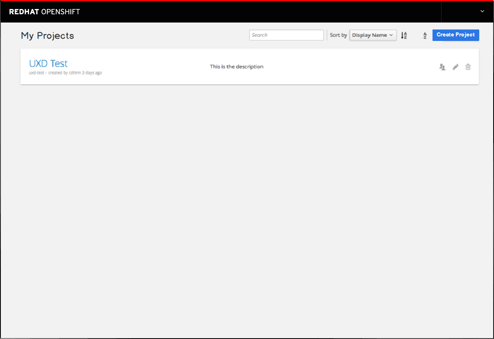
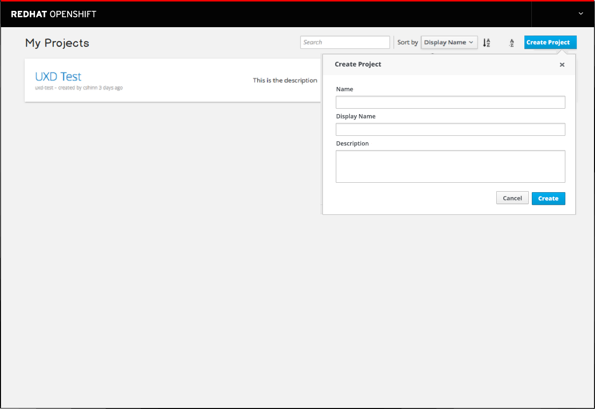
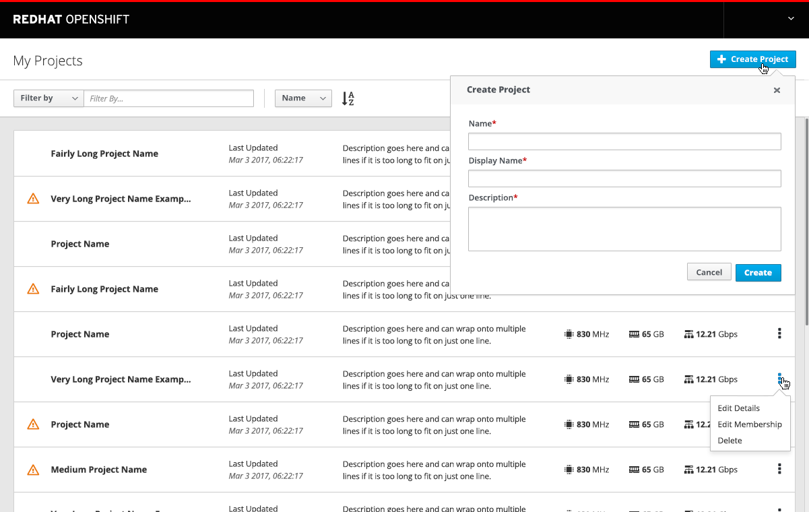
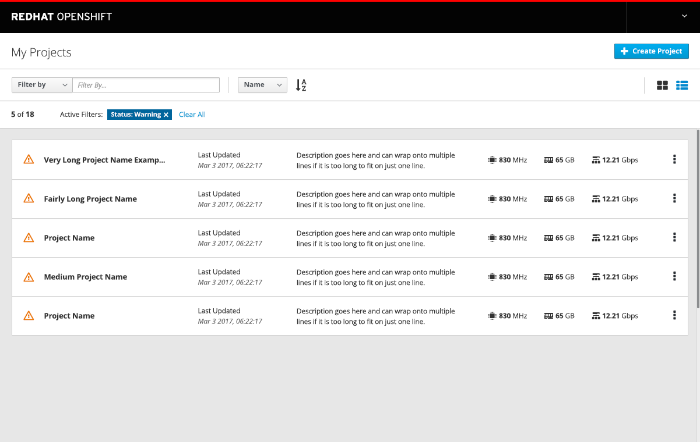
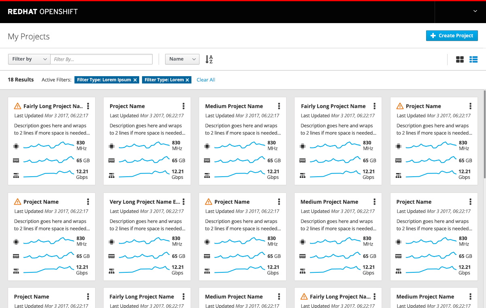

# Overview
- The projects page is accessible from the homepage and displays a full list of projects visible to the user.
- Users have the ability to search or sort the list and can edit or delete projects from this page.
- If a project is selected the user is brought to the specific project Overview page.

## Details
- The title and action button should be changed to match labels used on the homepage.
	- Projects should change to "My Projects"
	- New Project should change to "+ Create Project"

- The Create project button should open the shared component used on the homepage.

- The current implementation of the projects list should be maintained for the MVP version of this work. In the future, a PatternFly List and Card view may be implemented.

## Future Work - NOT MVP
- Add a "last updated" date to the project cards and sort by most recently updated, not by created date.
- Add status as a column to the left of the project name and display only when status is not okay.
- Move actions into the kebab menu.
- Add utilization metrics projects.
- **NOTE:** TBD - How to handle performance issues with longer project lists.

### List View

- Update the projects list page to use a PatternFly List View

- Add a filtering mechanism and use the PF Toolbar layout for filter and sort.
- Allow direct access to this filtered view of warning status from the homepage.

### Card View

- Update the projects list page to include a toggle to a PatternFly Card View
- Include utilization trendlines on the card view

#### Implementation Details
- **PatternFly design patterns:**
	- List View: http://www.patternfly.org/pattern-library/content-views/card-view/#/design
	- Card View: http://www.patternfly.org/pattern-library/content-views/list-view/#/design
- **Icon References:**
	- Memory: TBD
	- CPU: pficon-cpu
	- Network: pficon-network

#### Customer Feedback
- TBD
