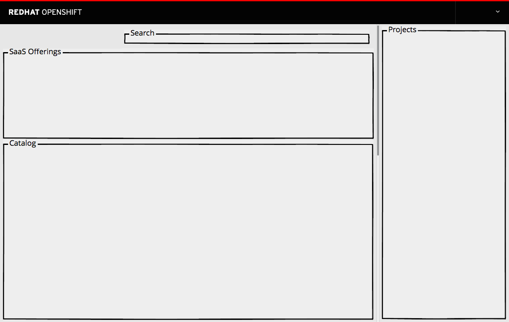
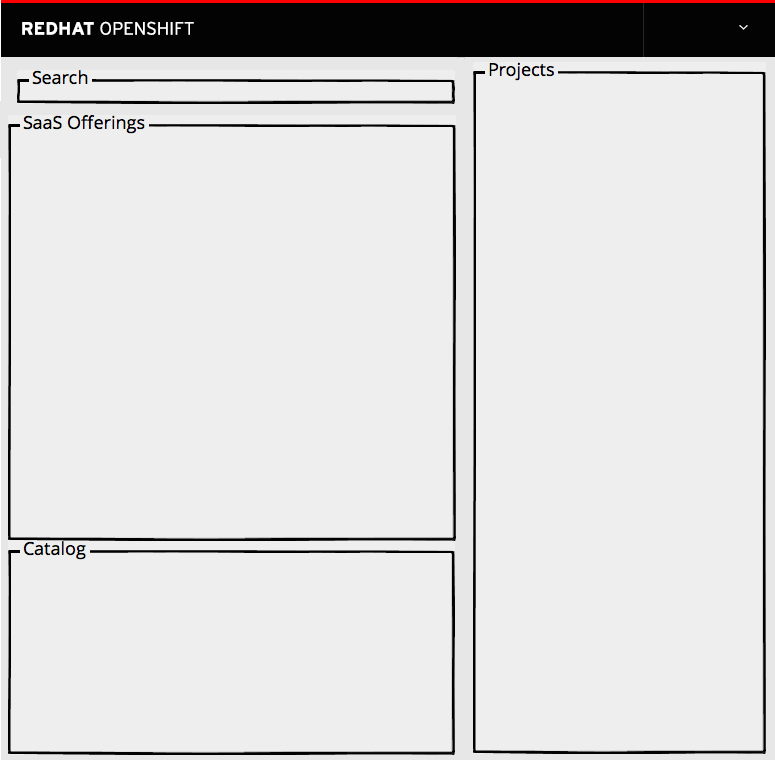
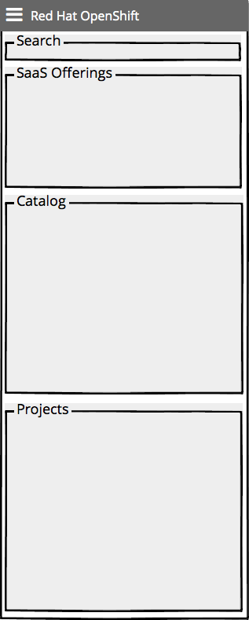

# Homepage

- This page is the first thing that a user encounters after signing in to the web console.
- It provides quick access to the various sections of the web console and serves as a landing page for users.
- This page has a default background image, but customers are able to override this image if desired.
- To account for any issues with the background image loading, there should be a default background color for the SaaS offerings area. The default background is: #3ca2c9

- The Web Console home page has five major sections
	- [Masthead](../patterns/masthead.md)
	- [Search and Filter](./search-filter.md)
	- [SaaS Offerings](./offerings.md)
	- [Catalog](./catalog.md)
	- [Project Panel](./project-panel.md)

## Responsive Designs

- As the page gets narrower, the projects column should remain the same width.
- The SaaS Offerings and Catalog sections may change size to fit the screen.

- On very small screens, the Projects sections should move below the other two sections.
- A hamburger menu should appear in the top left corner to account for the actions/options in the masthead.

