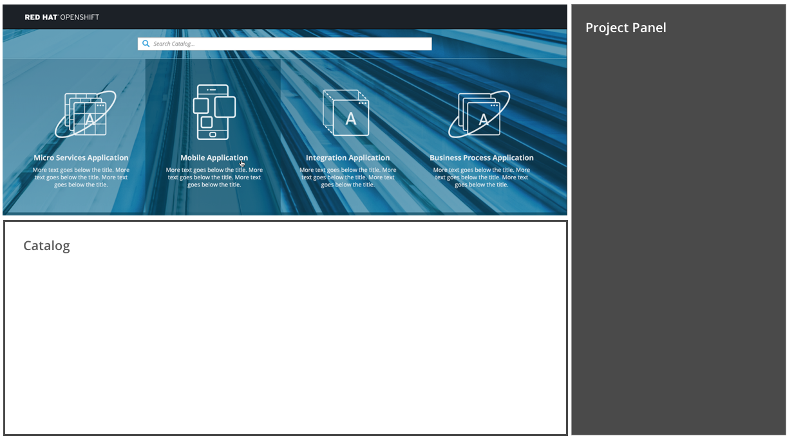
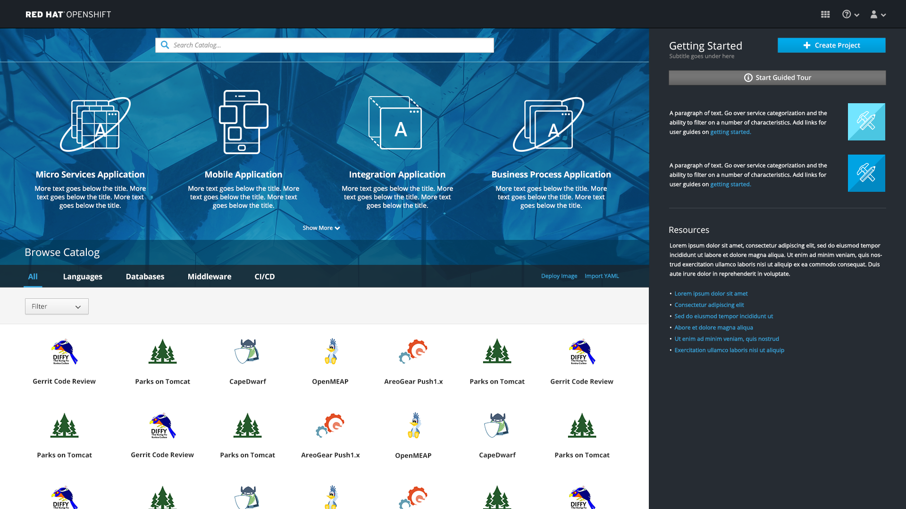
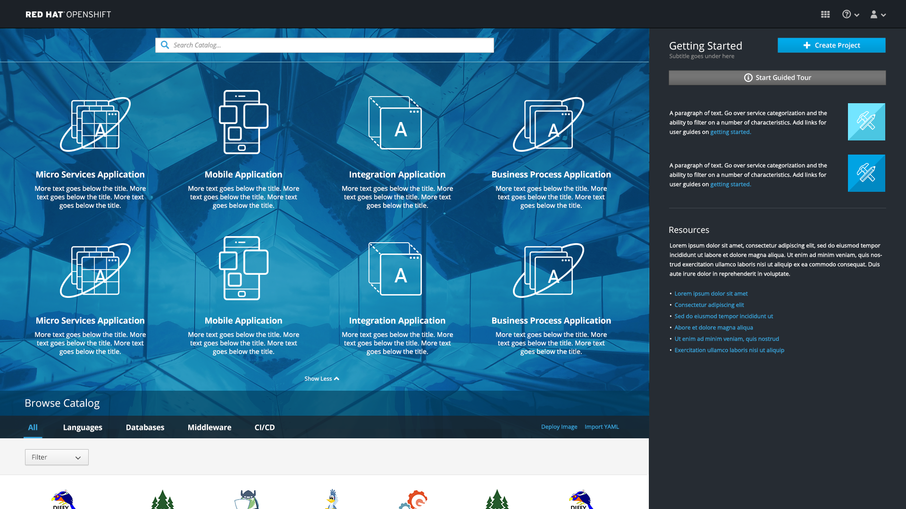

# SaaS Offerings

- SaaS Offerings are found at the top of the web console homepage on top of the blue background image.
- The SaaS Offerings section enables users to quickly launch services to help them build specific types of applications.

## Launch an offering

- Users may click on an offering to launch the associated service in another tab.

- On initial load, we will never show more than a single row of SaaS offerings (at most show 4 per row on largest screen sizes). Regardless of the screen resolution, the SaaS offerings should never wrap.
- Instead of wrapping, when a second row is needed, an arrow icon (fa-angle-down) with "Show More" text should be added to the bottom of the SaaS area, allowing users to expand to see the FULL set of offerings.

- The mouse pointer should change when hovering over the text or arrow.
- **Note:** In the expanded state, offerings should be left-aligned.

- In the expanded state, the arrow icon (fa-angle-up) should be used, giving the opportunity to collapse this section back to a single row. The text should read "Show Less" with this angle up arrow.   
- In the expanded state, the entire page will scroll if necessary. There will not be a separate scrollbar inside the SaaS area.

#### Implementation Details
- To account for any issues with the background image loading, there should be a default background color for the SaaS offerings area. The default background is: #3ca2c9
- It is possible that this section may be disabled for a given user, or have entries added/removed as determined by administrators.
- **Note:** The mockup shows four items but for MVP, there may only be one or two offerings available. The offerings should be centered on the page.
- For MVP, offerings do not appear as search results.
- Offering descriptions will be hidden in the mobile view of this section.

## Responsive designs

- As the screen narrows, Saas Offerings should drop the descriptions and shrink the size of the icon and text.

- The same treatment should be used on mobile when more than one row of SaaS offerings are available (greater than 2).
- Once more than two offerings exist, the down arrow with appear at the bottom allowing users to expand the section.
