# Project Panel
- The project panel should cover the right side of the homepage when viewing on a standard desktop screen.
- **NOTE:** In the future the panel size and location may be configurable by the user.

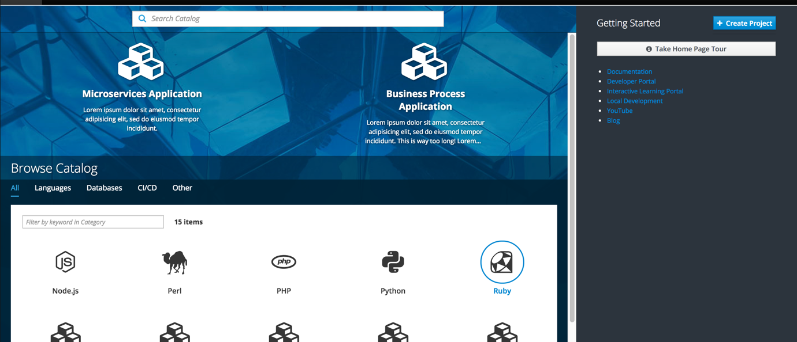
- Brand new users will not have any projects upon initial login so the "Getting Started" label will move up to the top with the Create Project button to the right.
- The Guided Tour button and and other Resources will be displayed below.

## My Projects

### Create Project
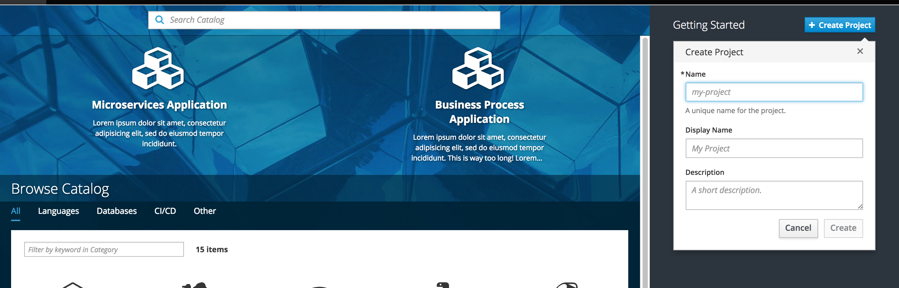
- **Primary Action Button** (optional): The Create project button is displayed by default and will open the new project panel. This button can be optionally hidden or customized. Admin users can provide a custom label and URL to open a new browser instead of the default project panel.
- The default create project button will open an overlay panel with a three-field form inside.
- Once the user has at least one project created, the "My Projects" section will appear at the top of the panel, moving the "Getting Started" section down. The Create Project button (if being used) will remain in the top right corner.

### Project List
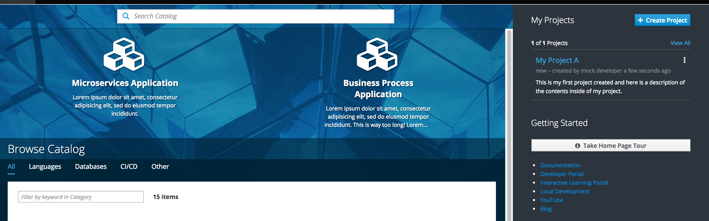

- Once created, the project will be listed at the top of the projects list.
- **Kebab Actions:** There are three actions under the kebab menu for projects: edit membership, edit project and delete project.
	- These actions should function as they currently behave today.
	- The delete action opens a confirmation modal
	- The edit action will function similar to the create function.
	- The membership action will navigate to another page.
- Any new projects will be added to the top of the project list.
- Clicking a project will bring the user directly to the project overview page for the particular project.

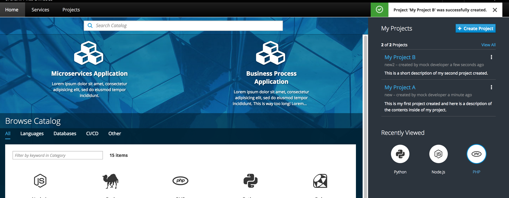

### Getting Started - Guided Tour
- A button labeled "Home Page Tour" should be displayed under the Getting Started heading. The button launches a quick tutorial to identify key sections of the interface. This button can be optionally hidden.
- The guided tour will not auto-start by default, but on premise admins may wish to turn the auto-start option on configure so the tour automatically launches for first time users.
- Users can manually start the guided tour by clicking the button on the right panel.
- Once users have more than one project created, the guided tour button will be hidden from the right panel, but should still be accessible under the help menu in the [Masthead](../patterns/masthead.md).
- Admin users can customize the guided tour by overwriting the title and description for any of the steps included.

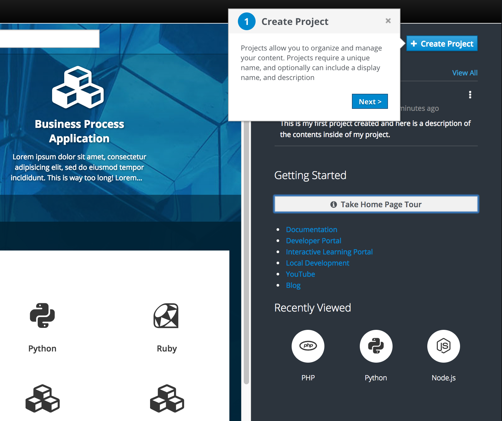

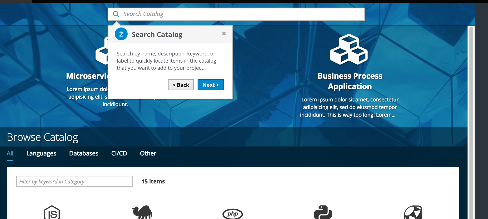

- All steps should include a cancel button. Users can cancel the tour at any time by clicking the x in the top right corner of a step.
- All steps, except for the final one, should include a next button. On the final step, the next button should turn into a "Done" button and will end the tour.
- All steps, except for the first one, should include a back button.
- The current step should point to the corresponding area of the interface.
- If any of the items are hidden from the UI (such as the create project button), the tour should bypass that step and the numbers should update accordingly.
- The default steps include the following:
	1. **Create Project:** Point to the action button on the right panel.
		- Description: Projects allow you to organize and manage your content. Projects require a unique name, and optionally can include a display name, and description.  
	2. **Search Resources:** Point to the search bar.
		- Description: Search by name, description, keyword, or label to quickly locate items in the catalog that you want to add to your project
	3. **Build Applications:** Point to the Red Hat Experience catalog, "What do you want to build" section.
		- Description: Build applications from a quickstart or popular framework.
	4. **Browse Catalog:** Select and point to the "All" category in the catalog.
		- Description: If you don’t know exactly what you are looking for, you can browse all available catalog items under the first tab in the catalog.
	5. **Browse by Category:** A secondary level of categorization is available to further narrow your search.
	Filter Catalog.
	6. **Filter Resources:** Open the filter panel and point to the dropdown.
		- Description: TBD
	7. **Configure a Resource:** Open the ordering panel for the first catalog item and point to this overlay panel.
		- Description: Clicking on a catalog item will open a panel allowing you to configure and create within a project.
	8. **Additional Help:** Point to the Resources section on the right panel.
		- Description: Additional resources can be found here or you can always access the help icon in the masthead for more information.
- Low Fidelity Prototype: https://redhat.invisionapp.com/share/6ZAVH8RHW

### Resource Links
- A list of resource links should be listed as bullets under the guided tour button.
- Resource links are customizable as on premise admins may wish to include different labels and URLs.
- Link labels and URLs include the following:
	- Documentation - reference "window.OPENSHIFT_CONSTANTS.HELP" from the help menu link to pull the correct version of docs
	- Developer Portal - https://developers.openshift.com/
	- Interactive Learning Portal -  https://openshift.katacoda.com/
	- Local Development -  https://www.openshift.org/minishift/
	- YouTube - https://www.youtube.com/user/rhopenshift
	- Blog - https://blog.openshift.com
- Resource links should be removed from the right panel at the same time the guided tour is removed (when more than one project exists).
- Resources should be accessible from the help menu in the [Masthead](../patterns/masthead.md).

### Recently Viewed
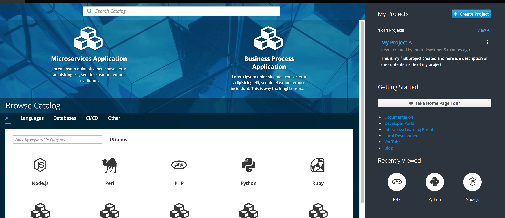
- Once the user has viewed at least one item in the catalog, a "Recently Viewed" section will appear at the bottom of the panel.
- The most recently viewed item will appear as the left most item in the row.
- Recently Viewed items should visually match the way they are represented in the catalog with a name and icon. They should also have the same hover treatment as they do inside the catalog.
- Recently viewed items should be left aligned when they do not take up the entire row across.
- Clicking on a catalog item from the recently viewed section will open the Overlay Panel for ordering.

### Projects List (More than 2)
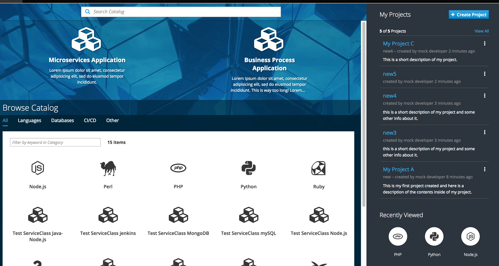
- New projects will appear at the top of the list.
- Show up to 5 projects on this page (based on the most recently accessed).
- At the top of the list, include a count (the number shown out of the total) along with a "view all" link to navigate to the full projects page.
- At any time, users can navigate to a full projects page via the "View All" link on the homepage or by clicking on the "My Projects" heading.

### Implementation Details
- The **Guided Tour** will use the [Hopscotch framework](http://linkedin.github.io/hopscotch/)
- There is an existing controller and form for the **create project** action already.  We should refactor into a component and move to the common repo so it is available to both console and catalog.
- **Kebab Actions** The edit membership action currently exist today for projects and take the user to a new page. For the initial release, this functionality should remain the same. For the delete and edit, these actions will be implemented to function in context as described in the documentation above.

## Responsive Behavior/ Mobile View
- On a mobile device, the right panel should disappear and move to the bottom of the screen, below the catalog content.

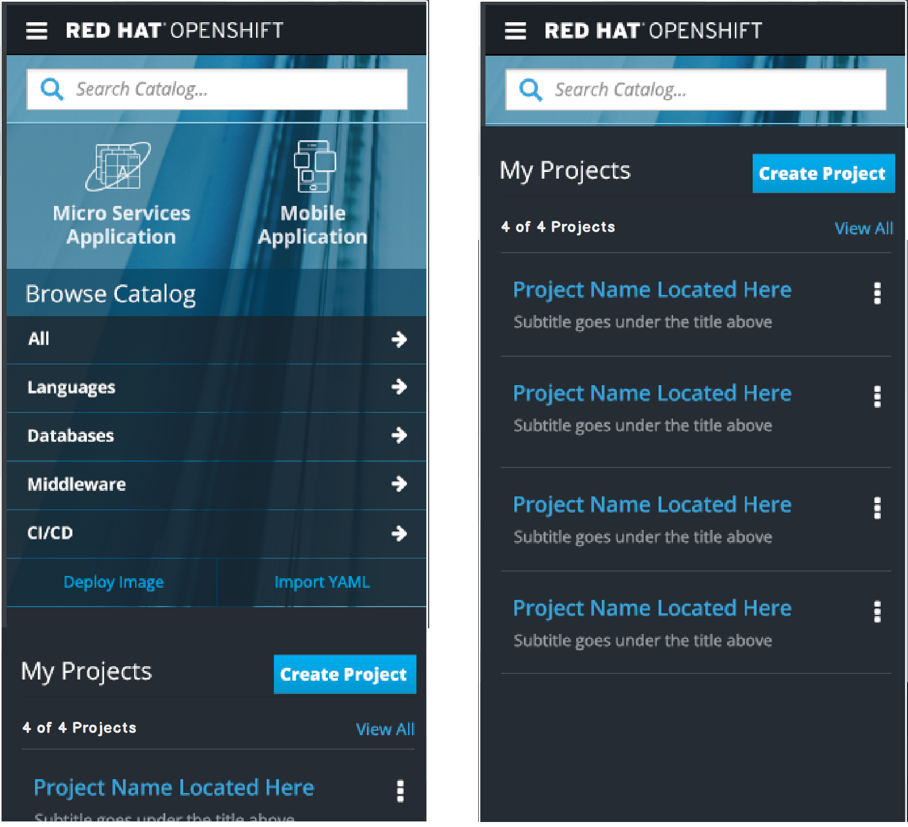
- Selecting View All will display the full projects lists on a new screen with the back button available.
- Selecting create project will show a full screen with the form and two action buttons, cancel and create at the bottom.

### Customer Feedback (if applicable)
- TBD

## Future Work - NOT MVP
- Add a "last updated" date to the project cards and sort by most recently updated, not by created date

### Projects - Card View
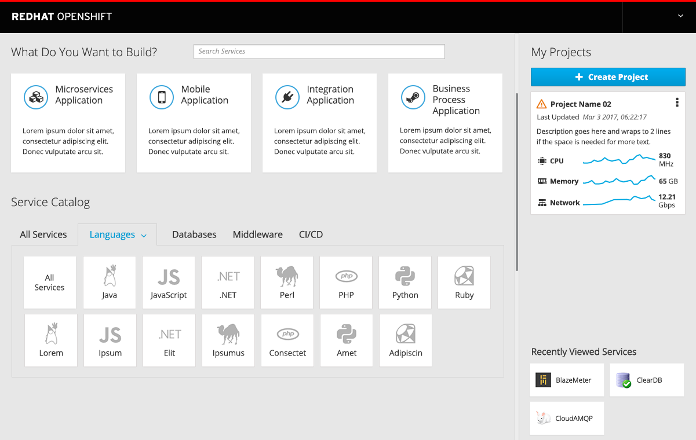
- Once a project has at least one resource, utilization metrics (CPU, Memory and Network) should be added to the project card along with the corresponding trendlines.

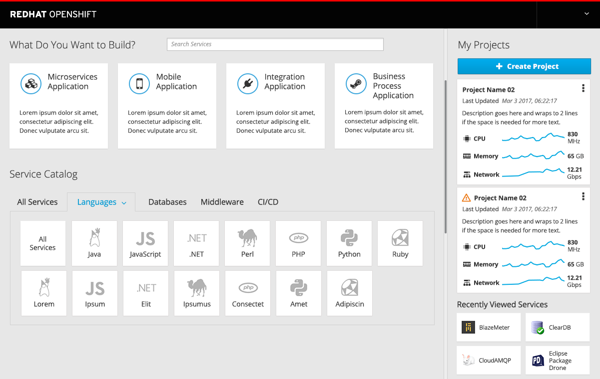
- The utilization metrics should be shown on the project cards as space permits (2 projects max).

### Projects - List View
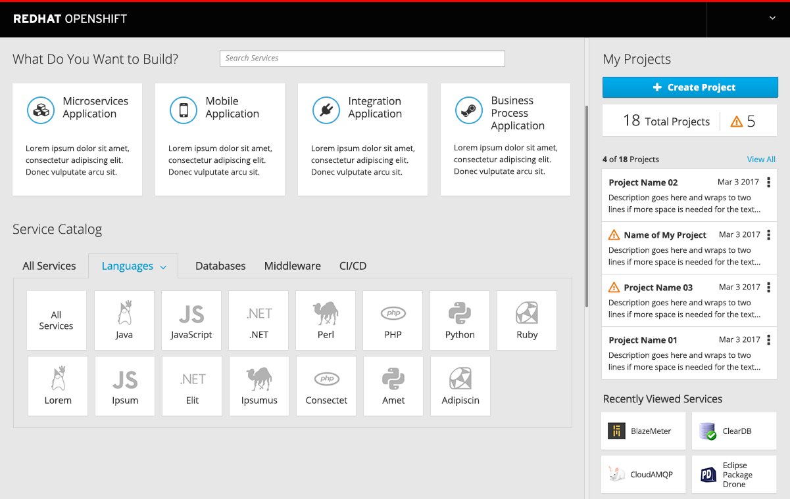
- The Projects view should change to a list to conserve vertical space once there are more than two projects.
- The summary panel should include a summary of warnings and allow direct link access to a filtered list on the projects page.

### Kebab Actions
- TBD

### Project Summary
- TBD
