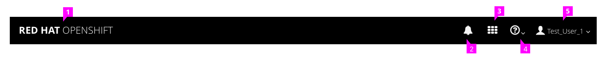
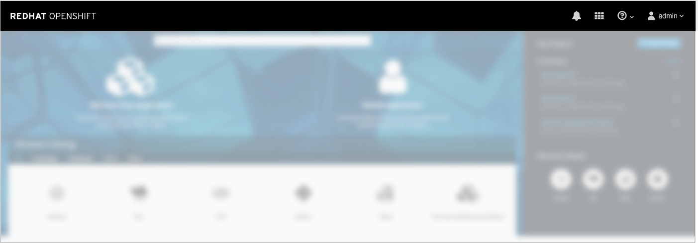
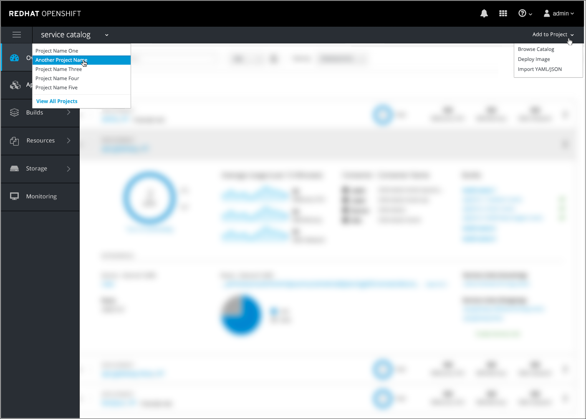
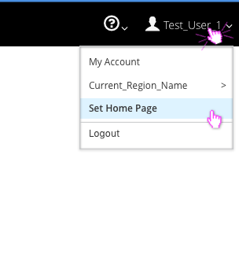
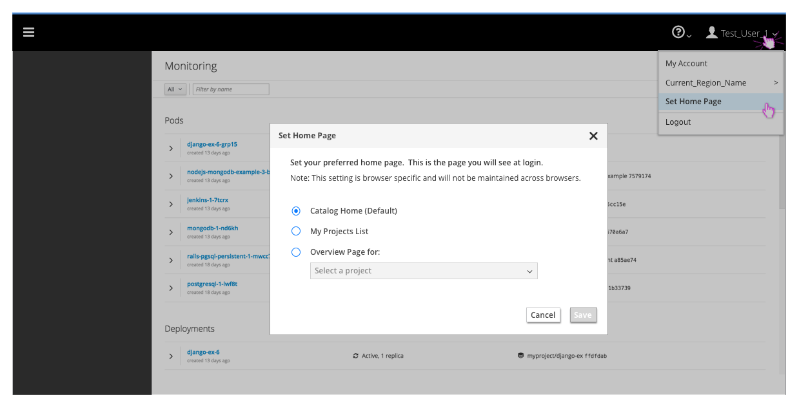
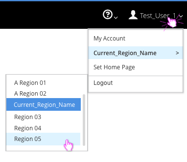
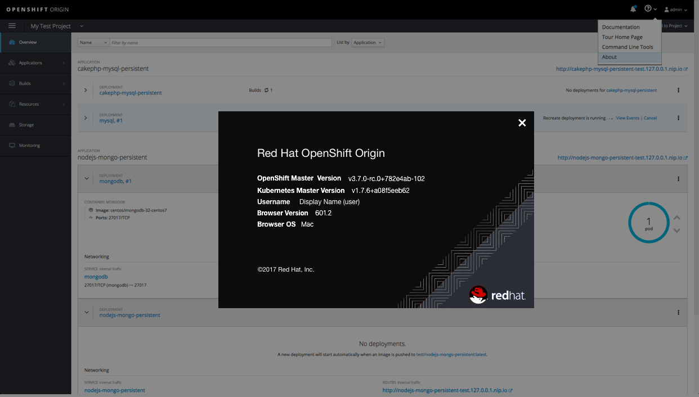
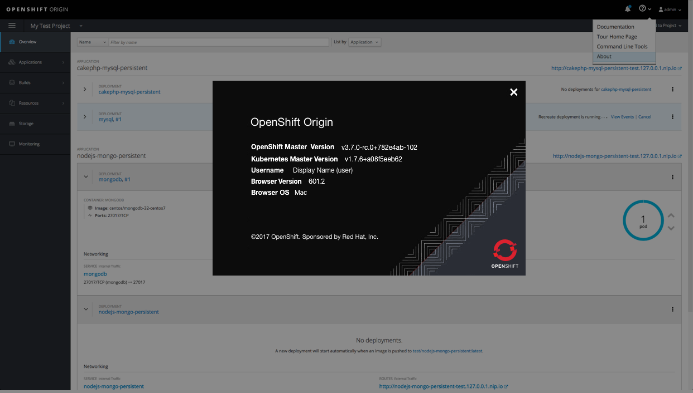

# Masthead

  

The PatternFly [Masthead](http://www.patternfly.org/pattern-library/application-framework/masthead/#/design) design should be followed for the and in this case the masthead should include the following from left to right:
1. **Name and Branding** Red Hat OpenShift or OpenShift Online
1. **Notifications** The [Notification Drawer](./notifications.md) can be accessed through the bell icon in the masthead
1. **Launcher:** Follow the PF [Launcher](http://www.patternfly.org/pattern-library/application-framework/launcher/#/design) pattern, allowing users to switch to another application.
1. **Help:** This menu should include documentation, about, and command line tools, and guided tours.
1. **User:** The username should be listed to the right of the icon. The "Log Out" option should be available in this dropdown menu, as well as any other user settings available (depending on the version) such as "My Account".

**Note:** For full screen widths, the masthead does not include the hamburger menu on the landing page. Once the user navigates to a specific project inside the console, vertical navigation appears and the hamburger menu will show up in the top left corner of the masthead.

## Primary Masthead
  
- On the landing page, the only navigation available is the Primary Masthead.
- The primary masthead should be the standard pf-black #030303

## Secondary Masthead
  
- Once a user navigates to a specific project inside the console, a second horizontal bar will appear below the primary masthead.
- The secondary masthead should meet the following requirements:
	- Height: 40px
	- Color: pf-black-900, #292e34
	- Border: 1px, #030303 (PF Black)
- The secondary masthead includes the following components:
 1. **Hamburger Icon:** In the far left corner the hamburger icon will be available for collapsing and expanding the vertical nav. (This is moved to the primary masthead on mobile).
 2. **Project Switcher:** Next to the hamburger icon is the name of the current project with a caret icon indicating users can switch to another project using the dropdown menu. At the bottom of the menu the "View All Projects" option should be listed as a blue link, taking users to the full projects list. The current project name should be displayed as 16px in Open Sans regular font.
 3. **Quick Add:** On the far right side there is a dropdown labeled "Add to Project" which allows users to either (1)Browse Catalog, (2) Deploy Image or (3) Import YAML. Option (1) will bring users back to the homepage and options (2) and (3) will bring up an overlay panel.

## Implementation Details

### User

#### Set Home Page
- Users will have the ability to view and change their home page. This setting will determine what page will be displayed upon initial login.

- A menu option called "Set Home Page" will be displayed under the user dropdown, underneath the Regions (if present).

- Clicking Set Home Page will launch a modal with the following three options:
	- Catalog Home (Default)
	- My Projects List
	- Project Overview
- The catalog home will be the default selection before a user makes any changes.

- The project overview option will require the user to select the specific project from a dropdown before the Save button will be enabled.
- This saved home page setting will be configured on a per browser, per user basis and will not span across browsers.

#### Regions (OpenShift Online ONLY)
- Users will have the ability to view and change their cluster region.

- For MVP, the cluster region will be listed as a fly-out option under the user menu in the masthead.  
- The current region will be displayed in the dropdown.

### Help
- The guided tour and the resources should always  be accessible under the help menu in the masthead.

- The menu item will be called "Guided Tour" and should come after "documentation" in the dropdown.
- Resources should be below the guided tour in the list and a flyout menu should appear with the 6 links available.
- **Note:** If customers have hidden the resource links from the homepage, they should not be displayed in the masthead either.

#### About
- The About option should be the last item in the help menu.
- Clicking About will open a modal displaying relevant information for the user that is signed in.
- The [About Modal](http://www.patternfly.org/pattern-library/communication/about-modal/) should follow PatternFly standards.
- Both the upstream and downstream versions of the About modal will match the black masthead color and will include the corresponding logo in the bottom right corner.
- **Note:** The top header should display the full product name, for example: OpenShift Origin, OpenShift Container Platform, or OpenShift Online. For the downstream versions, "Red Hat" would be added to the beginning of the product names.

**Downstream Version:**

**Upstream Version:**

### System Alerts (OpenShift Online ONLY)
- If system alerts exist, a warning icon will appear in the masthead as the left-most icon in the group to the left of the notifications bell.
- System alerts pertain to the infrastructure on which OpenShift is running. They are used to communicate system status to online users. (https://status.openshift.com/)
- System alerts are implemented via a javascript config extension point, so users are able to customize their OpenShift instance to override the warning icon and use the space as desired.

## Responsive Designs
- Masthead actions will drop into the hamburger menu with the exception of the system alerts and notification drawer.
- The notification drawer will remain in the top right corner of the UI, with the system alert warning icon to the left of the bell when needed for Online.
- Jump to the [Navigation](./navigation.md) design for details.
