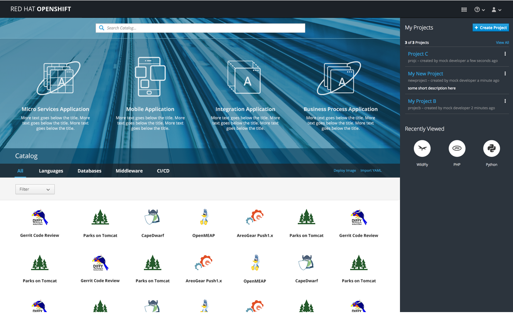
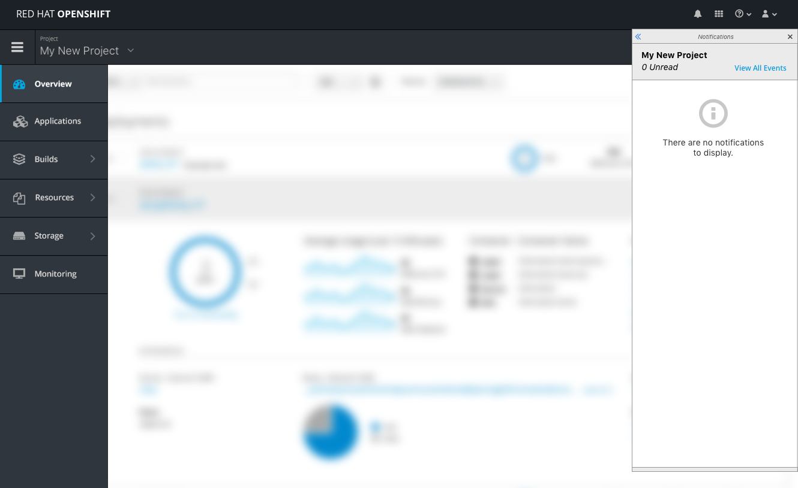
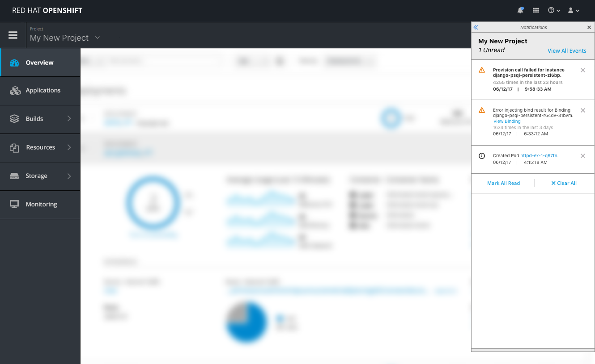
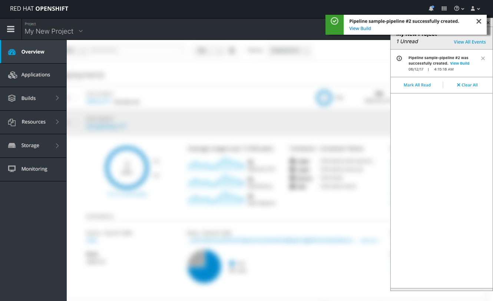
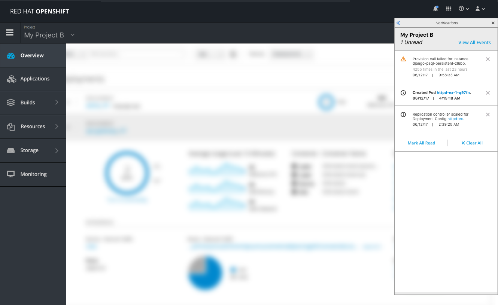
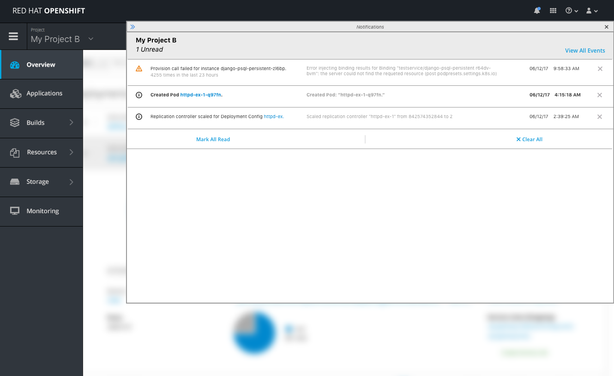

# Notification Drawer

### Homepage

- The notification drawer will not be accessible from the homepage so the bell will be hidden from this view.

### Inside the Console

- Once in the context of a specific project inside the console, the notification drawer will be accessible via the bell icon, in the  [Masthead](./masthead.md).
- The [PatternFly Notification Drawer](http://www.patternfly.org/pattern-library/communication/notification-drawer/) pattern should be applied to this design.
- At the top of the drawer the project name will appear with the number of unread notifications below.
- To the right of the project name will be a link to view all Events which will take the user directly to the 'Monitoring >> Events' full page view.
  - **Note:** A section header with project name and summary information should always be displayed at the top of the drawer and this section will always remain open. The accordion arrow shown in PatternFly should be hidden because there will never be more than one project section displayed at one time.
- The blue badge appears when "unread" notifications exist for the current project.
- Unread notifications are displayed with bold text until they are marked as read
- A notification will be marked as read when a user clicks anywhere on that row in the drawer, clicks on the corresponding toast notification action, or clicks the "Mark All Read" link.

- The notification drawer will be in the empty state when there are no notifications to display for the current project.

#### Events

- Events and toast notifications will show up in the drawer as they occur
- Events can be of two types, either Warnings or Informational.
- Each event will show up as a new row in the drawer with the icon and reason code presented first, followed by the instance kind and name.  
- Below the error/type/name information should be the timestamp info, first showing "x times in x hours" if the event has occurred more than once, followed by the actual time and date information.

- When a user interacts with the actions inside of a toast notification, the message should automatically be marked as read inside the drawer.
- When events expire from the events page, they should also expire from the notification drawer. ("time to live" information should be used here)
- Users can clear notifications individually or by clicking the clear all button to remove all notifications from the drawer of the current project.
- When notifications are cleared from the drawer they should also be cleared from the events page.

#### Switching Projects

- When a user switches to a different project, the drawer should automatically be in the closed state until reopened by the user.
- When opened, the project name and summary at the top of the drawer will reflect the new selected project.
- Notifications will only be shown and tracked for the currently selected project inside the console and switching projects is the only way to receive notifications regarding another project.

#### Expand Functionality  

- The user can choose to expand/ collapse the drawer to see more details as needed.
- When in the expanded state, the full message should be displayed as is the case in the expanded state of the event details page.
