# Ordering Experience

The catalog will include builder images, templates and items from the Broker API.  This experience allows the user to remain in context, by using the overlay panel.

## Design
- Upon clicking on an item in the catalog, the Overlay Panel Component will be used to generate a guided experience.  
- The guided overlay panel has 3 main areas: top panel, content panel & button panel

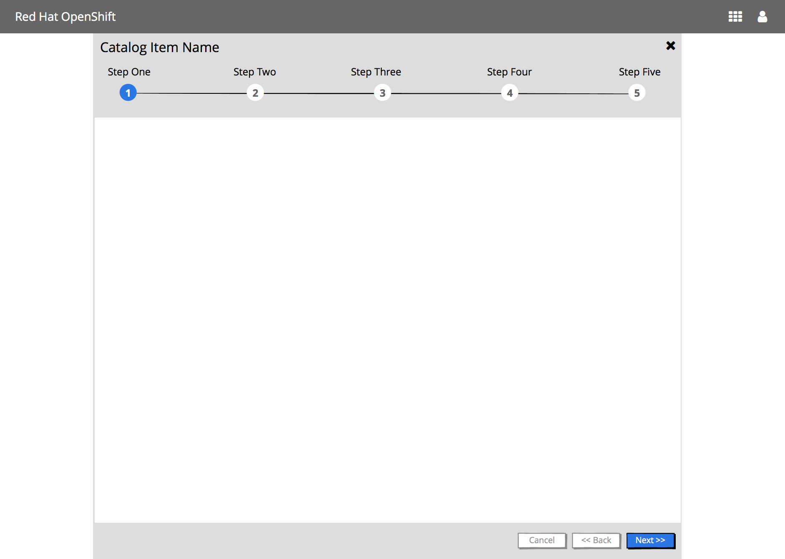

### Top Panel
- The Catalog Item Name is displayed as the title of the overlay panel
- The main steps of the wizard are shown under the title
- This panel “sticky”, thus if the content panel scrolls, the top panel will not

#### Steps Visualization when there are 5 or less steps
- All step numbers and associated step names are shown
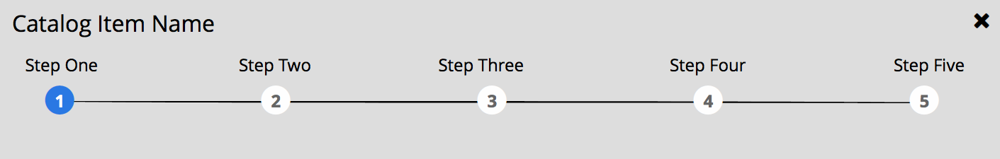

#### Steps Visualization when there are 6 plus steps
- All step numbers are shown
- Only the current step name is shown

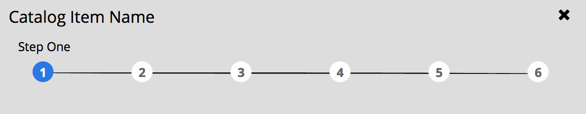

#### Steps Visualization - Mobile :iphone:
- Only the current step number & name are shown
	

### Content Panel

The content panel displays the content of the steps.
This panel displays a vertical scroll as needed.

### Button Panel

The button panel includes navigation buttons: Cancel, Back and Next/Create/Close.  
- The Back button should always be enabled except for the first step.
- The Next button should become enabled once all required information has been entered for the current step and/or sub-step. The Next button will move the user through any sub-steps before it moves the user to the next main step. The Back button will also behave the same way.  

## Possible Steps
The following steps may be part of the this process:
1. Information
1. Plan (optional)
1. Configuration
1. Bind (optional)
1. Parameters (optional)
1. Results

### 1 - Information Step

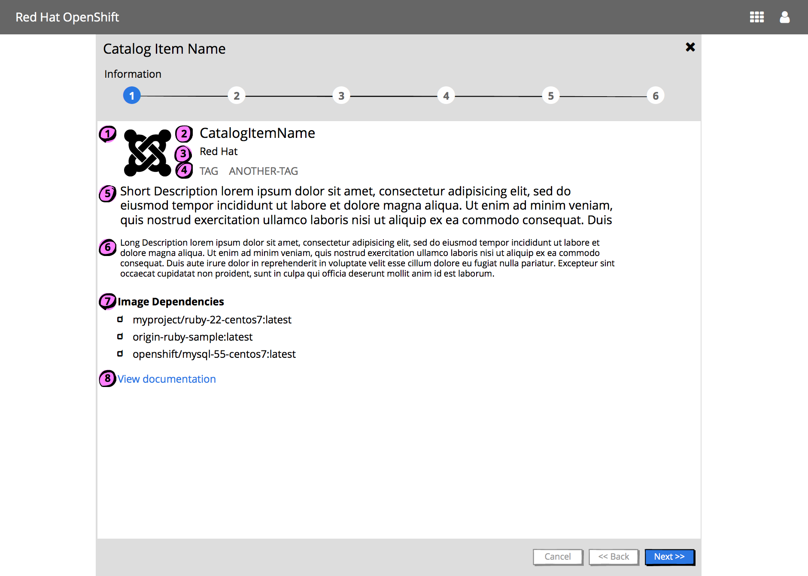

1. Catalog Item Icon
	- metadata.imageURL from [OpenServiceBroker Service Metadata](https://github.com/openservicebrokerapi/servicebroker/blob/master/profile.md#service-metadata-fields)
1. Catalog Item Name
	- metadata.displayName from [OpenServiceBroker Service Metadata](https://github.com/openservicebrokerapi/servicebroker/blob/master/profile.md#service-metadata-fields)
1. Provider (Optional)
	- metadata.providerDisplayName from [OpenServiceBroker Service Metadata](https://github.com/openservicebrokerapi/servicebroker/blob/master/profile.md#service-metadata-fields)
1. List of tags (Optional)
1. Short description (Optional)
1. Long description (Optional)
	- metadata.longDescription from [OpenServiceBroker Service Metadata](https://github.com/openservicebrokerapi/servicebroker/blob/master/profile.md#service-metadata-fields)
1. Image dependencies : Includes an **Image Dependencies** title following by a list of dependencies.  Each image name is preceded by an image icon (note the PF icon)
1. **View documentation** link which will open a new browser/tab linking to the Documentation URL (Optional)
	- metadata.documentationUrl from [OpenServiceBroker Service Metadata](https://github.com/openservicebrokerapi/servicebroker/blob/master/profile.md#service-metadata-fields)

### 2 - Plan Step (Optional)
This step should be shown if there are 1+ plans.

#### Single Plan
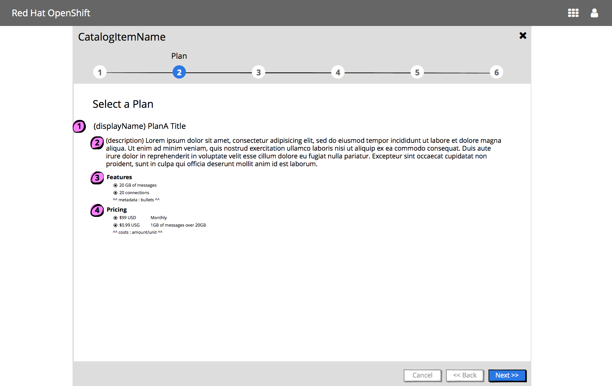

For each plan, display:
1. Plan title
	- metadata.displayName from [Plan Metadata Fields](https://github.com/openservicebrokerapi/servicebroker/blob/master/profile.md#plan-metadata-fields)
1. Optional description
1. Features
	- if the plan has 1+ features, show a **Features** title following by a list of features
	- metadata.bullets from [Plan Metadata Fields](https://github.com/openservicebrokerapi/servicebroker/blob/master/profile.md#plan-metadata-fields)
1. Pricing
	- if the plan has 1+ pricing options, show a **Pricing** title following by a list of costs
	- amount from [Cost Object of the Plan Metadata Fields](https://github.com/openservicebrokerapi/servicebroker/blob/master/profile.md#plan-metadata-fields)
	- unit from [Cost Object of the Plan Metadata Fields](https://github.com/openservicebrokerapi/servicebroker/blob/master/profile.md#plan-metadata-fields)

- Buttons associated with this step
	- Cancel, Back & Next buttons should be displayed & enabled

#### Multiple Plans

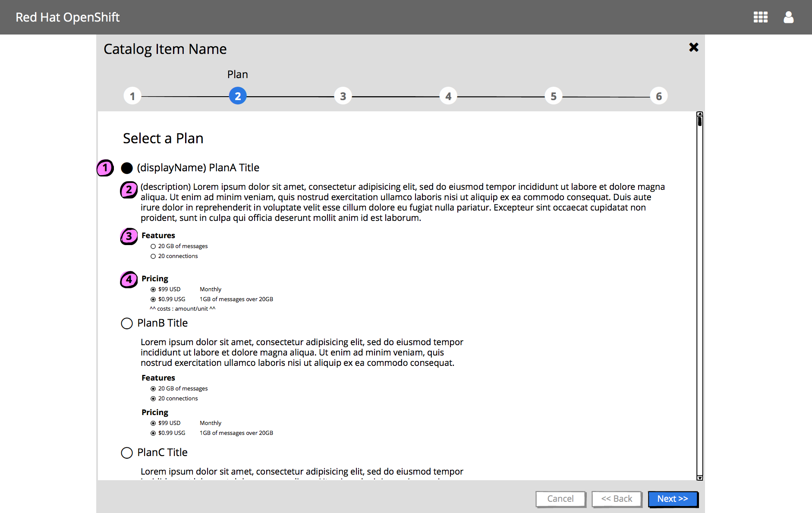
- Each plan should be presented as a radio button option, by the plan title.  
- The first plan should be selected by default.

### 3 - Configuration Step

#### Implementation Details
- This step is mandatory
- Content panel includes:
	- Optional version selection
		- Include a Version list if there are multiple versions
	- “Add to Project” selection
		- “Add to Project” list includes the existing projects the user has access to
		- “Create Project”
			- "Create Project" should be added to the top of the list, unless it has been turned off on prem
			- Clicking “Create Project” will add additional input widgets to gather necessary information to create the project in context
	- Configuration options
		- Field level validation
			- Should be available for builder images
			- Will not be supported for items from the catalog API
		- Mandatory fields should be indicated with an asterisk
	- Optional "Show Advanced Options" link
		- Available for some builder images
	- Vertical scroll bar is displayed as needed
- Buttons associated with this step
	- Cancel, Back & Create buttons should be displayed
	- Cancel should always be enabled
	- Back should be enabled IF there is a previous Plan step
	- Create should be disabled until all mandatory fields have been input

#### Form Layout
- Labels are displayed before the input widget
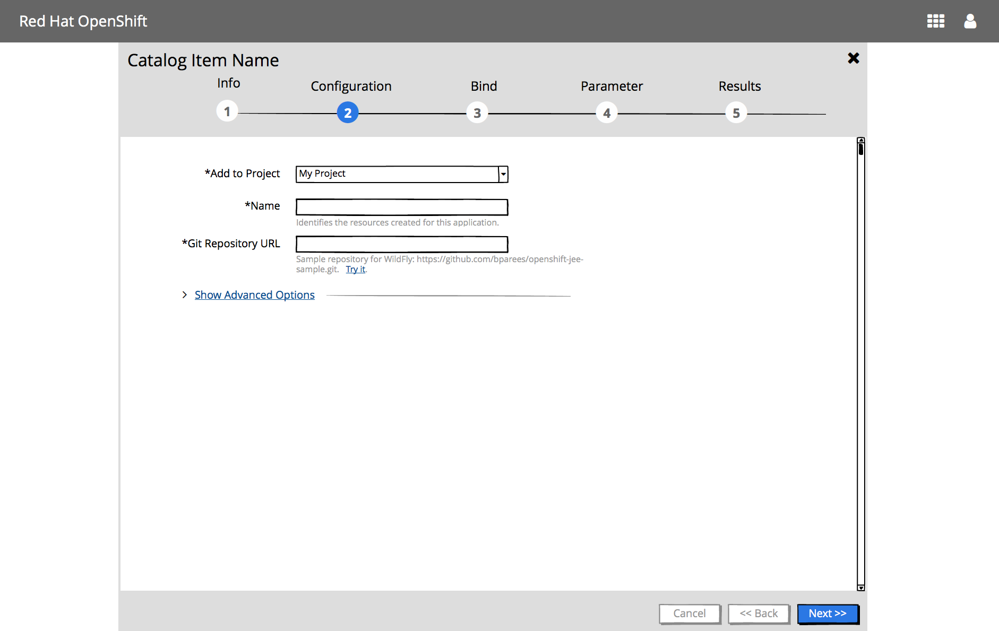

#### Form Layout - Mobile :iphone:
- On mobile displays, labels are displayed above the input widgets

	

#### Catalog item shows advanced options
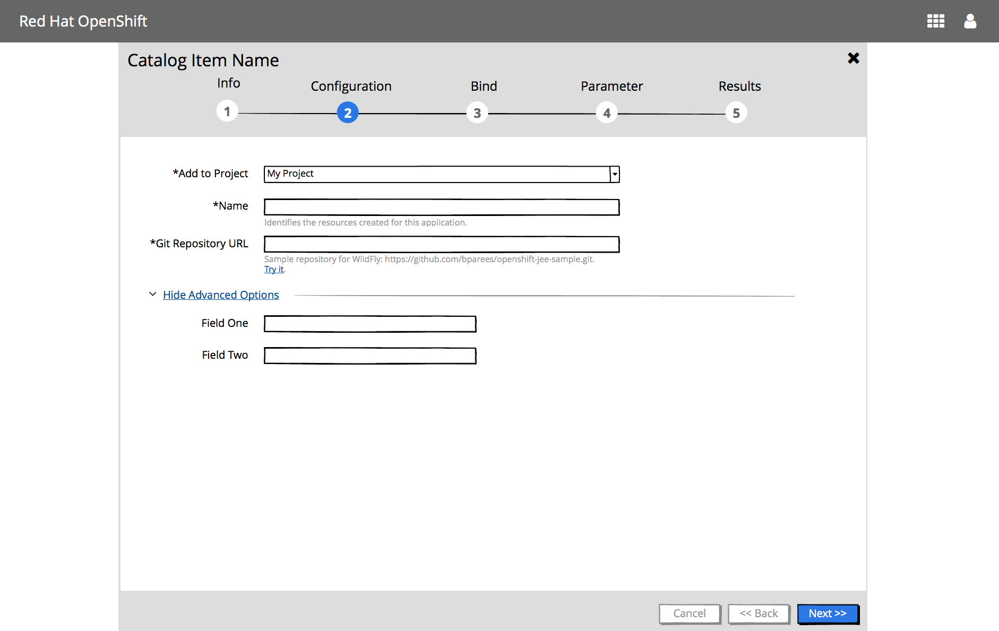

#### User views available projects in context of this flow
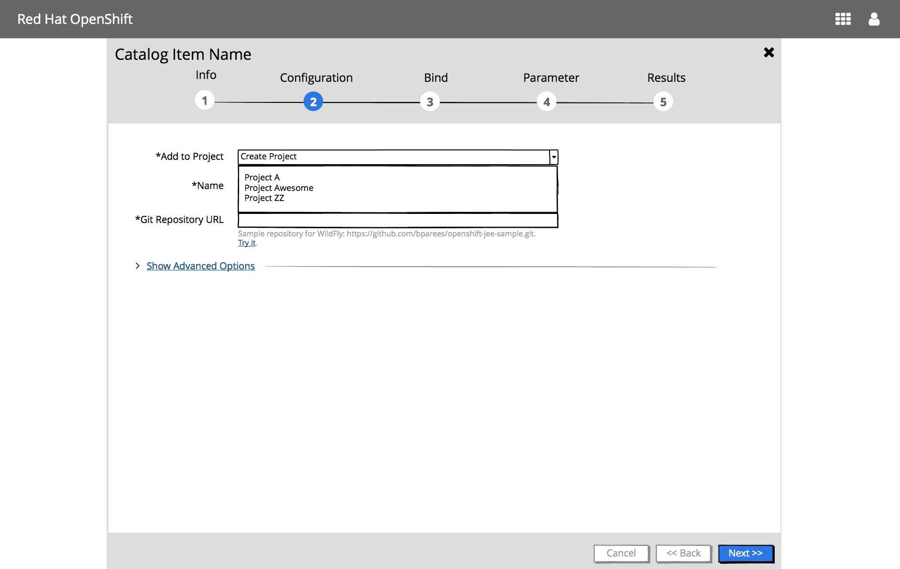

#### User creates a new project in context of this flow
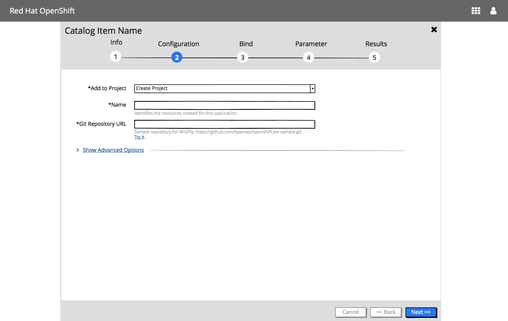

### 4 - Bind Step (Optional)
This step is only valid if the selected project is not new / has items that can be bound to.
Automatically show this step if the service/image is bindable.

### 5 - Parameters Step (Optional & Future)

### 6 - Results Step

See [Wizard Results documentation](./wizard-results.md)

#### Expanded Log Section
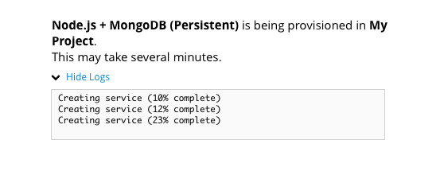

#### Request has been submitted, and is in progress
	** Missing mock **

#### User views build logs
	** Missing mock **

#### Completed with errors
	** Missing mock **

#### Completed successfully
	** Missing mock **

#### Implementation Details
- This step is mandatory
- Content panel includes:
	- Results In Progress or Completed
	- Link to View build logs
	- If completed, include View Project action
- Buttons associated with this step
	- Cancel, Back & Create buttons should be displayed
	- Cancel should always be enabled
	- Back should be enabled IF there is a previous Plan step
	- Create should be enabled IF all mandatory fields have been input

## Future Considerations

### Review Panel
Should we have a Review panel which then has the action button and then the content will turn to the Results & Create turns to Close?

### Field Level Help versus Field Hints
- For now, we will leave the same as currently implemented (field hints)
- Question as to whether we go with Option A (less cluttered & cleaner) or Option B (user sees field level hints up front).

#### OptionA
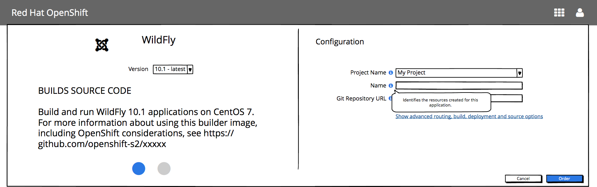
- Upside: Less cluttered, cleaner.  
- Downside: More work for the user if they need to get help on multiple fields

#### OptionB
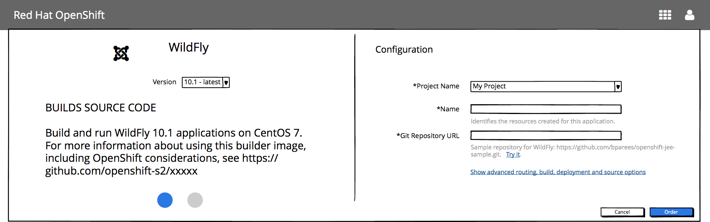
- Upside: User sees field level hints upfront
- Downside: More cluttered, distracting.  We (UX) doesn’t control this help information, it’ll be returned from the API so hard to control what is here.
