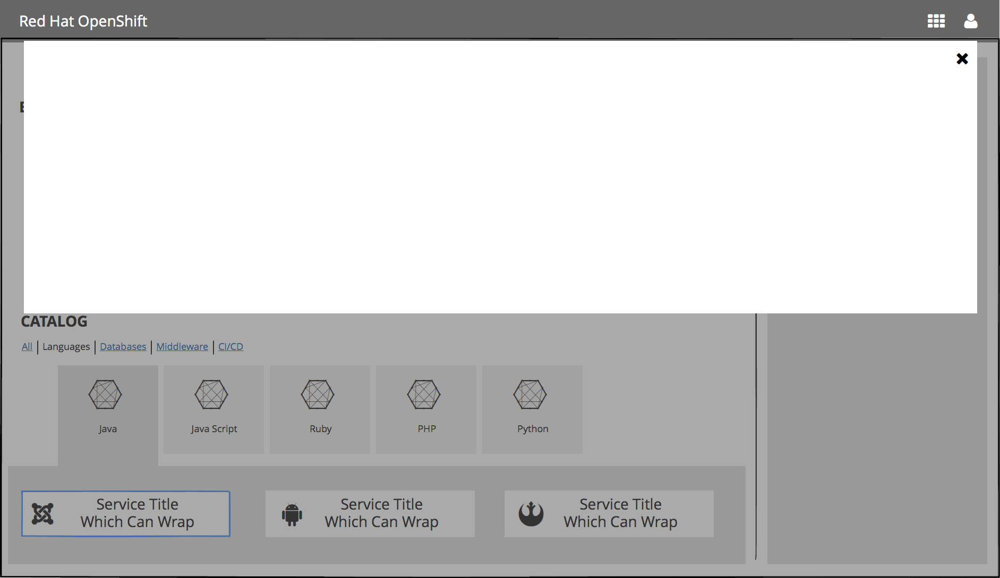
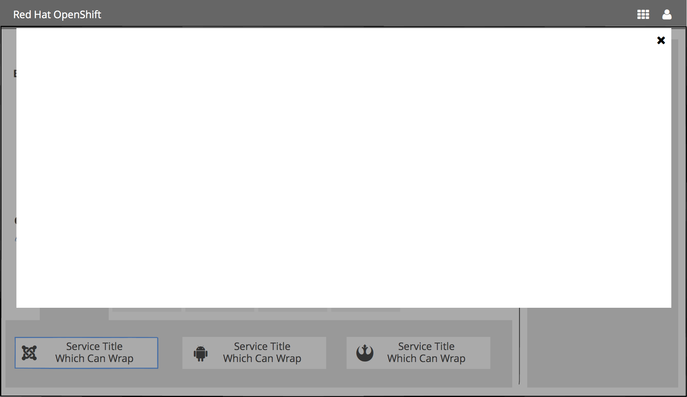

# Overlay Panel Pattern

## Overview

The overlay panel is a common component which will be used in multiple areas in the OpenShift Web Console.

## Who will use this?
- Ordering Experience
Selecting an item from the Catalog Browser will present a flow in the overlay panel
- Selecting an item from the Catalog Search results from the landing page
- Selecting an item from the Catalog Search results from within a project
- Import YAML in context (from within a project)
- Bind in context (from within a project)
- Deploy  Image in context (from within a project)

## Implementation Details
- Panel has 2 height options
- Panel should have a close button in the top right corner
- Panel should have a maximum width and should be centered
- Panel transitions down from the masthead when opening
When the panel is open, the rest of the UI should not be accessible (behaves like a modal)
- Scrolling should not be handled by this component since there are different layout options.


## Design

### Width
- Width of the overlay shouldn’t be full browser width ( maybe 20-30 px margin on left/right ) with a maximum of 1200px

### Height
- Regular Height

- Long Panel

