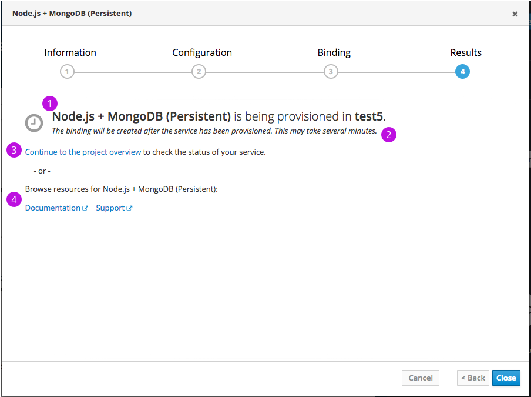
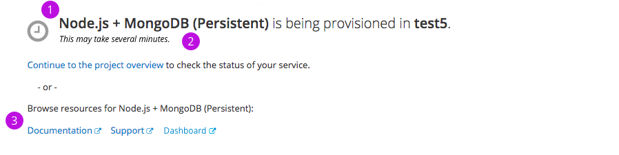
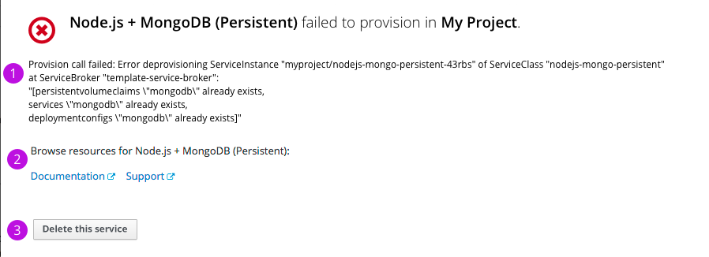
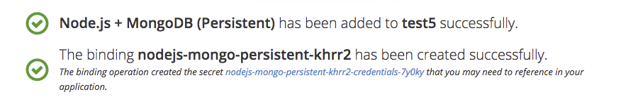
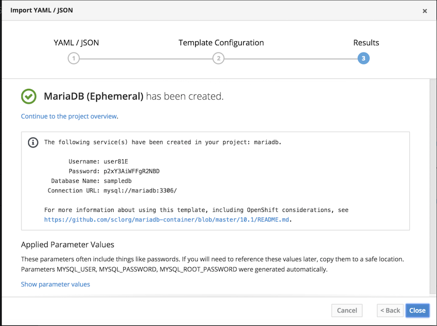
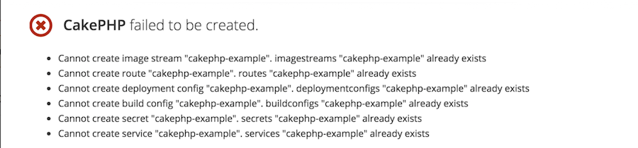
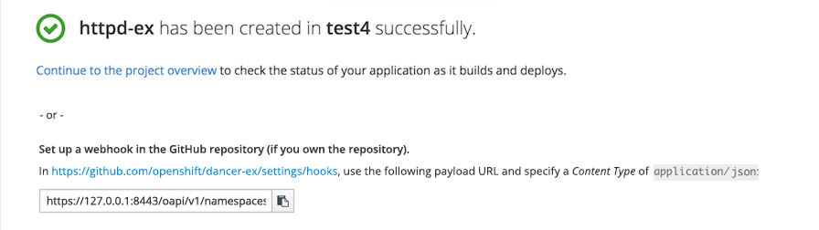
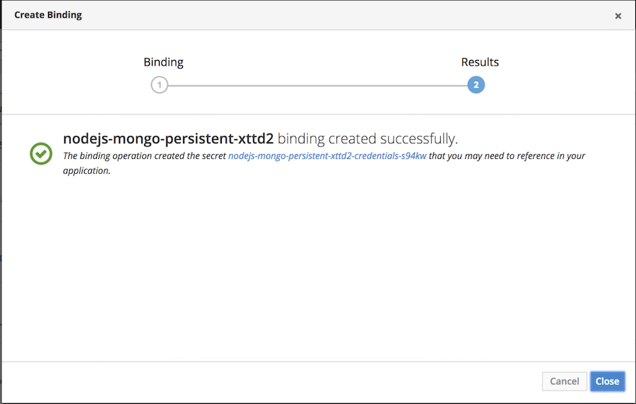

# Wizard Results

The results step for the "add to projects" wizards should follow a consistent format while supporting the unique needs of the various methods by which users may add resources to their projects. The experience should be similar, even if the types of information to be displayed is different.

## Design

1. A status icon followed by the status. The status should call out the resource being created by name and if the action is initiated from outside of a project, the project name should be included as well.
  - Status icons
    - `fa-clock-o` for provisioning
    - `pficon-ok` for success
    - `pficon-error-circle-o` for failure
1. Additional details about the status, such as error messages, additional actions to be performed or estimates for how long the operation may take.
1. An action to take users to the overview of the project that the operation affects.
1. Other information specific to the type of operation, for example, template messages, applied parameters, documentation, etc.

## Implementation details

### Provisioned Services Without Bindings

1. When a provision is in progress, the status should read "X is being provisioned in Y Project" where X is the Service Class Display Name. Other statuses should read similarly: "...has been provisioned successfully..." or "...failed to provision..."
1. The UI should give the user an indication of how long the provision may take. If no specific message is provided by the broker, the default should set the user's expectation, but need not be overly specific, for example "This may take several minutes."
  - There is an [issue](https://github.com/openservicebrokerapi/servicebroker/issues/315) open to the Open Service Broker to allow brokers to return a message for async operations before polling. 
1. Links to documentation, support and a dashboard should be provided if those links exist (services may not provide all three items).

If a service failed to provision, users should be given:
1. The relevant error message.
1. Links to service documentation and support information.
1. TODO The ability to delete failed services.

### Provisioned Services With Bindings

- Text underneath the provision status informs the user that bindings are only created after the service has been provisioned.

- Once the service has been provisioned successfully, the status of the binding is updated underneath the completion message for the service.

- If the binding was created successfully, the success message names the bonding object. Explanatory text below includes a link to the secret.

### Templates from Import YAML or Select from Project

- If a template that includes a template message is instantiated, the template message should be rendered in monospace type to preserve the formatting. The template message should be outlined to separate it from the other content.
- An Applied Parameter Values section should follow the template message (if one exists). Automatically generated parameters are listed and all values are available in an expand/collapse section.

- If a template fails, individual errors are enumerated below the status.
- TODO Users should be given the ability to delete any items that were created successfully.
- TODO We should block users from taking an action that we know is going to fail, for example if the template creates one or more resources that already exist in a project.

### Builder Images

- For builder images, generic and GitHub webhooks are generated automatically. Users may set up webhooks on their GitHub repo using the generated payload URL.  
- NOTE: When a user selects the Advanced Options for builders, the configuration and results are NOT in a wizard. The contents of the results page is the same as what would appear in the wizard in that case.

### Binding

- The binding results step includes the same status messages as described previously for [Provisioned Services with bindings](#Provisioned-Services-With-Bindings).
- As this result is only possible within the context of a project, no "Continue to the project overview" action is provided.
