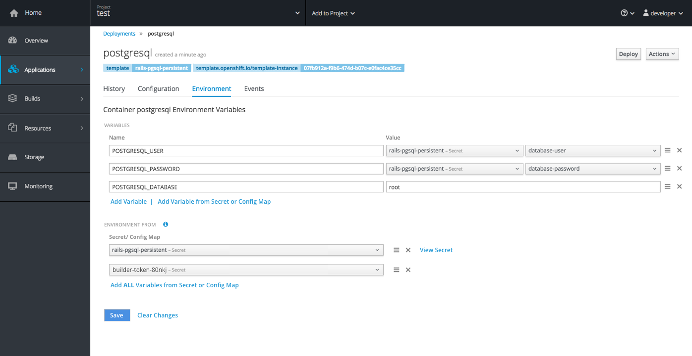
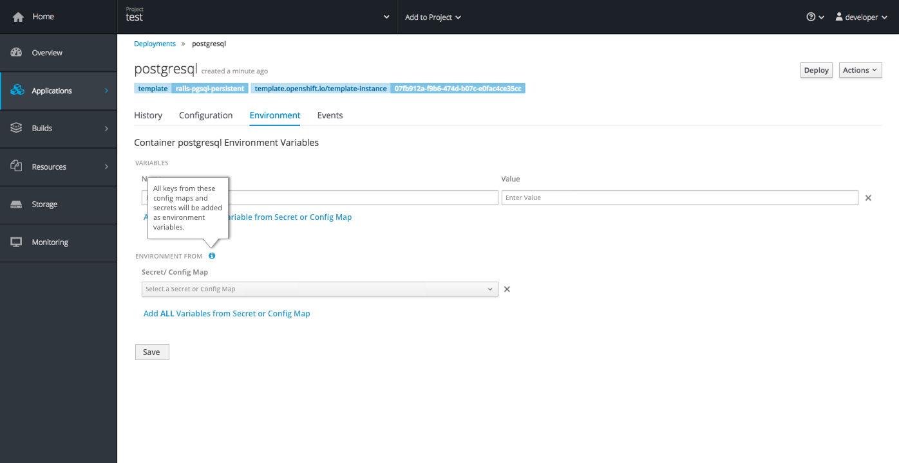
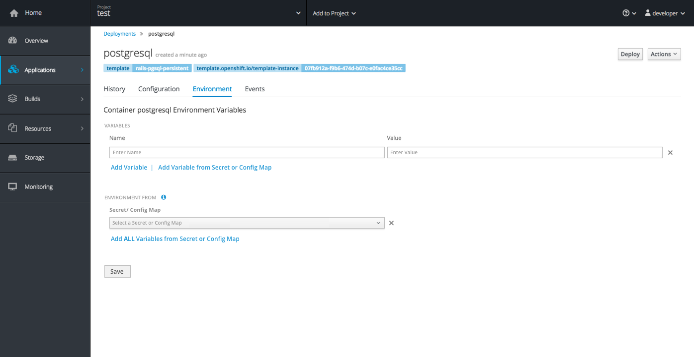
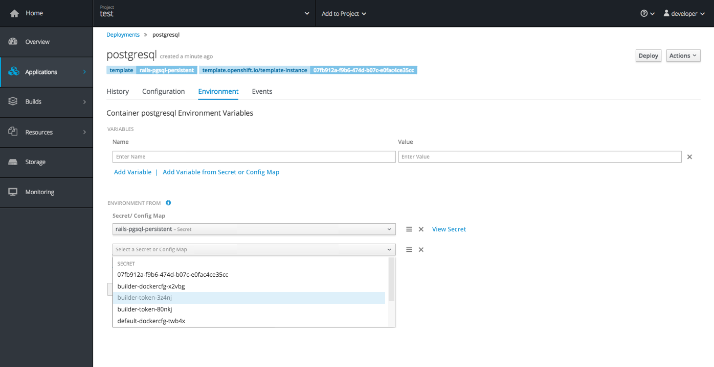

# Deployments: Details Page

- Selecting a deployment from the Deployments landing page or from the Overview will bring the user to the Deployment Details page.
- The details page for Deployments will include four tabs: History, Configuration, Environment, Events.

## History Tab
No change at this time.

## Configuration Tab
No change at this time.

## Environment Tab
 
- This tab will now consist of two parts, (1) the "Variables" section that already existed and (2) the "Environment From" section that is new to the page.
- These grey subheadings will be used to separate the two sections. (10px @ #757575)
- Once any changes have been made in either area, the Save button should become enabled as a primary action button (in blue).

### Variables
- This area allows users to create a single new environment variable or create a single variable by picking one specific key from a secret or config map.
- Order is important and users can sort variables within this section.
- The two action links should be called "Add Variable" and "Add Variable from Secret or Config Map."

### Environment From
- This area allows users to create environment variables by pulling ALL values from a specific Secret or Config Map.
- This list should also display the Secrets or Config Maps that have been added via the "Add to Application" action from a Secret or Config Map detail page.

- There should be a Field Level Help icon to the right of this section header.
  - Clicking the field level help will display the following text: All keys from these config maps and secrets will be added as environment variables.
  - See the [Field Level Help](http://www.patternfly.org/pattern-library/forms-and-controls/field-level-help/) pattern on PatternFly for guidance on implementation.
- The column label should be "Secret/ Config Map," and should match the visual treatment of the "Name" and "Value" labels in the section above.

- The empty state should include one empty row in each of the sections.
- The action at the bottom of this section is called "Add ALL Variables from Secret or Config Map" with the ALL piece in bold font. Clicking this action will add another row below.

- Each row will contain a dropdown allowing users to select a secret or config map from the list (using the same dropdown that appears in the top section)
- Order is important here as well and users can sort variables within this section.
- Once changes have been saved, a "View Secret" link will also appear to the right of each row allowing users to jump directly to the secret details page in the UI.

#### Implementation Details:
- If a variable appears in both the top and bottom lists, the top standalone variable will take precedence over the bottom one (that is part of a secret). When this type of conflict occurs, upon clicking save, a warning notification should be displayed to explain which variable will be accepted.  
- Save should be enabled as a blue primary button once the user has made changes that have not yet been saved. Clear changes should also appear as a link to the right of save.
- **Note:** The new Environment From section is closely tied to the "Add to Application" action found on the Secrets and Config Maps pages. When a user performs the [Add to Application](./add-to-application.md) action, that Secret or Config Map should be displayed in the dropdown and added as a new row under "Environment From."

## Events Tab
No change at this time.
