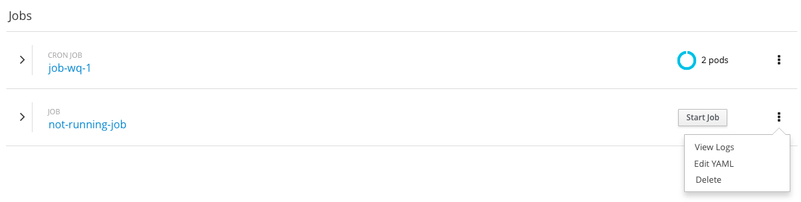
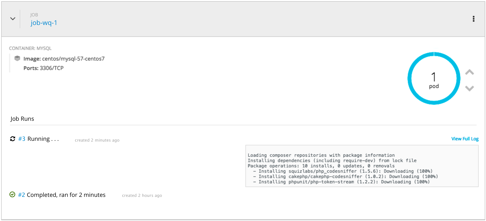
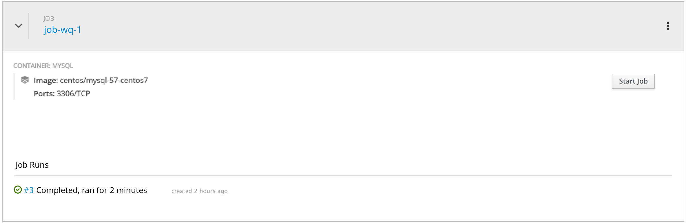
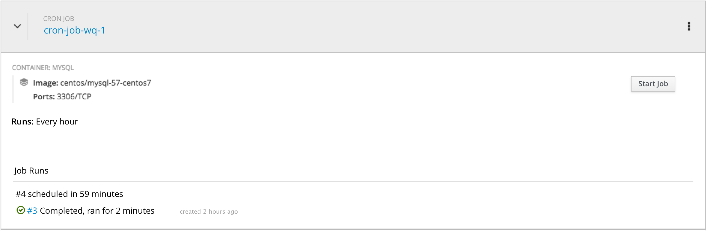
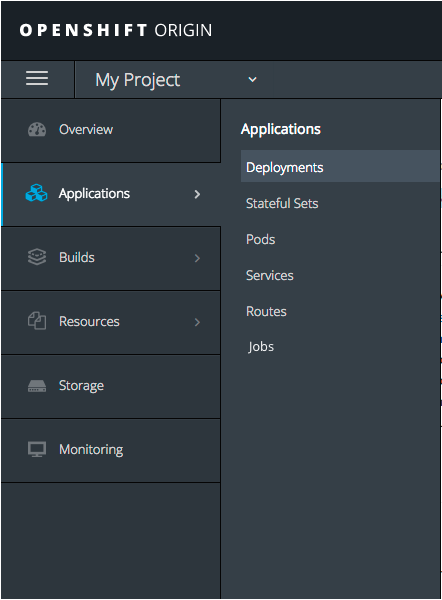
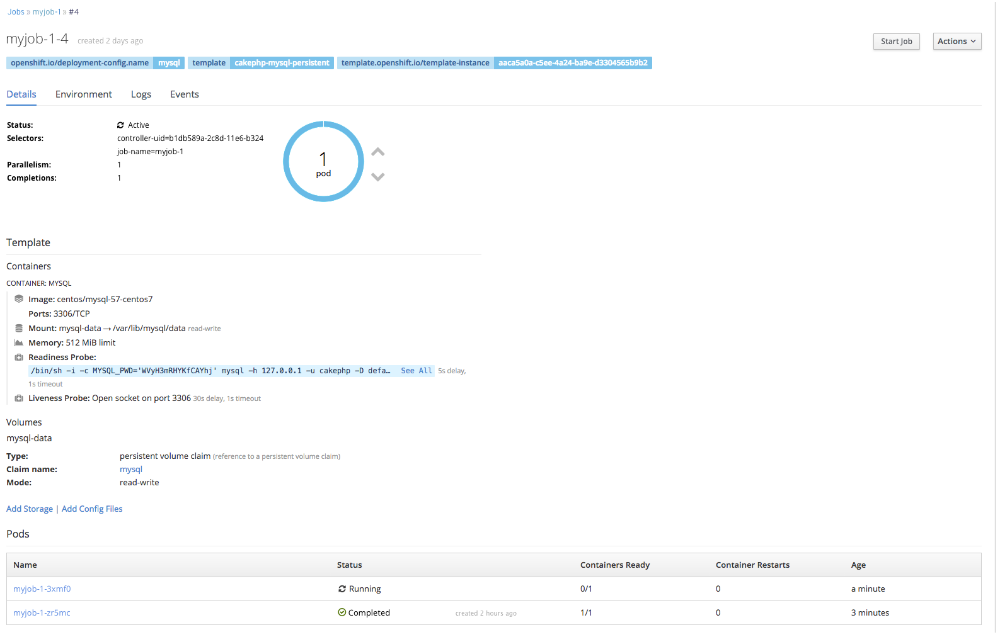

# Jobs

- A Job creates one or more pods which run to completion, i.e. they don't run continuously like deployments.
- A Cron Job extends a regular Job by allowing users to schedule when a job will run.
- This documentation uses "Job" to refer to both Jobs and Cron Jobs, except when Cron Jobs are called out specifically.

## Overview
- Jobs and Cron Jobs would be listed under a "Jobs" heading in the list by Resource Type view of the Overview.
- Jobs and Cron Jobs would be listed under Other Resources in the Application and Pipleine views, unless they are part of an application or pipeline. In that case, they would be grouped with the appropriate application or pipeline.  
- The heading over individual Job names would specify if it is a Job or Cron Job.

### Collapsed State

- Jobs are listed on the Overview page similarly to deployments.
- Currently running jobs have the pod donut donut.
- For Jobs that are not running, the pod donut is replaced by a "Start Job" button which would initiate a job run.
- The kebab includes the following actions: "View Logs", "Edit YAML" and "Delete".

### Expanded State

#### Running

- In the expanded state information about the container would be shown, as with deployments.
- The pod donut is shown and the user is able to scale up and down.
- There is a separate section for "Job Runs"
- Run number and status are shown on the left.
- Status for completed jobs includes the duration.
- Logs for a single running pod are shown in this view similar to builds, with a link to the full logs. If that pod finishes, but the job has other pods that need to run, logs for another pod should be shown.
- Clicking on the run number takes the user to the details page for that job run.

#### Not Running

- For jobs that are not running, the pod donut is replaced by an action button to "Start Job".
- When the user activates the "Start Job" button, that button should be immediately replaced by an indication that the job is running and what its status is, for example a blank pod donut.
- The last completed run should be shown in the Job Runs area.

#### Cron Jobs

- Cron Jobs add an indication of how often they run, eg. every hour in top section.
- The cron format on the YAML should be translated into something human readable. See https://cronexpressiondescriptor.azurewebsites.net/ for an example.
- When a Cron Job is not running, the Job Runs section includes an entry for the next scheduled run, with the time that run should start.

## Details Pages

- A link to a top-level Jobs page is found in the Applications menu.

### Job Details Page

- Similar to build or deployment config details pages, a top-level Jobs page lists current and past runs in a table.
- Users may drill into details for runs by clicking on the run number.

### Job Run Details Page

- Details pages for Job Runs should be very similar to details pages for replication controllers.
- A Job Runs section includes a table listing pods and their statuses for active or completed runs .
- "Start Job" is the main action for this page.
- If a job is not running the pod donut does not appear.  
