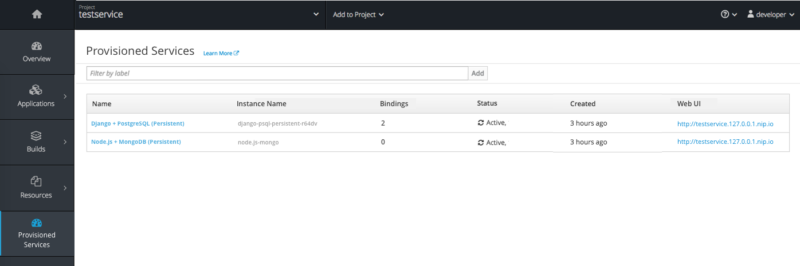
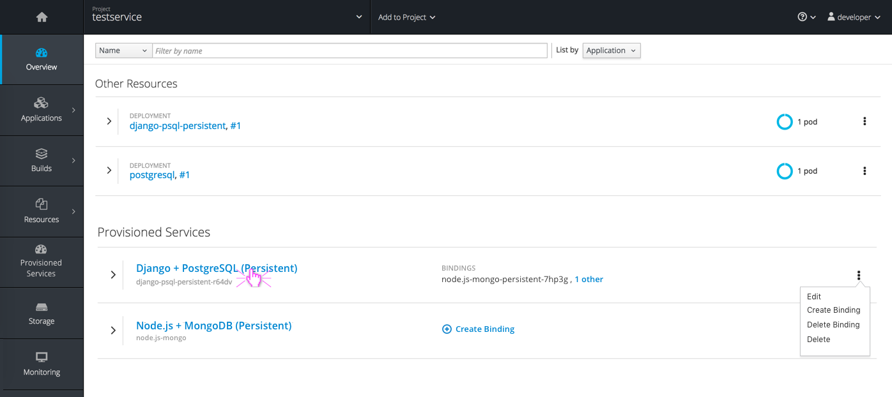
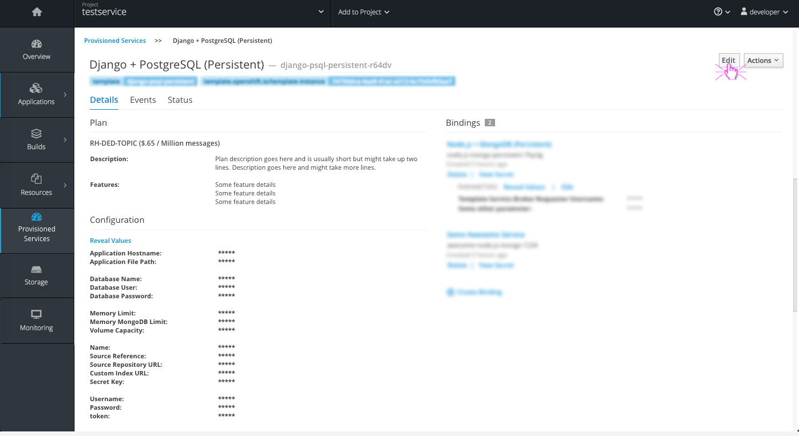
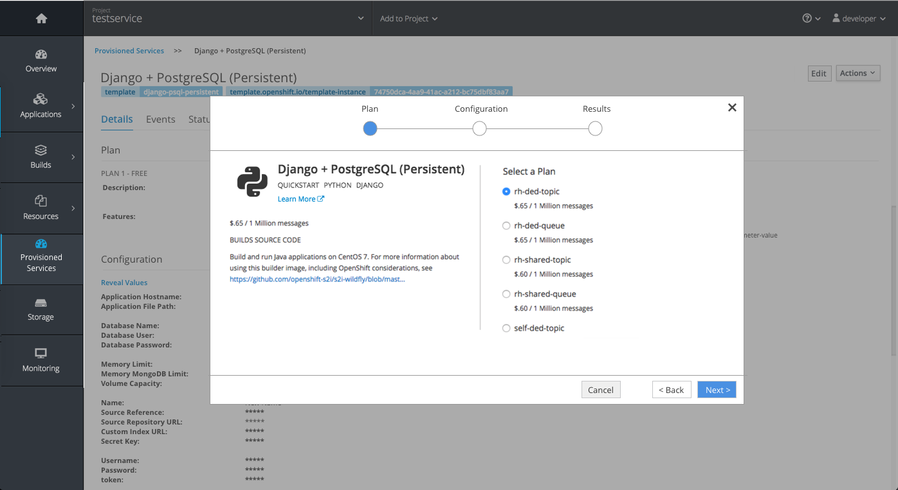
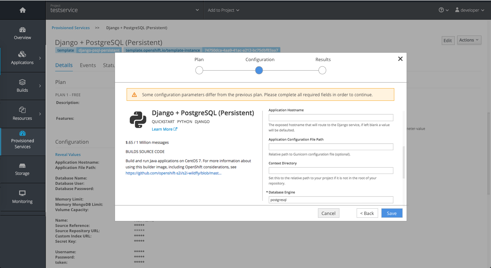
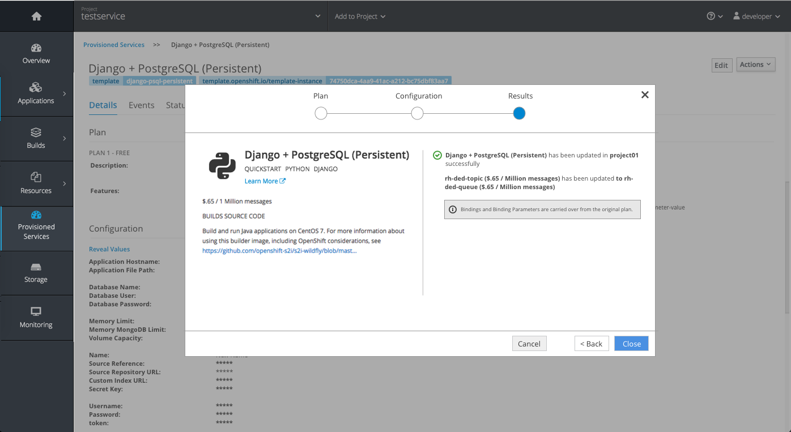
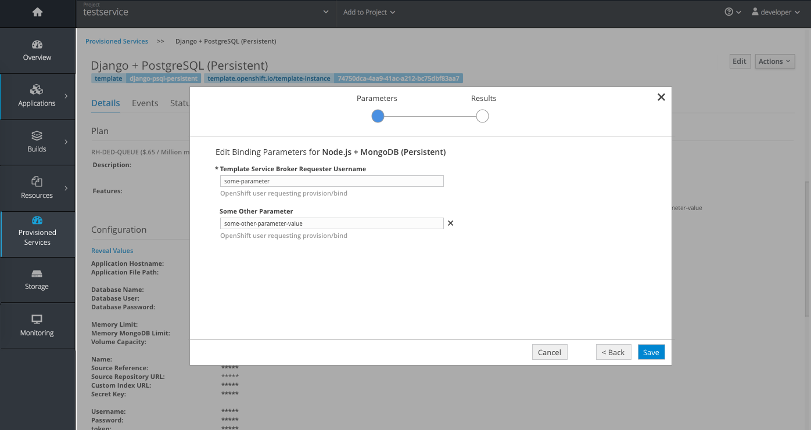

# Provisioned Service Details

- Provisioned Services are those services provisioned from the Service Catalog and should be displayed
- Some Provisioned Service info will be shown on the Project Overview page. For details on  the collapsed and expanded list views see [Provisioned Services on the Overview](./provisioned-services-overview.md).

## Navigating to Provisioned Service Details

- Provisioned Services will be a primary navigation item below Resources.
- **Note:** The icon for Provisioned Services is TBD and screenshots currently include a placeholder icon that will not be used.
- There will be a landing page for a list of all Provisioned Services, where users can select from the list of Names to enter into the Details view of a particular provisioned service. will Selecting the a provisioned service from the
- The standard landing page filter should be available at the top of the table.
- The columns included are the name (link to details page), instance name, number of bindings, status, created date/time, and the Web Interface URL.

- Users can also jump directly to a specific provisioned service by clicking on the link available in the list view on the Project Overview.
- Some of the Provisioned service actions are also available from the Overview page via the kebab menu.

## Details Page

- The top of the provisioned service details page should have the standard breadcrumbs, large service name and smaller instance name in grey, as well as any tags that correspond to the service below the name.
- The tabs available will be Details, Events, and Status.
- On the Details tab, sections will include:
  1. Plan: Display the name of the plan followed by any description and feature information below.
  2. Configuration: Display all configuration parameters with corresponding disguised values to the right.
    - **Implementation Details:** The Reveal Values link should be left aligned above the parameters and should function the same as the "Reveal Secrets" link works to show all hidden values below.
  3. Bindings:
    - Visit [Binding Details](./binding-details.md) for more information on what to display in this section.
    - **Note:** Bindings are shown to the right but for smaller viewports this section will fall below the Configuration section as needed.    

### Edit Plan/ Configuration
- Clicking the "Edit" button in the top right corner of the Details page will allow a user to edit the current Plan and/or Configuration shown.
- **Note:** This Edit action is also available from the Overview via the kebab menu and the same wizard steps will apply on that page.

- The same wizard initially used to order this Provisioned Service will appear with the current plan selected.
- Users can click next if they wish to keep the current plan and simply edit the configuration parameters on the next step OR users can select a new plan using the radio button plan options on the right.

- When a user selects a new plan, configuration parameters will be carried over to the new plan if possible.
- Some required fields may not translate across plans. Display a warning at the top to notify users there are required fields that must be filled out in order to continue.
- **Note:** The save button should be greyed out if required information is missing. The save button should also be greyed out if the user did not made changes on either step (Plan or Configuration).

- Results should provide status of the changes regarding the plan and/or configuration.
- Include an informational inline notification to notify users that any Bindings that previously existed will be carried over.

### Actions Menu and Inline Actions

- General Actions will appear in the "Actions" dropdown including edit YAML, Create Binding, Delete Binding, and Delete (Deprovision).
- Inline actions are available for each Binding listed in the Bindings section.
- The Edit link will be available if the binding has parameters associated with it.

- This Edit action will bring up the current wizard component with the "Parameters" step showing all Binding parameters and values as editable fields.
- The Save action will become available once a change has been made.
- The results step should provide the confirmation/ status message once parameters have been updated.
