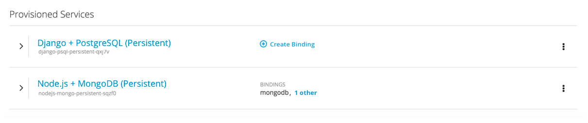
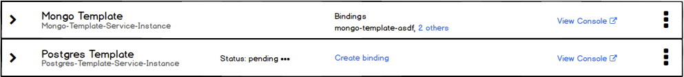
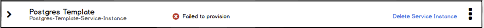
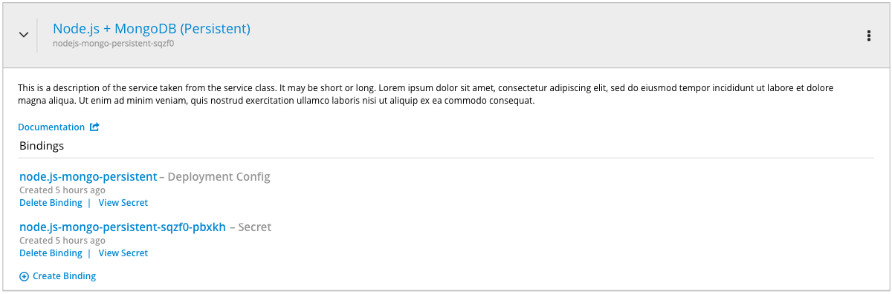
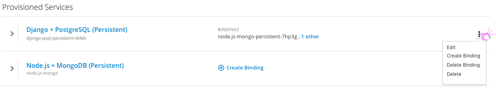
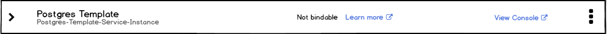
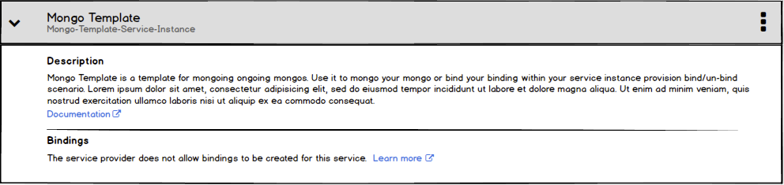

# Provisioned Services in the Overview

- Provisioned Services are those services provisioned from the Service Catalog.
- Provisioned Services need to be shown in the Project Details Overview along with other project resources and would use the same expandable list as the rest of the Overview.

## Collapsed State

- Provisioned Services should have their own category heading in all views of the overview (i.e. view by: application, pipeline and resource).
- In the collapsed state, show the display name for the service class with the service instance name underneath.
- The display name should link to a details page for that service instance.
- If the provision service has a binding, it is listed under the label "Bindings."
- If the service has nothing bound to it, the bindings section should be replaced by a create binding action. The pficon-add-circle-o icon should be shown in front of the "Create Binding" link.

#### Implementation Details

- If a provisioned service has more than one thing bound to it, show the first item by name followed by “n others,” which expands the row.
- If a service has been provisioned, but is not yet available, that should be indicated between the name and bindings area on desktop. Other warnings or alerts would be placed similarly.
- For services that have an external console, the View Console action should be included and should open the link in a new browser window/tab.
- The indication that a service is not yet available should be followed by an animated ellipsis.

- If the provisioning is in a permanently failed state, a delete service action should be provided.
- The placement of warnings on Provisioned Services should be similar to that of other resources in the Overview.

## Expanded State

- In the expanded view there may be three sections: Description, Plan, and Bindings.
- The Description includes the service class description if one exists, as well as a link to documentation.
- If a plan exists, the name of the plan should be listed in the expanded state of the overview below the documentation. If additional plan details/ features exist, they will only be shown on the details page.
- The Bindings section includes a listing of any bindings as well as the option to create a binding. See [documentation for binding details](./binding-details.md).
- Configuration details for individual bindings are not shown in this view, but should be available from the provisioned service details page.

#### Implementation Details
- If the service is not available yet, show an inline alert message in the expanded state. Other warnings/alerts from the service would be shown inline as well.
- Include a link to more information, if any is available.
- In the event that the provisioning of a service instance is in a failed state, include an action to delete that service from the project.

## Kebab Actions

- The kebab menu should include actions for Edit, Create Binding, Delete Binding, and Delete.
- The "Edit" action will bring up the wizard for the provisioned service and allow a user to update Plan and Configuration information as desired.
	- For **Implementation Details** on editing the plan or configuration, visit the [Provisioned Service Details](./provisioned-service-details.md) page, as the same edit functionality is available there. Additionally, the edit binding action is available on the details page.

## Unbindable Services

- In the collapsed state there should be an indication that the service is unbindable with a link to documentation that explains what that means.

- The expanded state maintains the "Bindings" section, but that section includes a message that the service is unbindable,Why as well as a link to relevant documentation.
- The "Create binding" and "Delete binding" actions are disabled in the kebab menu.
