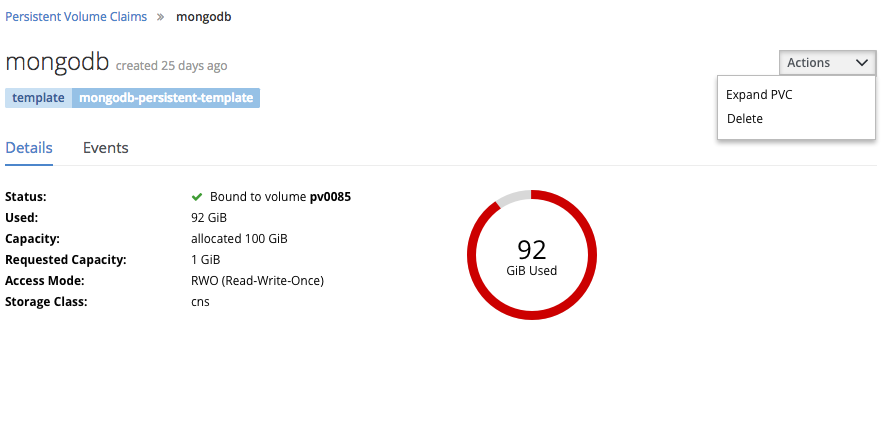
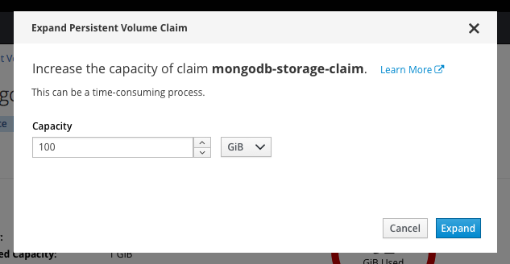
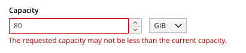
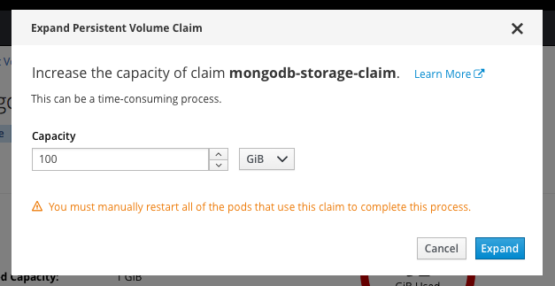
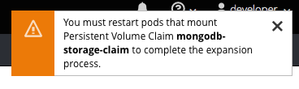

# Expand PVC

## Design

- "Expand PVC" should appear in the `Actions` menu of the details page for PVCs that support expansion.
- The "Expand PVC" action should **not** appear if expansion is not supported by the PVC's Storage Class.
- Clicking the Expand PVC brings up a modal where the user can enter the desired PVC capacity.

### CNS Modal

- The modal should indicate the name of the claim to be expanded and provide a link to relevant documentation.
- Users may set the desired capacity with a [bootstrap touchspin control](https://rawgit.com/patternfly/patternfly/master-dist/dist/tests/bootstrap-touchspin.html) with controls stacked.
- Units (e.g. MiB, GiB) are selected via a dropdown menu.
- Users should be informed that expanding a PVC is potentially a time-consuming process.
- The primary action button is `Expand` and a there is a secondary `Cancel` action.

#### Implementation Details
- The `Expand` action should be disabled until the user enters a capacity greater than the current capacity for that volume.
- The user should not be able to use the decrement button to set a value lower than the current capacity.

- If the user types a value lower than the current capacity in the touchspin, or changes the units to a smaller value, the error should be indicated inline and the `Expand` action button disabled.

### Non-CNS Modal

- For providers other than CNS, the modal should warn users that they will need to manually restarted to complete the expansion process.

### Toasts

- When the expansion has completed successfully, the user should see a toast notification as well as receiving a notification in the notification drawer.

- For non-CNS providers, users should receive a warning toast indicating that they should restart their pods.

- If the expansion fails for some reason, it would be nice to be able to provide users with an easy-to-understand error message.
- The failure event should also be added to the notification drawer.

## Experience Gaps
- The fact that we cannot know what applications are consuming a given PVC is a gap in terms of the UX.
- For all providers, but particularly for non-CNS providers, it would be very helpful if we could tell users what applications will be affected by changes to the PVC.
- Users may also want to protect their data by backing up or snapshotting their volumes. Once this functionality is implemented, the UI should communicate best practices.
- Users are unable to restore from a snapshot or backup. Therefore we are unable to provide any guidance or remedy in the event that the expansion fails in such a way that users' data is corrupted or unavailable.
