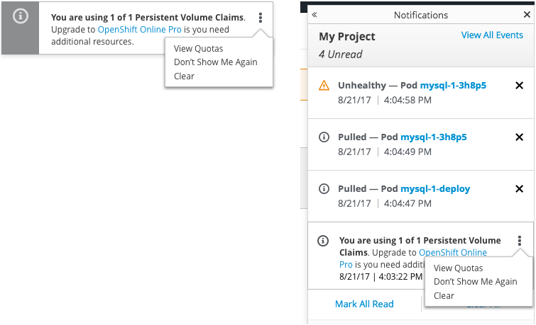

# Quota Warnings

## General
- Distinguish between **compute-resource** limits and **object-count** quotas.
- Both types of quotas/limits should be further broken down to specify the resource in question, e.g. Pods, Services, PVCs, Routes, Secrets, CPU, Memory.
- Messages should be customizable.

- Toasts and notification drawer messages should include a kebab menu with options to:
  - View Quotas
  - Don't Show Me Again
  - Clear notification

### Don't Show Me Again option
- Option should be specific to each quota/limit.
- Reset if the quota/limit changes. I.e. if I purchase additional capacity, I should get notifications if I reach/exceed the new quota.

## On the Overview

### At quota for object-count
- User should be alerted via an informational message.
- If the user takes an action that brings her to quota, that informational message should be toasted.
- If the user logs into the system and it is at quota, a message should appear in the [Notification drawer](../patterns/notifications.md) with no toast notification.
- The message should include
  - The resource in question
  - The total used and the max allowed.
  - Information/link to help the user take action if action is needed.
  - Link to quota page.
- The message should be customizable.  
- For example: "You are using 1 of 1 Persistent Volume Claims. Contact your system administrator if you need additional resources. View Quotas"

### At quota for compute-resource
- User should be alerted via an informational message.
- *FUTURE* If the user takes an action that brings her to the quota, she should see a toast notification.
- Otherwise if the user logs into the system and it’s at quota, skip the toast, but put a message in the notification drawer.
- Message should include:
  - The resource in question
  - The total percentage requested (to avoid confusion with units) and max plus units.
  - Information/link to help the user take action if action is needed.
  - Link to quota page.
- The message should be customizable.
- “Your project is using 97% of 2 cores CPU. Upgrade to OpenShift Pro if you need additional resources. View Quotas”

## *FUTURE* On Add to Project
- If Add to Project fails due to insufficient quota, the Results step of the wizard should give information about the quotas and suggestions to address the issue (e.g. upgrade to Pro, Add More Storage, etc)
- It would be useful to know before attempting to provision (and entering config information) if add to project is going to fail due to insufficient quota.

## Create Storage, Secret etc
- Dialog with plain language explanation that the resource couldn’t be created along with a remedy, if possible.
- “Unable to create storage. You are using 2 of 2 Persistent Volume Claims. Contact your system administrator if you need additional storage.”

## Scaling Pods
- Toast once quota is reached.
- Indicate the quota limit is as well as the scope.
- “You are using 8 of 8 pods for this project. This may affect your ability to scale pods. Contact your system administrator if you need additional quota.”
