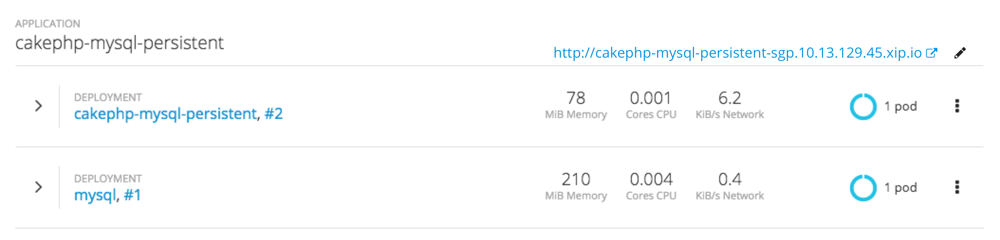
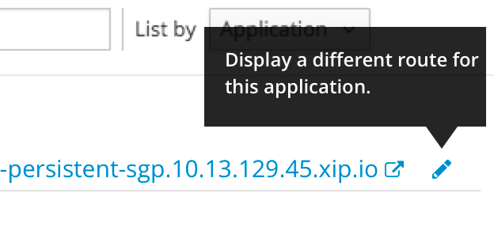
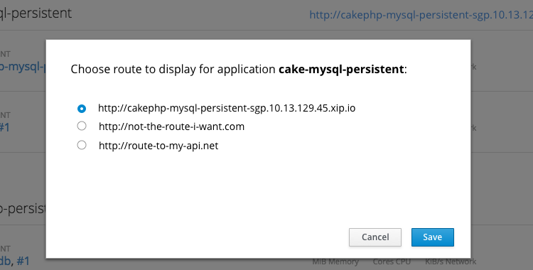

# Select Route to Display

## Background
- When viewing the project overview listed by application, the console displays a route associated with each application.
- In cases where an application has more than one route, the console will display what it believes to be the main route based on scoring criteria.
- It is possible the console may not choose what the user considers to be the main route.
- This design allows a user to choose the route to display in the overview.

## Design

- For applications that have more than one route associated with them, a pencil icon `pficon-edit` appears to the right of the displayed route.

- The icon should be color `#252525` by default and `#0088ce` on hover.
- Also on hover, a tooltip gives gives the user more information about the action, e.g. "Choose a different route to display for this application."

- Clicking the pencil icon brings up a modal dialog with the instruction "Choose route to display for application [application-name]."
- The URLs for routes associated with that application are enumerated and are selectable via radio button.
- The radio button for the currently displayed route should be selected by default.
- "Save" is the main action and "Cancel" is a secondary action.

### Implementation Details
- Selecting a route through the console, as described previously would change the route only on a per user, per browser basis. Other users would not be affected by this change.

## Primary Route Annotation
- Template authors may add an optional annotation to a route to designate it as primary.
- An annotated primary route would take precedence over the route scoring performed by the console.
- However, a route chosen by a user through the UI would take precedence over the annotated route.
- If multiple routes have the primary annotation, route scoring will determine which to display.
