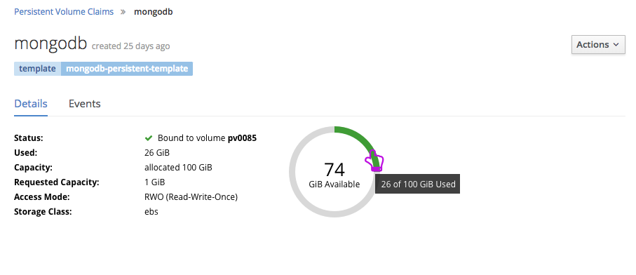
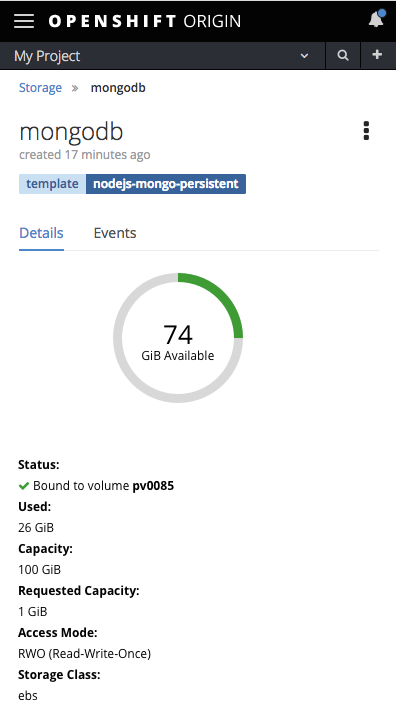
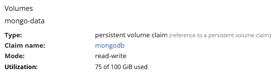
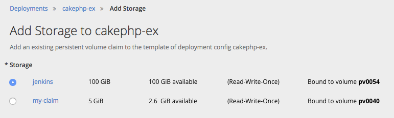

# Storage usage Metrics

## Open Questions
- Will we actually be able to know the reason the metric is not shown in the PVC list? I.e. would we be able to discern whether the metric exists but the data are just unavailable versus the metric does not exist for a given provider?
- Will these storage metrics be tied to any events or warnings so that we can proactively inform users of any storage problems?

## Storage List Page

- Add a column **Used** between the **Status** and **Capacity** columns.
- The units should match between the **Used** and **Capacity** columns for easy comparison.
- Because it's possible that not all storage classes will have the capacity consumed metric, field-level help should be used in the column header to explain why some rows may not have an entry in that column.
- If that metric is not available for a storage class, `--` should appear in the **Used** column for that row.
- If the metric exists for a storage class, but the data is temporarily unavailable, `N/A` should be used in the table.
- In either of the preceding scenarios (`--` and `N/A`) a tooltip should explain why those data are not available.

## Storage Details Page

- When the capacity consumed metric is available for a PVC, a utilization donut chart is added to the details page to show the capacity consumed, with a label indicating the available storage capacity.
- A **Used** entry should appear in the details list and the units should match the units for **Capacity**.
- If the PVC has a storage class, that should be shown on the details page regardless whether metrics are available or not.
- *FUTURE* May be useful to have time-based view of storage consumption so that users will be able to predict when they might need to take action on their storage.

#### Storage Donut Chart
- Use [PatternFly Donut Chart](http://www.patternfly.org/pattern-library/data-visualization/donut-chart/#design).
- The colored portion of the chart should show the amount of storage **used**.
- The chart should be color coded according to thresholds. The default thresholds are:
  - Green (`pf-green-400` `#3f9c35`)if < 80%
  - Orange (`pf-orange-400` `#ec7a08`) between 80-89%
  - Red (`pf-red-100` `#cc0000`) >= 90%
- The label in the center of the donut should give the capacity **available** in the format "x GiB Available", with the x value in large type.
- Hovering on either the used or unused sections of the chart should give the amount used or available (as the case may be) in a tooltip. For example, "x of y GiB used."

### Mobile

- The donut should appear above the other details at smaller viewport widths.
- This is similar to the behavior of RC pages.

## Deployment and Pod Pages
### Volume Details

- Volume details appear on the configuration tab for DCs, and the details tab for RCs and Pods.
- When storage metrics are available for a PVC, a **Utilization** entry should be added for that volume in the form "x of y GiB used".
- This affords the user a view of storage utilization from the perspective of the application(s) consuming that storage claim.

### Add Storage

- A column should be added indicating the amount of capacity *available* for each claim, when the storage class supports the metric.
- This may give a user some indication of which PVCs are being consumed by other applications.
- `N/A` should appear in that column if the metric is not available.
- If none of the claims listed support the metric, that column should not appear.

## *FUTURE* Warnings and Notifications
- We should be able to proactively warn users when they are nearing their storage capacity.
- We should indicate those situations on the Storage list page as well as on details pages.
- At the deployment level, we should warn users if storage claims their applications are consuming are nearing or at their storage capacity. Warnings should be visible on the Overview, deployments list and deployment details pages.
- Warnings about storage usage should appear inline rather than in the notification drawer so that they are not missed.  
