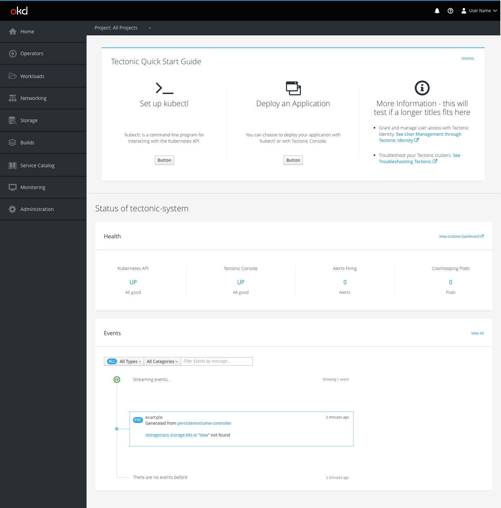
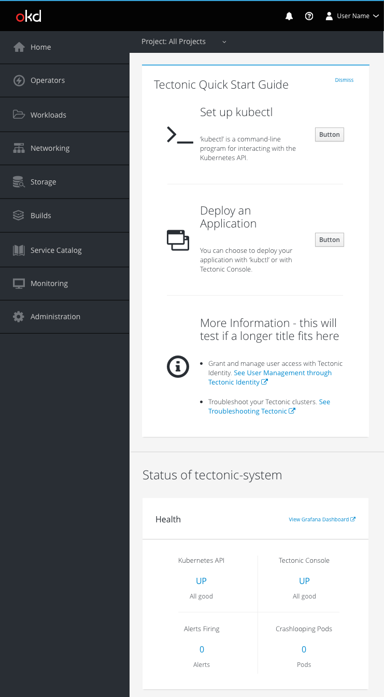
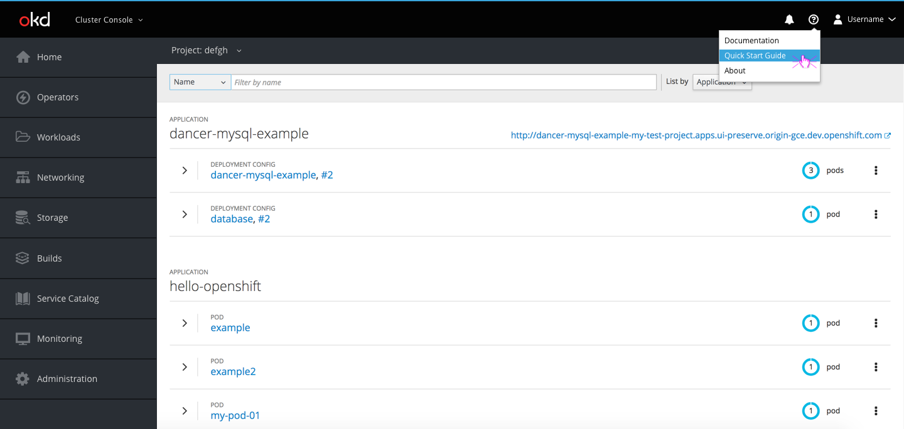

# Quick Start Guide

## Design
* The quick start guide will be displayed on the status page in a dismissible panel.
* Users can dismiss the guide by using the dismiss button in the top right corner of the guide.
  * If a user dismisses the guide, it will no longer show up on subsequent page loads.
  * Users can access the quick start guide again by accessing it from the help menu on any page.

**Status page**
* The quick start guide will be displayed in a horizontal layout by default, but can be displayed in a vertical layout in a responsive view.
* The quick start guide content should be divided into appropriate sections.
  * Separate each section with vertical keylines.
  * Each section should have an associated icon, title, description, and button or link.
  * Calls to action that result in internal changes should be displayed as a secondary buttons.
  * Calls to action that lead to external sites should be displayed as links with the fa-external-link icon.
  * Note: If there is one primary call to action, it may be displayed as a primary button. However, there should never be more than one primary button on a page.

**Status page default (horizontal layout)**

* Display the quick start guide in a separate box at the top of the page.
* Display the quick start guide content horizontally.
* Use a horizontal divider beneath the quick start guide area.

**Status page responsive (vertical layout)**

* Display the quick start guide in a separate box in the main content area.
* Stack the quick start guide content vertically.
* Use a vertical divider between the quick start guide area and the rest of the page content.

**Help Menu**

* The help menu dropdown will include a link to the quick start guide, which will take users to the guide's landing page.

**Landing page**

* The quick start guide landing page will have the quick start guide info, information regarding documentation and additional support links, and information about the oc client and command line tools.
