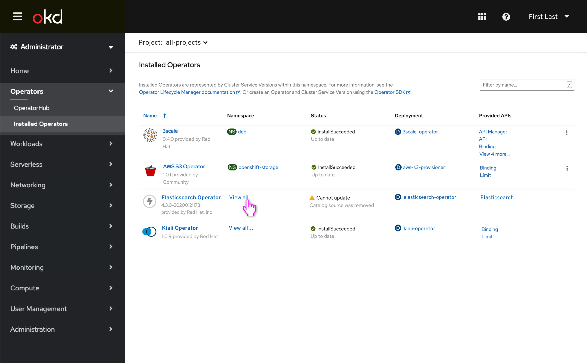
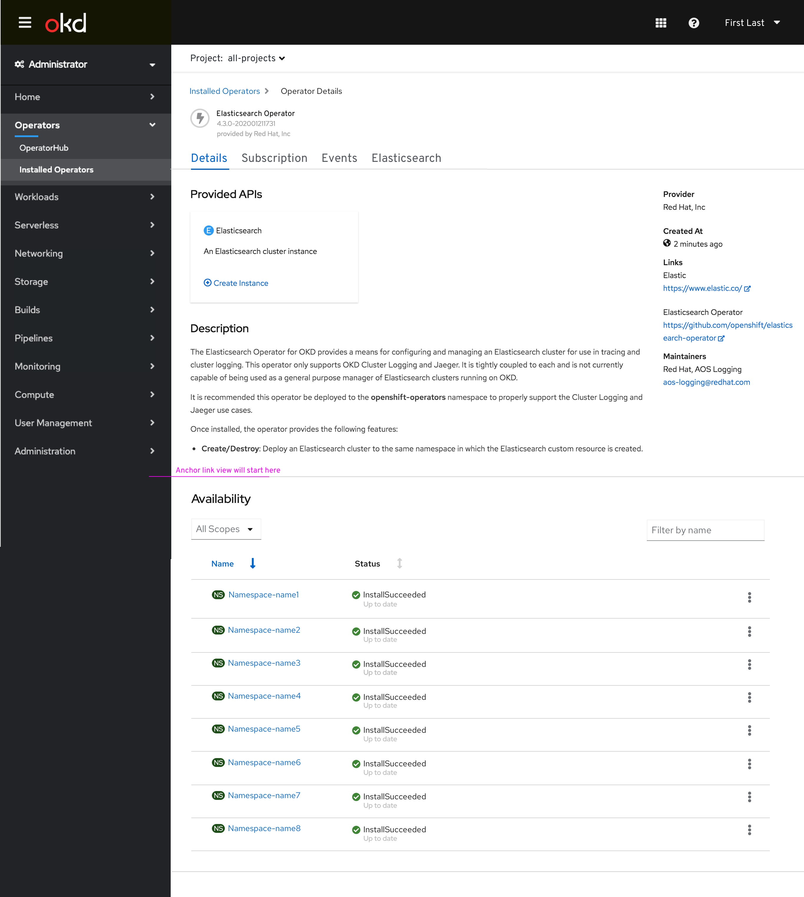
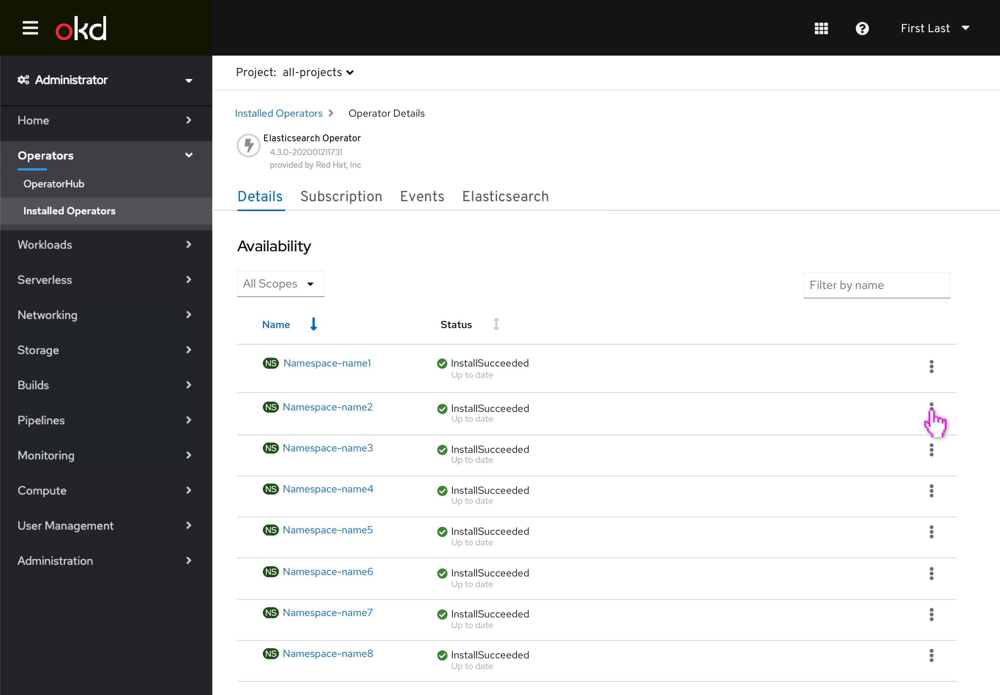
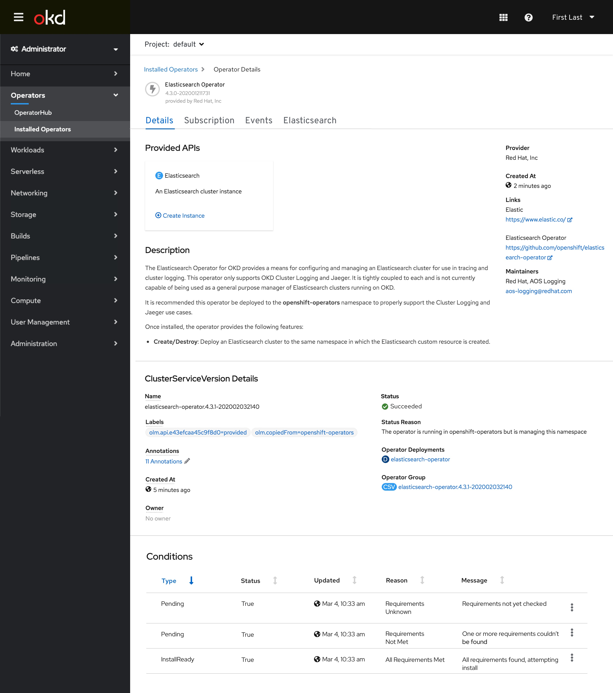
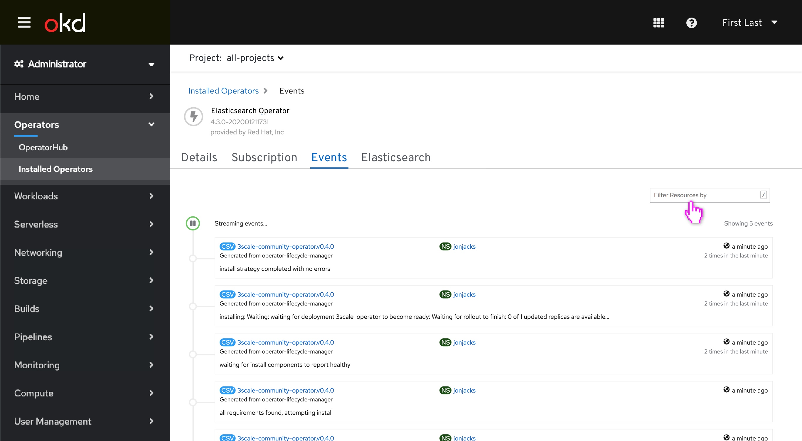

---
parent: Administrator
version: 4.5
---

# List of Operators

## All projects view

- When a user has selected the all-projects view from the project selector on the Installed Operators page, here they can view all of their Installed Operators. The goal of this design is to simplify how a user views the namespaces and associated operator(s) when they have selected to view the Installed Operators under all-projects.

- When a user clicks the link in the table, “View all…”, an anchor link takes the user to the Namespaces in the body of the Operator Details page. In this flow, we opt for a filterable experience in which the user can later filter by namespace or project under tabs such as Provided APIs or Events. (Scroll to view experience)

- In an alternate path, if a user were to click into the Operator, it would take the user to the top of the Operator Details page rather than the anchor link in the body of the page. 

## Operator Details Page

Here you can see the Namespaces in the body of the Operator Details page. The project selector is still 'All-projects'. This is one of the first times in the console (aside from API Explorer) that the user can view an object in a "global" context using the project selector, with the ability to still view it in the context of a single-namespace (by using the new kebab action in the namespace table or by manually changing the project selector):

Here is the anchor link view:

Clicking into the kebab menu, the user can access a dropdown from kebab, and click “View Operator in this Namespace” to view this particular Namespace’s Operator.

After clicking into the kebab, the user lands on the specific Operator Details page for this Namespace, which looks like our current Operator Details page: 

## Filtering on Events Page
On the Events page the user can filter by Namespace or Project. In this view they are not in a unique Namespace’s Operator’s events and are instead viewing all Events for all Namespaces that they can filter by. The events & API tabs now show values for all Namespaces.

**Note:** The YAML view doesn't appear in this new "all-projects" view of the operator, but still does in an single-namespace's view of operator (as it always has.) The user will now access the ability to edit the YAML within the view of the Namespace as it exists currently.

