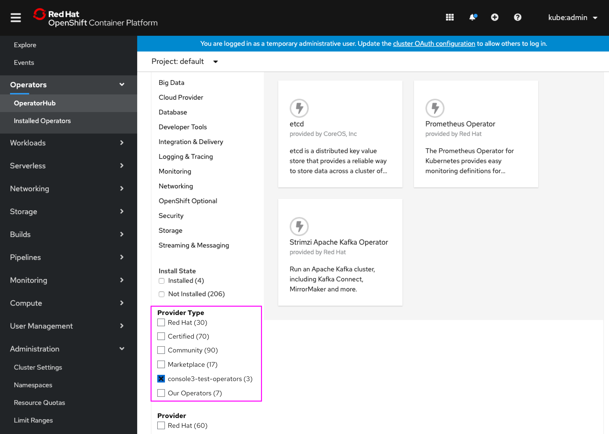

# Custom CatalogSource as OperatorHub ‘Provider Type’ filter facet

When a custom CatalogSource is added today, it appears in the “Custom” facet in the ‘Provider Type’ filter in OperatorHub. Customers are interested in having these CatalogSources show up as their own facet instead of being lumped under “Custom.”

A new annotation will be added to CatalogSources that allows the creator to specify a display-name of that CatalogSource. This value will appear as the facet in ‘Provider Type’ filter. If a display-name isn’t specified, the actual CatalogSource Name will be used.

The "Custom" provider type will no longer exist going forward, and is instead replaced by each CatalogSource being surfaced uniquely. 

## OperatorHub ‘Provider Type’ filter

- Custom catalog sources have been added to the cluster and appear in the **Provider Type** filter.
- “Custom” provider type no longer exists, instead each CatalogSource is shown individually.
- One custom source, “Our Operators,” has a display name specified.
- The other custom source, “console3-test-operators,” does not have a display name specified and the CatalogSource name is shown.
- Ideally **Red Hat**, **Certified**, **Community** and **Marketplace** facets would appear first, with the rest alphabetized after, though all alphabetized is also acceptable.
- If more than 6 Provider Type facets appear, they will be surfaced under an expandable **Show # more** link, similar to Provider filter.
- Names are truncated as needed.

- Filtering to that source shows only it’s operators (existing behavior.)
