# Catalog Source UI Enhancements

Enabling and disabling default catalog sources (which appear in the OperatorHub as Provider Types) is now available from the Details tab of the OperatorHub settings resource.

Users have been able to configure custom curated catalog sources as of OpenShift 4.4 with metadata like “Display Name”, “URL of Image Registry”, and the Registry Poll Interval.” Those custom sources now have their full details conveyed in the web console.

## OperatorHub settings

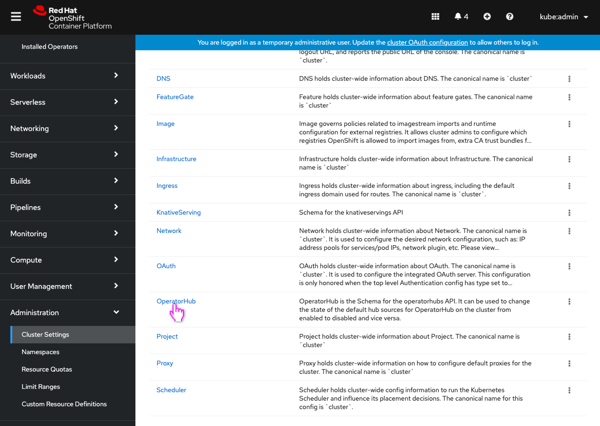
- The user opens the OperatorHub settings page.

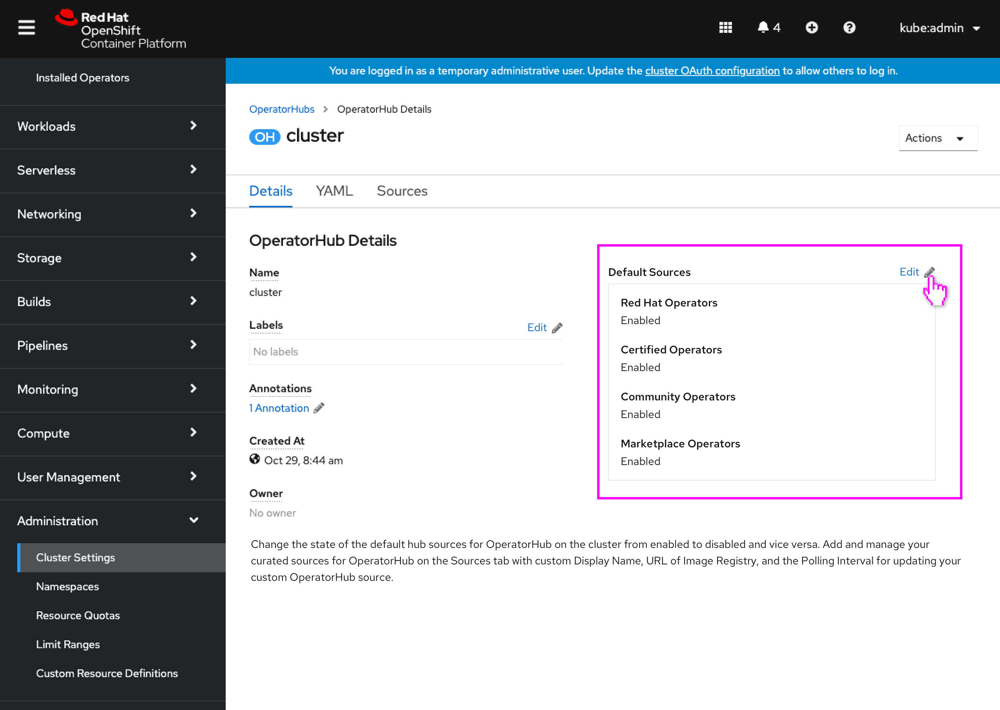
- The user can now enable/disable default sources from the OperatorHub Details tab.

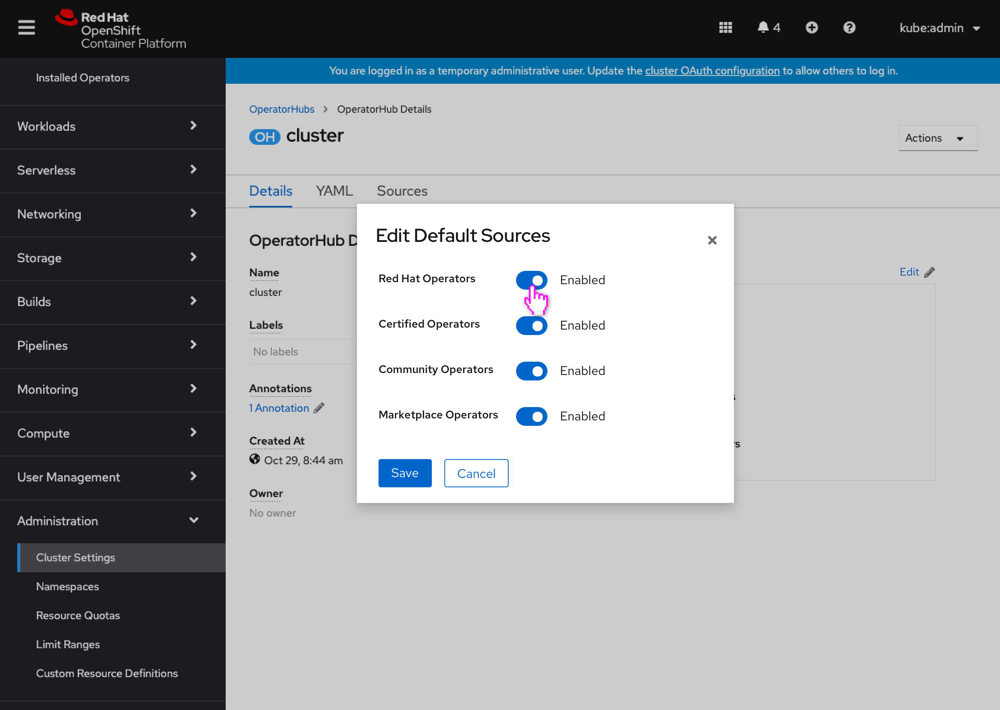
- A modal is opened that reflects the enabled/disabled state for the 4 default sources using switches.

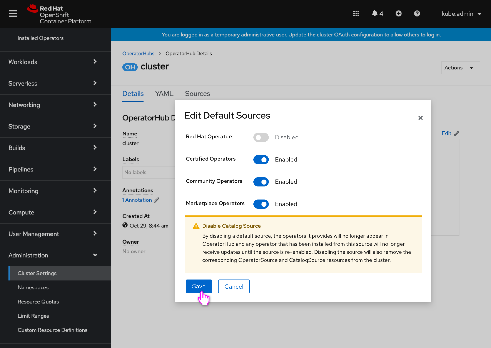
- If 1 or more default sources are disabled, an inline alert appears reflecting ramifications.

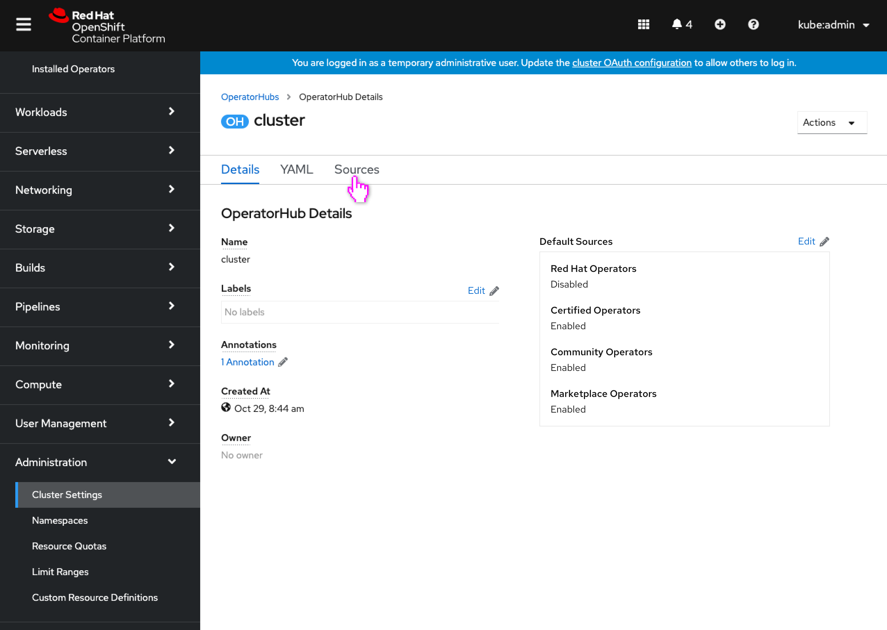
- The source’s status is updated.

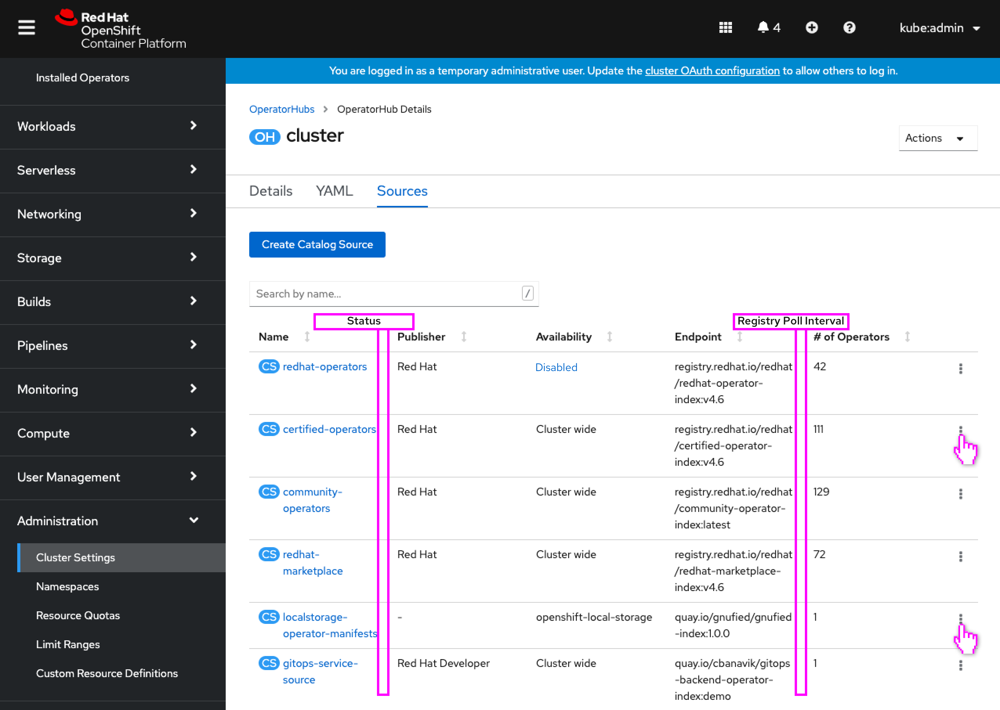
- The Sources tab list view now includes 2 new columns for the Catalog Sources: **Status** and **Registry Poll Interval**.
- The user opens the action menu(s).

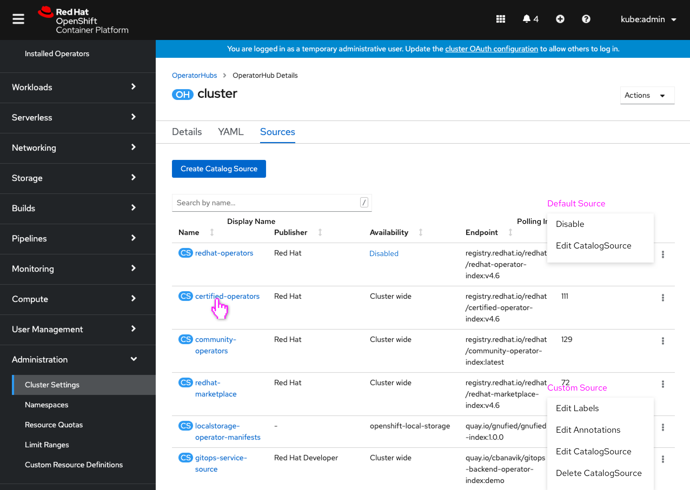
- For default sources: Only the existing **Disable** and **Edit CatalogSource** actions are available, since any other delete or edit will immediately be reverted by the cluster operator. **Disable** becomes **Enable** when the source is disabled.
- For custom sources: The menus match the Actions menu in the Catalog Source.

## Catalog Source details view

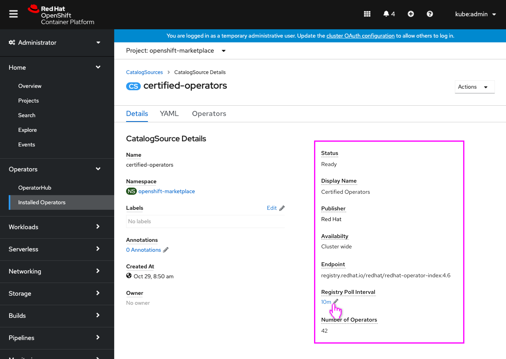
- The details view of the Catalog Source now includes the new fields: Status, Display Name, Publisher, Availability, Endpoint, Registry Poll Interval (editable), Number of Operators.

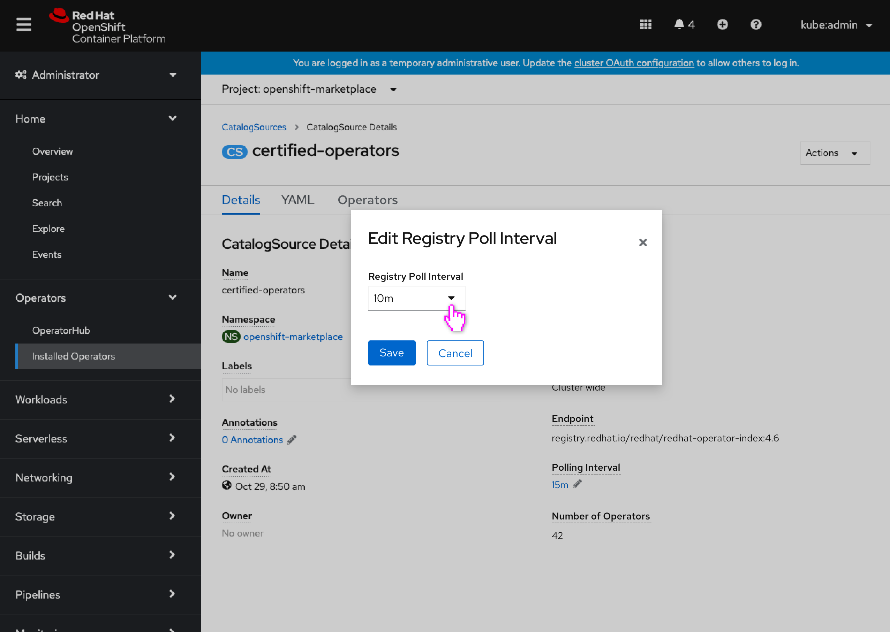
- Editing the registry poll interval allows the user to select from a dropdown list.

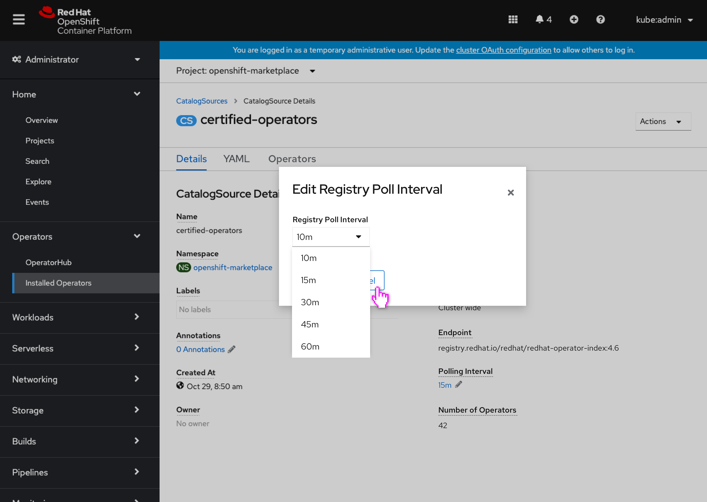
- Possible selections are: 10m, 15m, 30m, 45m, 60m.

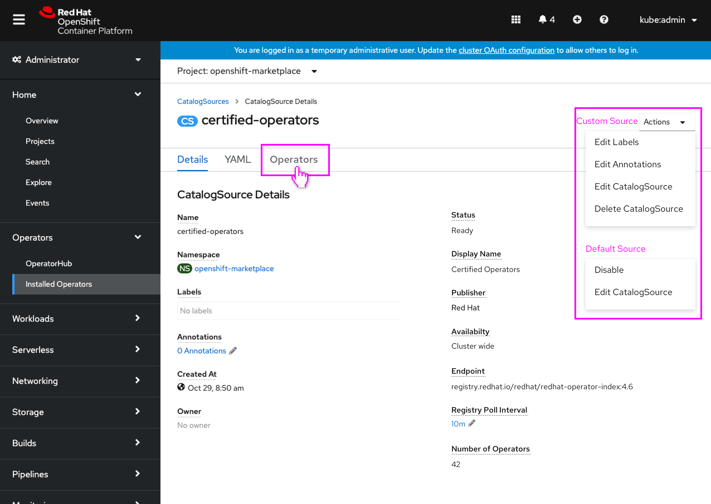
- The user navigates to a new **Operators** tab.
- The actions menu would also match the Sources list in the OperatorHub settings resource, with the different sets of actions for custom and default sources.

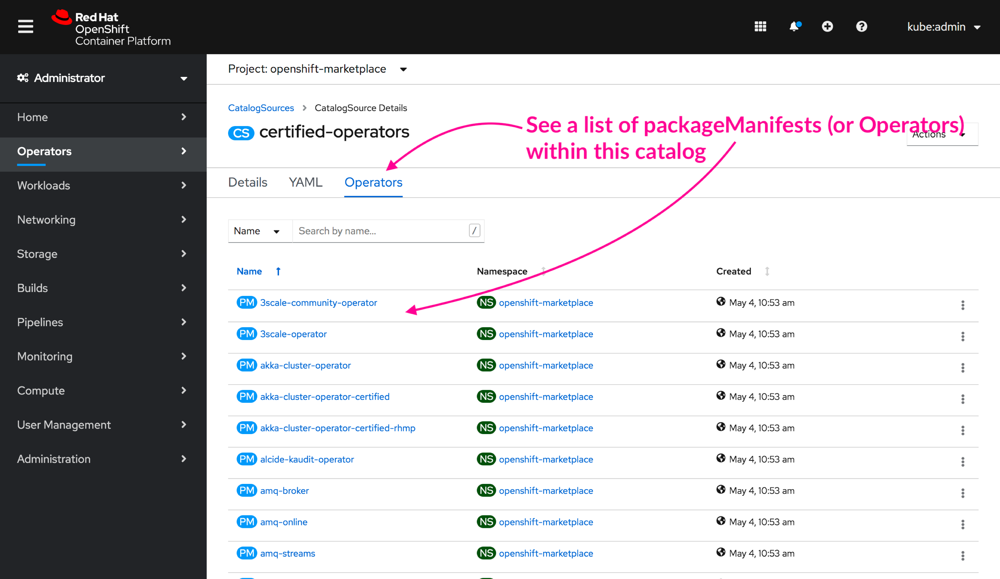
- The Operators tab lists out the PackageManifests that the Catalog Source contains.

## Catalog Source list view

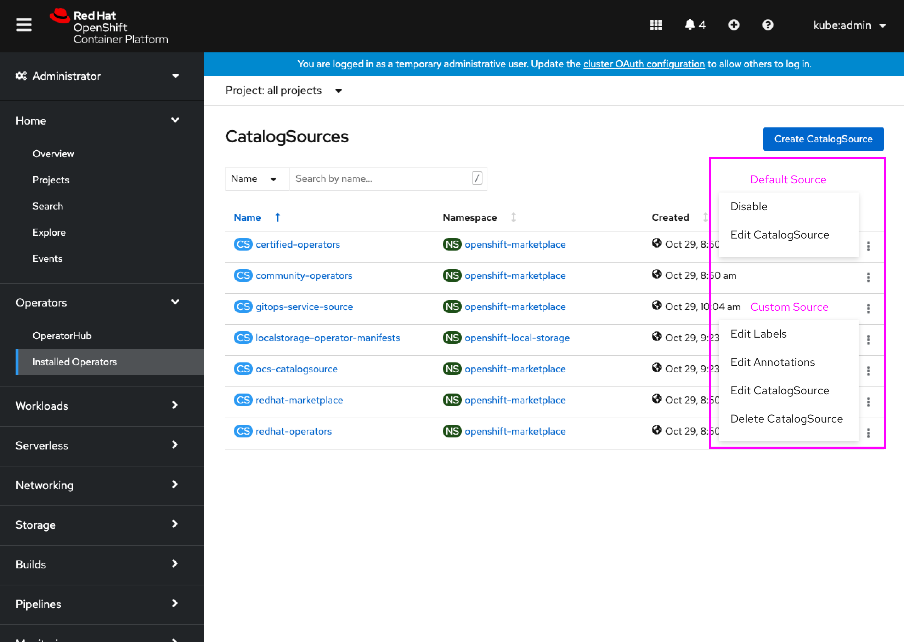
- The catalog source list view would also match the Sources list in the OperatorHub settings resource, with the different sets of actions for custom and default sources.