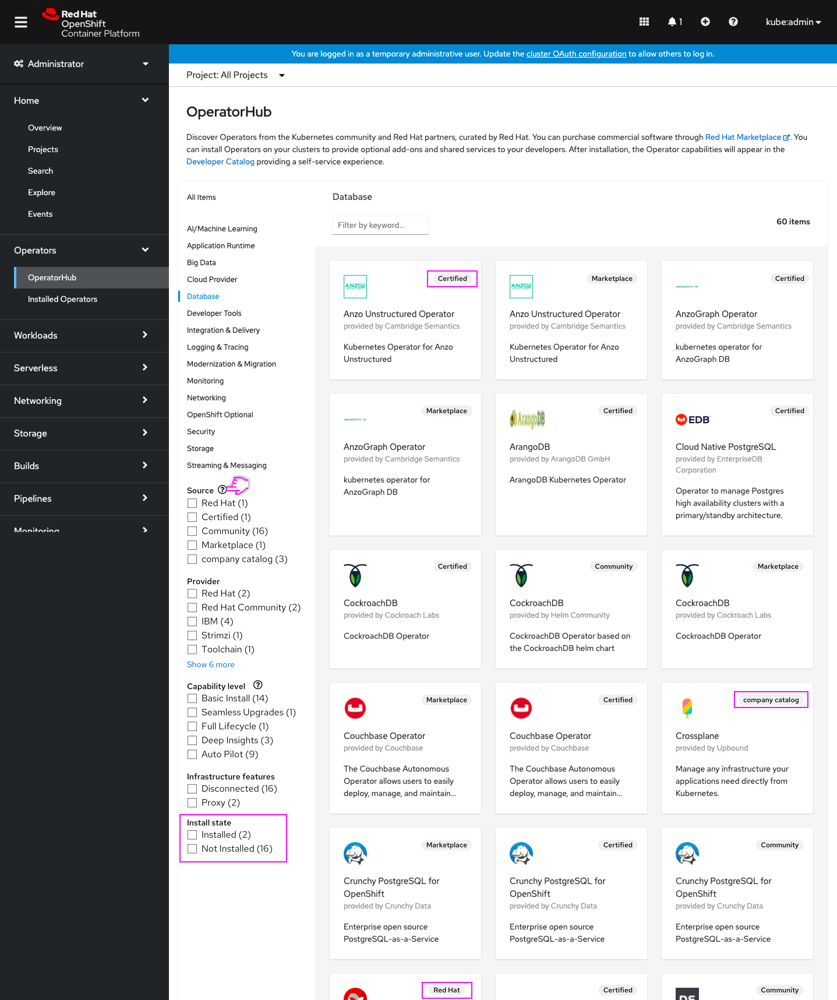
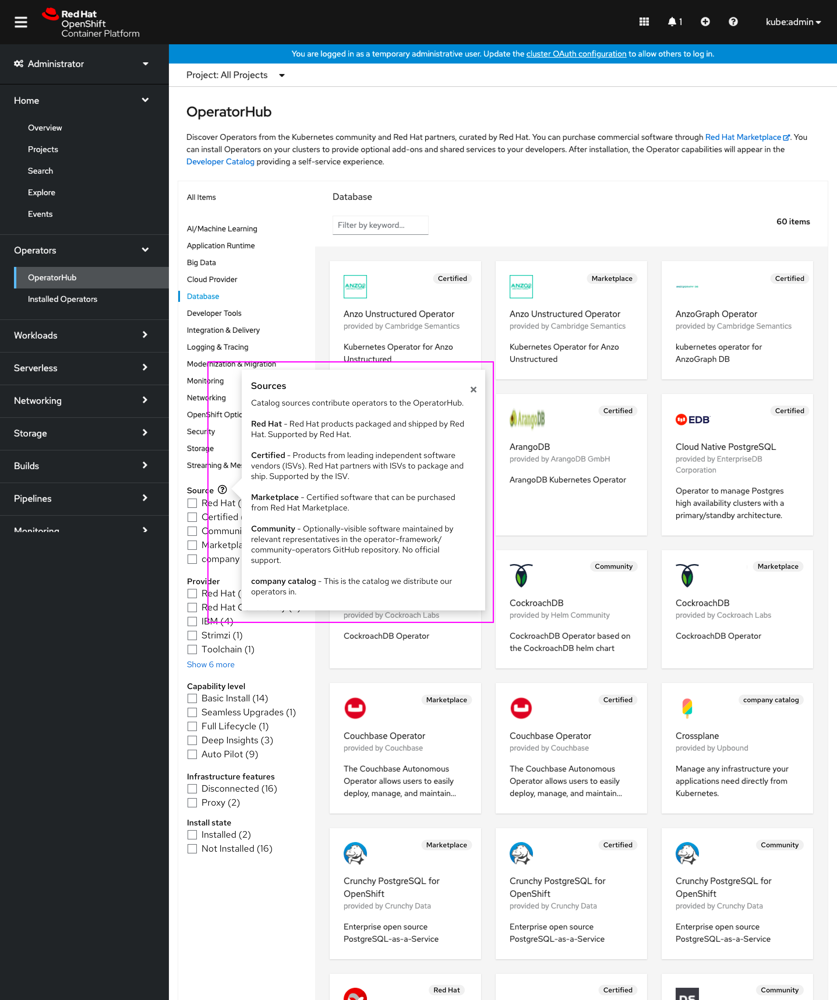
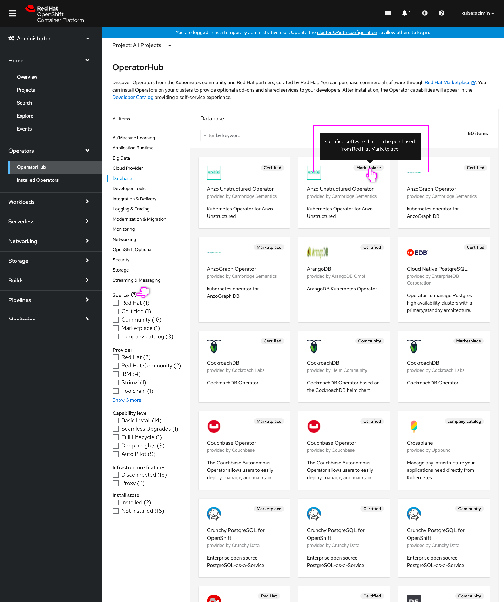

# Clarify OperatorHub sources and support

Today OperatorHub includes 4 default catalog sources, which provide different sources of operators. It’s not uncommon for a partner’s operator to have a Community version, a Certified version, and a Marketplace version, each showing up individually in OperatorHub. Community operators include a badge to indicate they are community-contributed, and not supported by Red Hat. Similarly, Marketplace have badges to indicate they are the Marketplace version of that operator that requires purchase from the RHM and includes additional support.

Because Red Hat and Certified operators do not have badges or indications on the tile of what their source is, it can be left to the user to try to infer what these operators are. Additionally, users may not completely understand the difference between Red Hat/Certified operators and their Marketplace equivalents, leaving them unsure which version to install.

With this design, OperatorHub will include additional information to convey to users what the source of operators are, and what that source represents to them (generally a different level of support and cost, in the case of Marketplace.)

## Source tile badge and field level help

By adding the Catalog Source name to each tile, this will help the user better understand that this piece of information corresponds to the Catalog Source that operator comes from (vs just indicating it as a Community or Marketplace operator.) The Catalog Sources can then be further described using field level help near the Sources filter, to better convey the difference between the sources.

Additionally, this will also help differentiate between when the same operator appears many times from different sources (such as Catalog Sources for nightly builds of an operator) with that information appearing right on the tile and further described in a tooltip.

- The badge styling previously only used for Community and Marketplace will now appear on all tiles conveying CatalogSource for all operators.
- Custom catalogs names should be truncated as needed.
- **Install state** filter is moved to bottom of filter list to highlight Source and other filters, and because the **Installed Operators** page is more often used for viewing installed operators. 
- The Source filter heading now includes a field level help.

- The Source field level help conveys a brief description of the catalog sources and then lists the CatalogSources with descriptions as well as the contents of their description. Any CatalogSources without a description should not appear.
- OLM team will need to help with adding the [description text for the default Catalog Sources](https://docs.openshift.com/container-platform/4.7/operators/understanding/olm-understanding-operatorhub.html#olm-operatorhub-overview_olm-understanding-operatorhub). These descriptions indicate the expected support level for each source.
- Any custom sources with descriptions will also be included.

- The Catalog source description will also appear in a tooltip on the CatalogSource badge to further identify this piece of metadata.
- A tooltip delay should be used to make sure that these din't appear while scrolling, which could be bothersome.