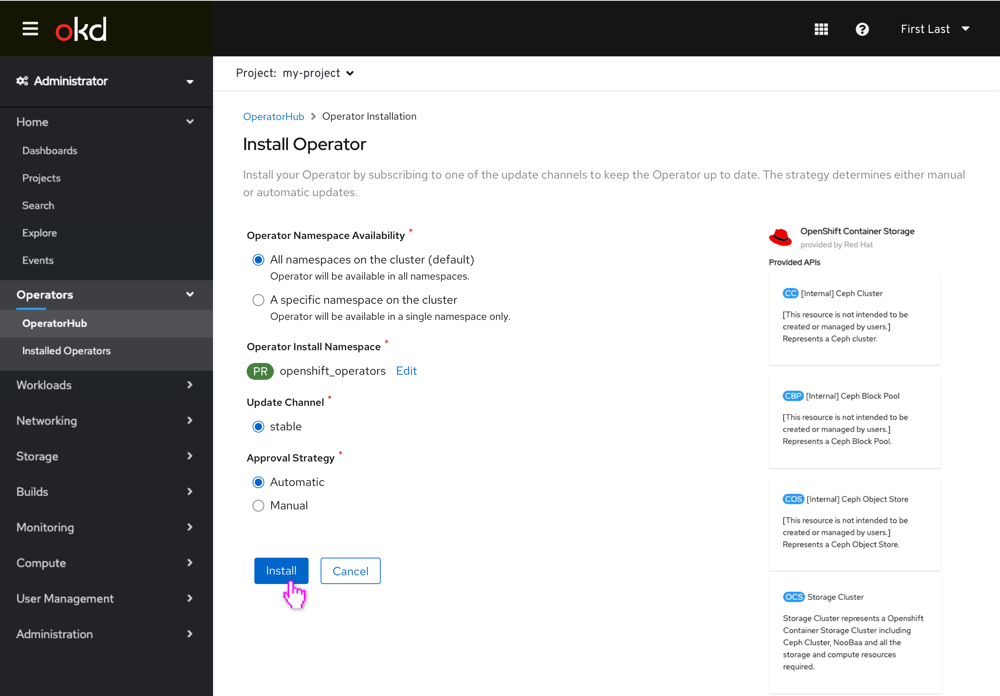
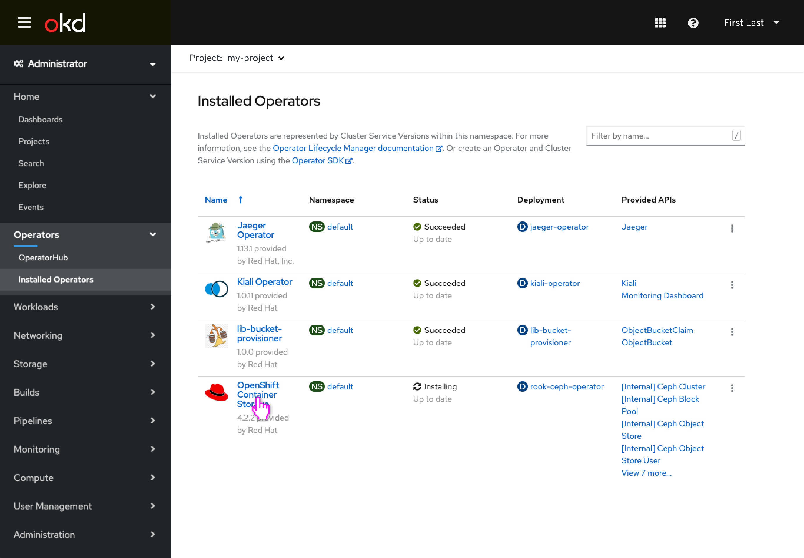
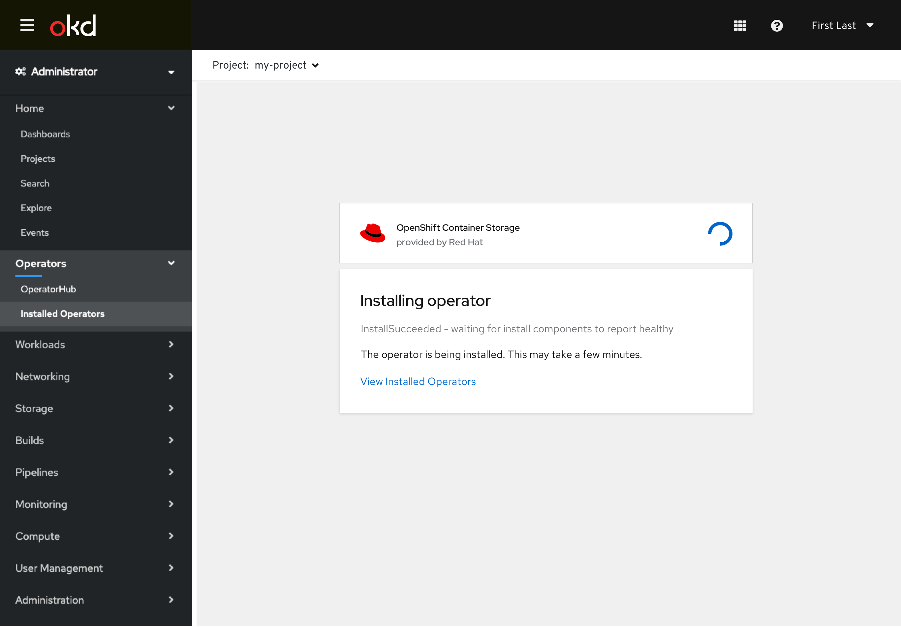
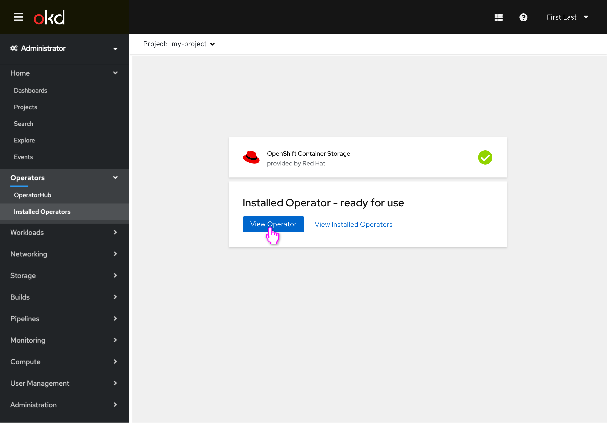
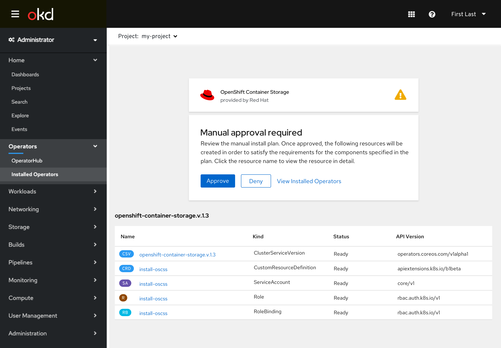
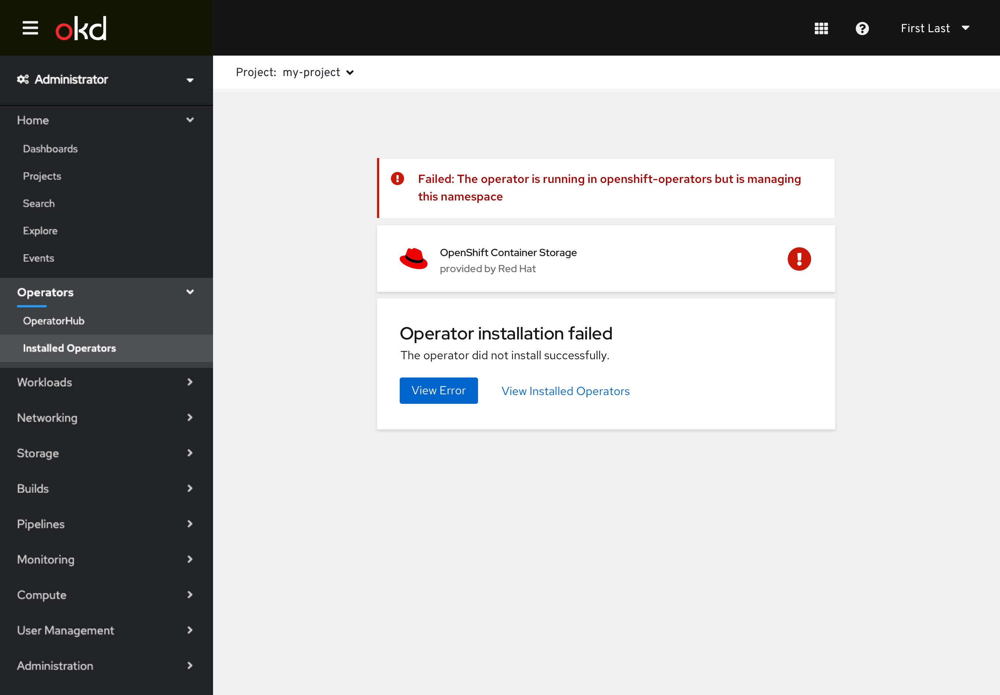

# Convey Operator is Installing

Currently when an operator is installed the user is taken to the **Installed Operators** list view, where it may take some time before the entry for the newly installed operator actually appears, particularly if the operator is installed globally and the user is viewing a namespace the operator will be copied to, and he CSV doesn't yet exist. This design gives the admin user immediate feedback that the operator is installing properly, and can surface errors that may occur during the installation process.

## Installing an Operator

- The user selects the operator they'd like to install and selected installation options (no changes to this screen.)

- The user is now taken to the new installing screen where a spinner conveys the operator is currently being installed.
- A link is included that allows the user to exit to the Installed Operators list.
- The user could navigate away from this screen using the left nav, and return to it via the **Installed Operators** list view.

- On the Installed Operators list, a row item would always appear (even if the CSV isn’t created in that project yet) that conveys the operator is installing, clicking it would return to the installing screen.
- Values in columns may be unfilled as neccessary.

- The user would return to the installing screen if the operator is still being installed. 
- If the operator had completed installing (either successfully or not,) the user would just be taken to the operator details using existing behavior.
- **Definition of 'operator installing':** **status.phase** is not yet **Succeeded**, only when **InstallWaiting** or **AllRequirementsMet**.

- When installation completes successfully, the user has the ability to view the installed operator (or view the installed operator list.)

- The user views the details of the operator.

## Warnings and Errors

- If the installing operator requires manual approval, the call to action will appear on the installing screen where the user the user can review the created resources and approve the install plan, and installation will continue.

- Assuming any of the following occur while the user is still viewing the ‘installing’ screen: Subscription creation fails, InstallPlan creation fails, CSV, CRD, Deployment, RBAC creation fails or requirements are not met, like MinKubeVersion, the error is presented on the failure screen.
- The user can view the resource that generated the error (or its parent resource) via the **View Error** button.
