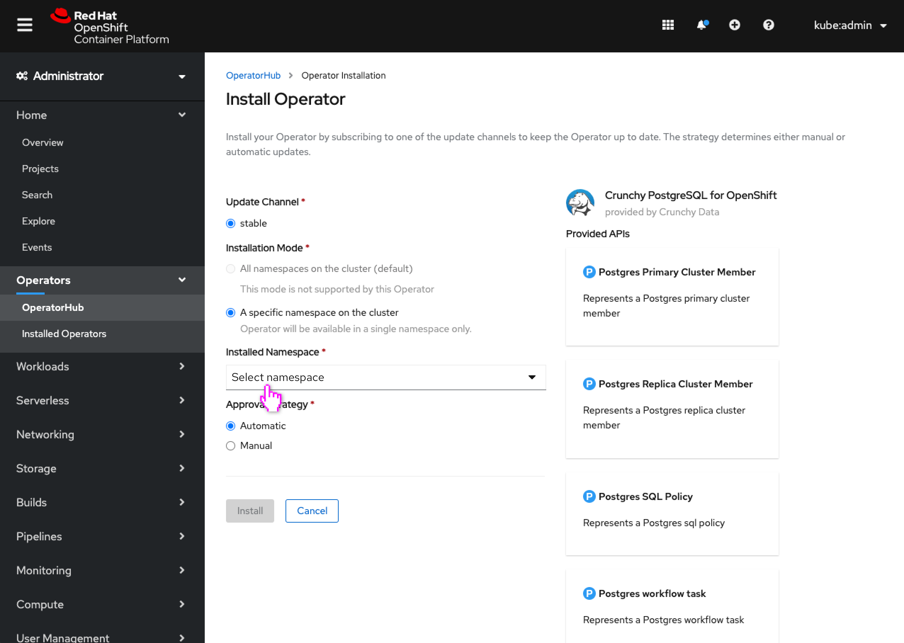
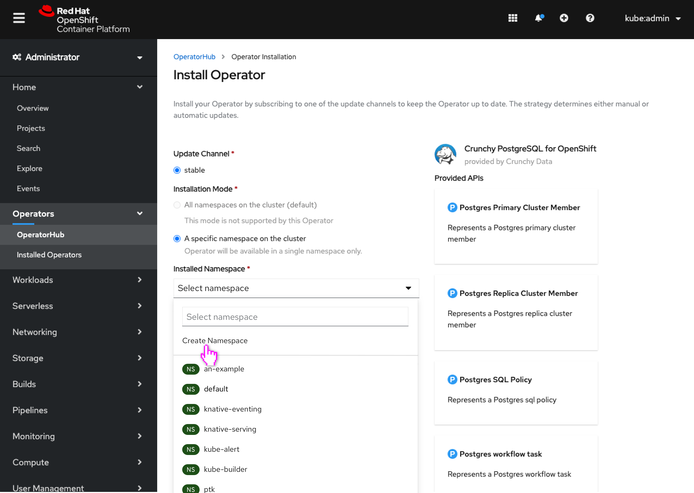
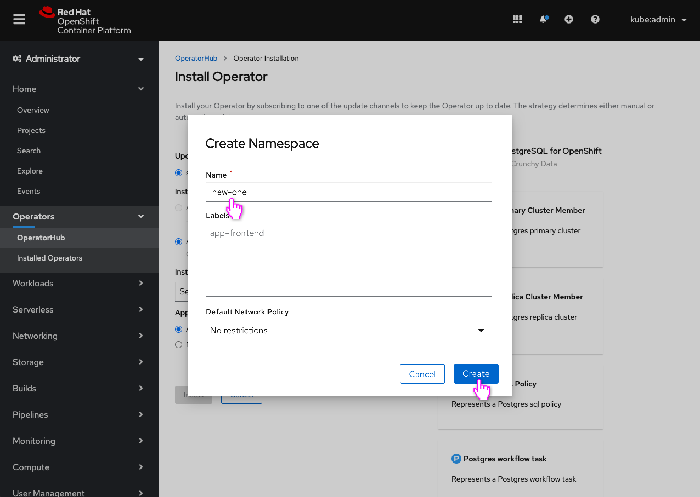
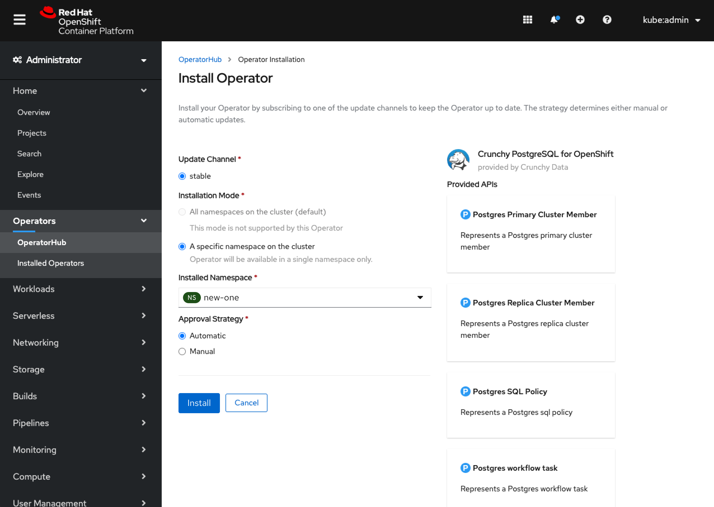

# Create a user-defined namespace from the Install Operator screen

Through various forms of feedback it has come up that users are interested in creating a particular project/namespace when they are on the Install Operator page. Users realize once they have begun installing the operator that they need a particular namespace that hasn't yet been created, and then need to exit the install process, create the namespace, then restart it. Ideally they would be able to create that namespace from the page.

This screen already supports [creating suggested namespaces that the operator author designated](http://openshift.github.io/openshift-origin-design/designs/administrator/olm/install-forcenamespace/), however this design conveys user-defined namespace creation.

## Creating a user-defined namespace (or project)

- User begins installing an operator and selecting the install namespace.

- This dropdown now has the user select a namespace, not a project.
- Note: For users without access to namespaces, projects would still be listed.
- The user realizes they still need to create a particular namespace to use and selects “Create Namespace.” ("Create Project" for users without namespace access.)

- The existing “Create Namespace” dialog opens and the user can create a new namespace, which will also create an equivalent project
- Note: Would be “Create Project” dialog for users without access to namespaces.

- The newly created namespace (or project) is selected

## Future enhancements
- A similarly timed effort is planning on conveying in the "Create Namespace" and "Create Project" dialogs that the matching project/namespace will also be created, and clarify the relationship of these resources to users.
