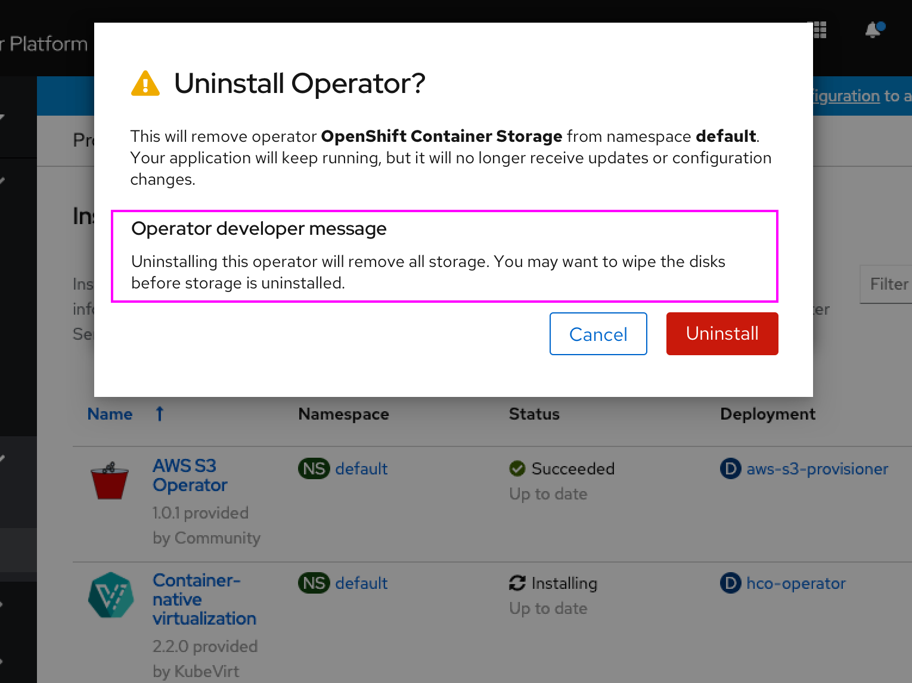

# Custom message on operator uninstall

When an operator is uninstalled by an admin, the operator's developer may like to show a custom message in the uninstall dialog that might warn the admin of any consequences of uninstalling it, that might be particular to that operator.

For example, when a storage operator is uninstalled, perhaps any associated data in that storage is also wiped, which the operator's developer would like to convey to the user.

**Note:** The custom warning text used in this design is just for example-sake, and not actually intended to be use.

## Uninstalling operator

- When the operator developer has specified a string in the new 'custom delete message' annotation, a new fixed header of **Message from operator developer** appears in the uninstall operator dialog with the string beneath it
- Note: The generic operator uninstall text is updated in this design and would be ideally included in this change.