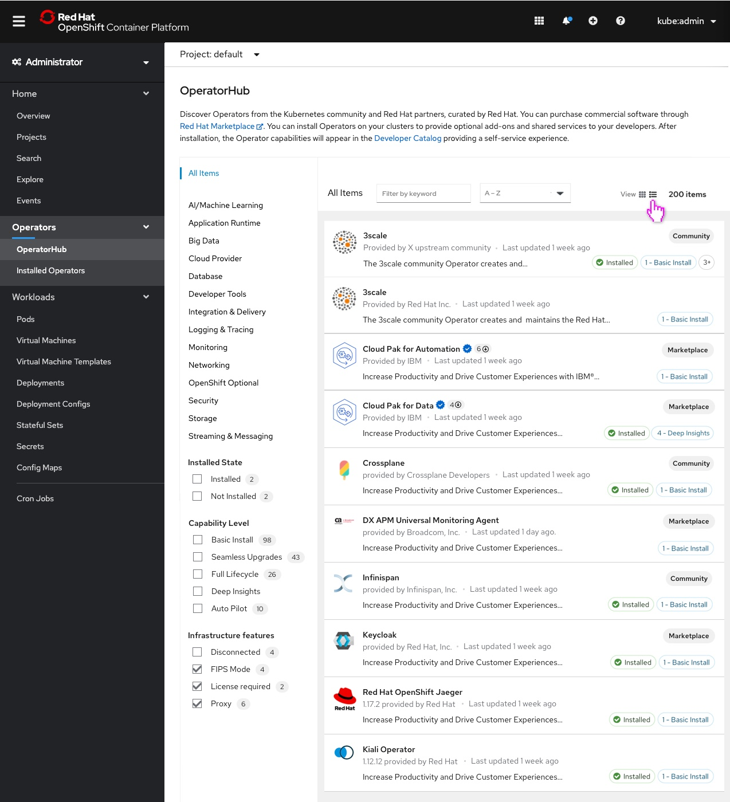
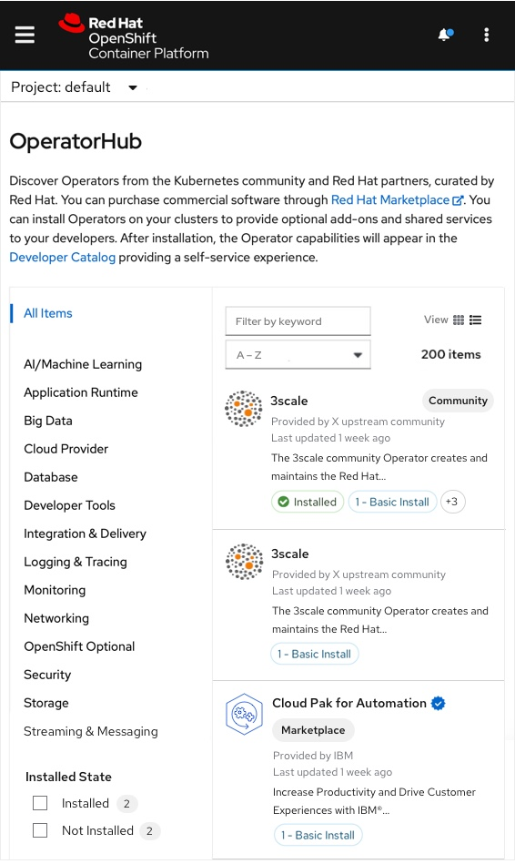

# List view on OperatorHub

In this story the list view demonstrates the Operator tiles in a new light by allowing the user to view the Operators in a list view. The list view shows more operators in a list view in order to expose more information to the user in a readable way.

When the user selects the list view the PatternFly data-list component powers more compact styling so more information can be viewed at once.

## See more badges

The user clicks into the 3+ badge to see more badges when there are conditional badges selected. Whatever number of conditional filters are selected should be represented in the "more" badge shown on this screen as an example. This badge will not appear if 2 badges or less appear on an Operator.

## Mobile view

This is the mobile view of the list view.

