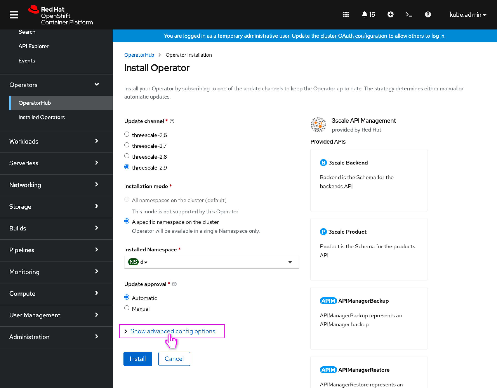
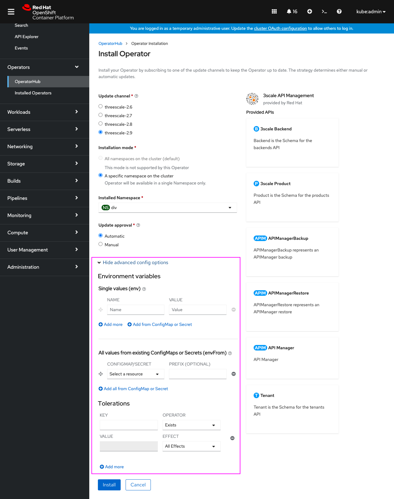
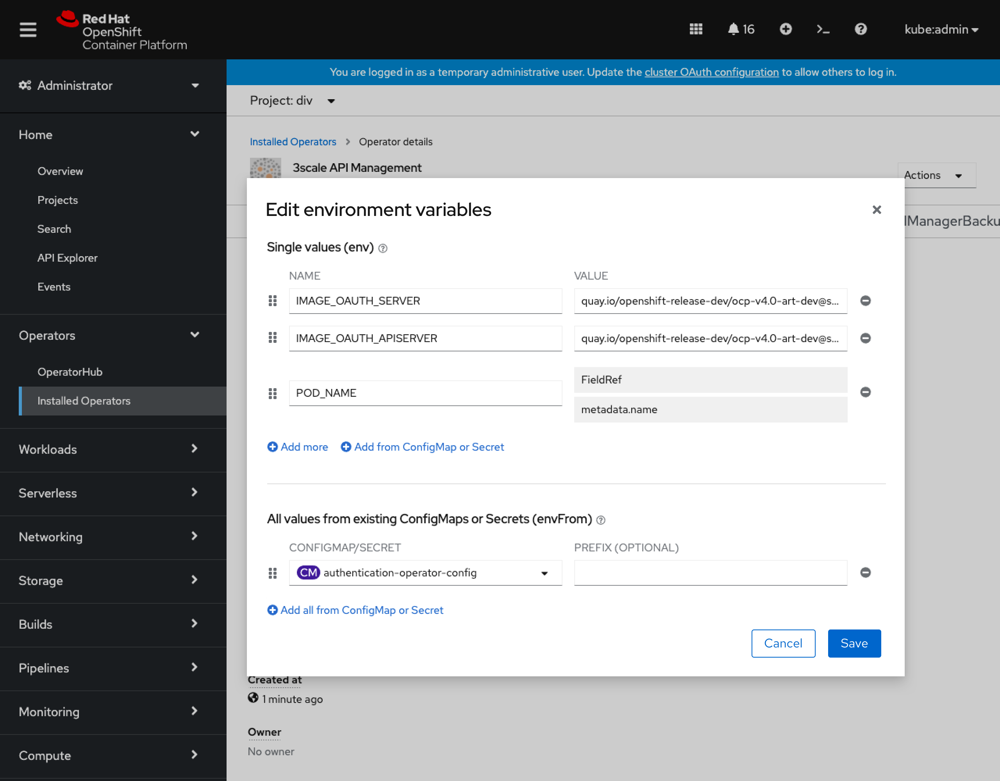
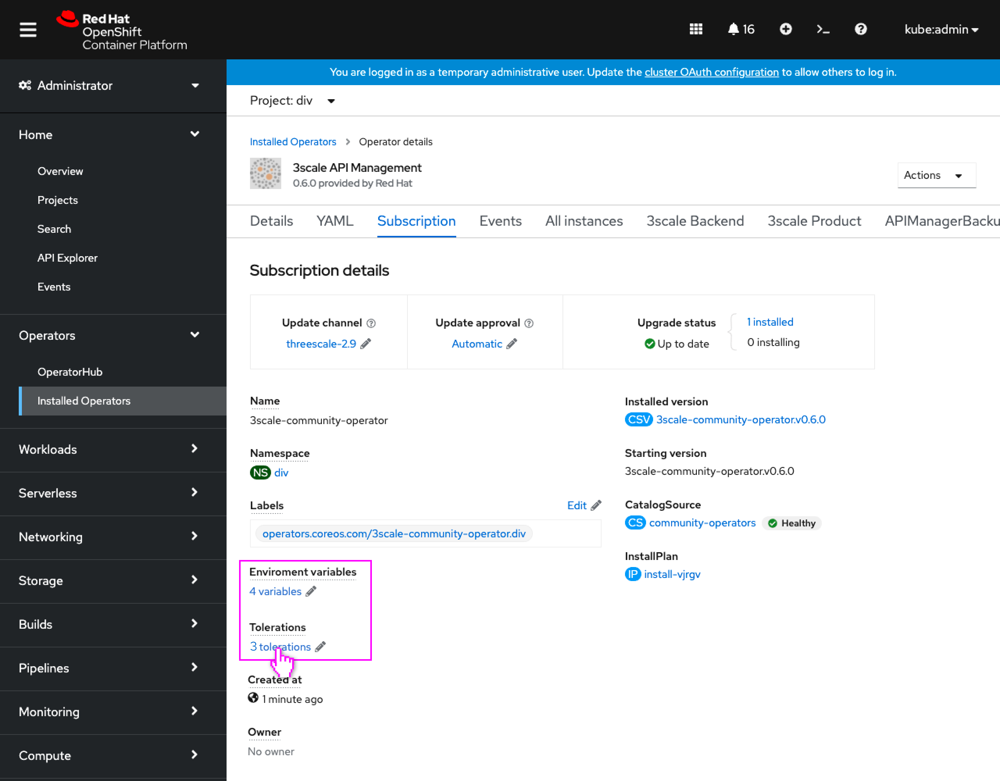
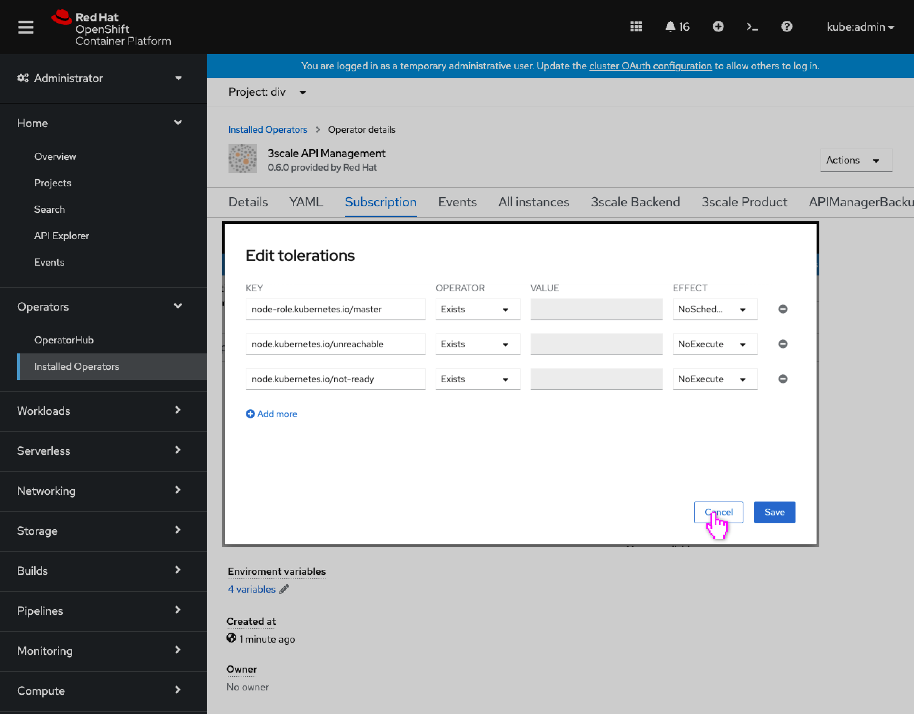

# Support configuration of Environment and Tolerations for operator subscriptions

Operator Subscription resources support users entering further config information about how the operator should be deployed or installed by OLM. These include Env/EnvFrom, Volumes, VolumeMounts, Tolerations and Resources, as seen in the [OLM documentation for Subscription Config](https://github.com/operator-framework/operator-lifecycle-manager/blob/master/doc/design/subscription-config.md). Today that information can only be configured via YAML, however the console should support configuration of these as well when installing an operator.

With this design, specifically the configuration of Env/EnvFrom and Tolerations will be supported, as those are low-hanging-fruit since we already have console UI widgets to support editing those configs we can reuse. These will be surfaced under an 'advanced configuration' area on the Install Operator form, and also be surfaced in the operator detail's Subscription tab for editing purposes as well.

## Install Operator form

- A new **Show advanced config options** expandable control is added to the bottom of the Install Operators page.

- When expanded, sections for **Environment variables** and **Tolerations** are shown.
- The **Environment variables** section includes controls for setting values for Env and EnvFrom. These controls function exactly the same as they do as the **Environment** tab in Pods, Deployments, etc. When selecting a ConfigMap or Secret resource for a variable, these would be chosen from the operators installation namespace (where the Subscription resource will be located.)
- The **Tolerations** section includes controls for specifying tolerations.  These controls function exactly the same as they do as the content of the **Edit tolerations** modal that is accessible from the details of Pods, Deployments, etc.

## Operator Details - Subscription tab

- The **Subscription** tab in operator details would now include a new spec descriptor for **Environment variables** and a spec descriptor for **Tolerations**.
- This new Environment variables spec descriptor could potentially be used for operand forms some day as well.

- A new **Edit environment variables** dialog allows the user to edit values for Env and EnvFrom. The controls in the modal function exactly the same as they do as the **Environment** tab in Pods, Deployments, etc. When selecting a ConfigMap or Secret resource for a variable, these would be chosen from the operators installation namespace (where the Subscription resource is located.)

- The existing spec descriptor for Tolerations would be included to allow for editing Tolerations.

- The **Edit tolerations** modal would show any existing tolerations in the config on the Subscription, and the dialog would function as it does for other resources.