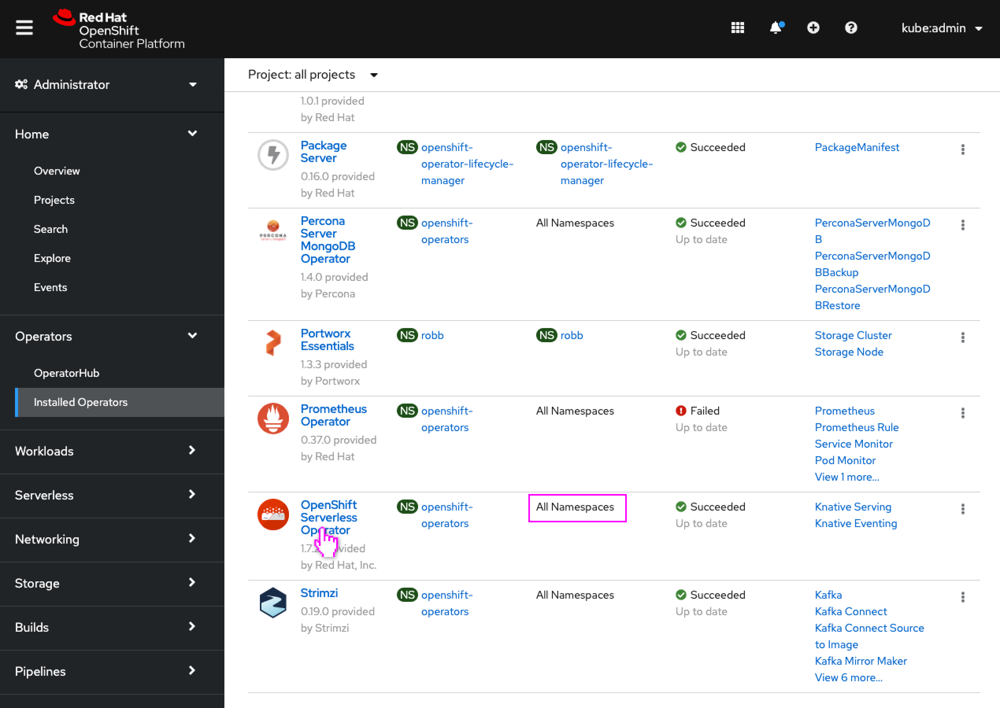
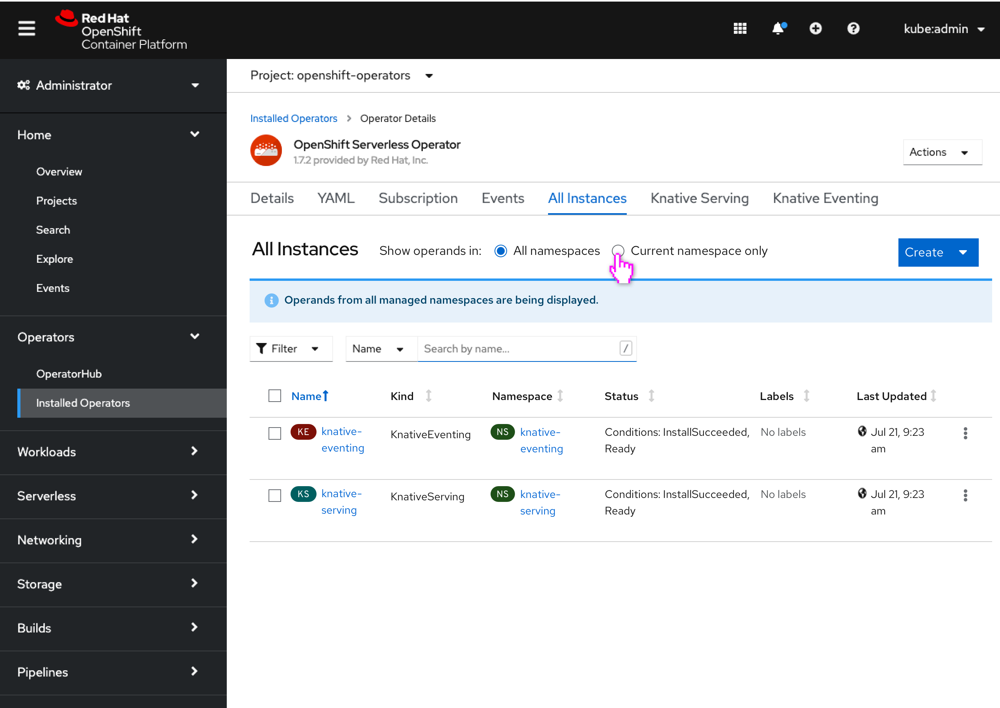
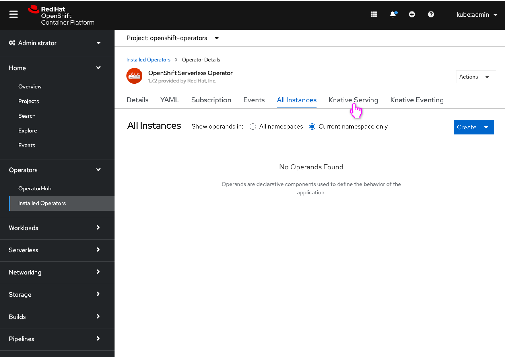
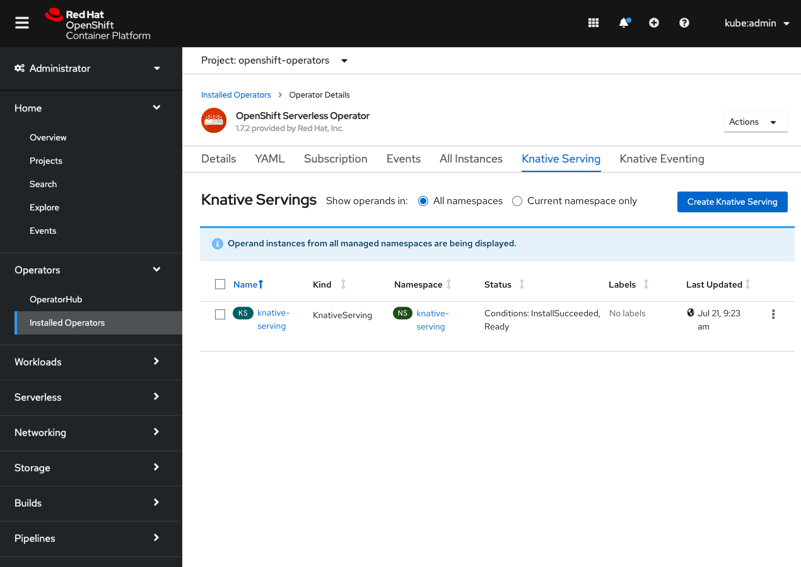
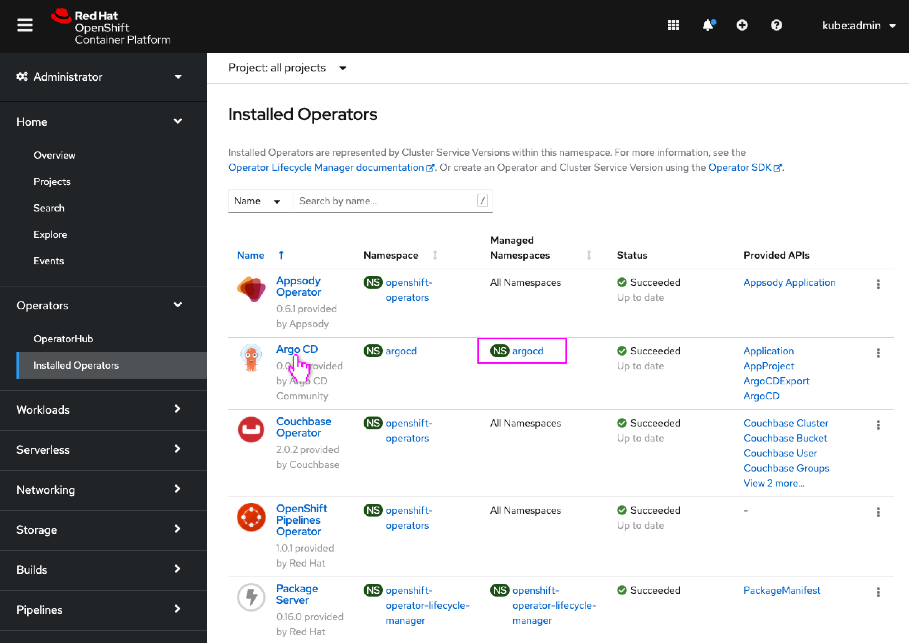
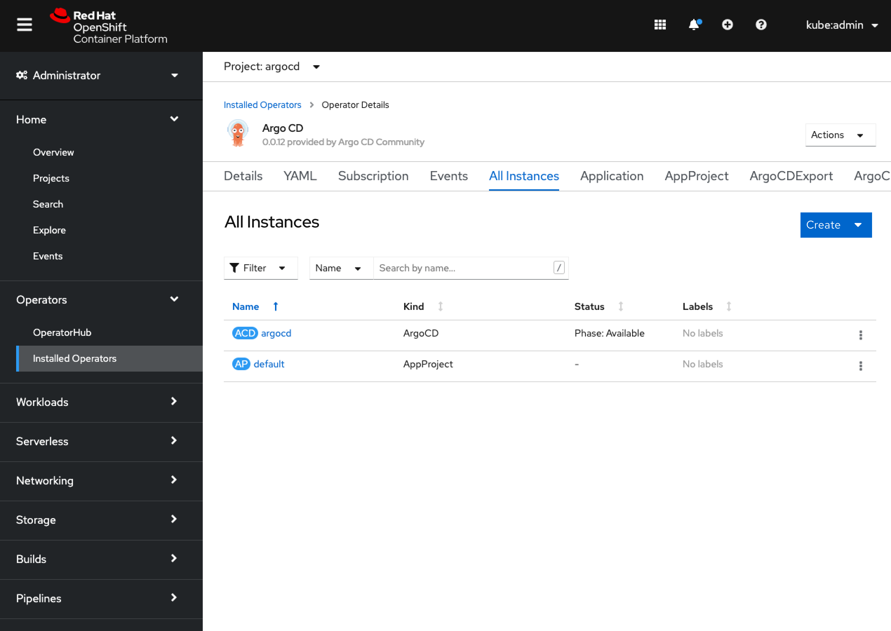

# Display All Namespace Operands for Global Operators

Today in the console, when a user clicks on an operator that manages “All namespaces” (globally installed) from the “All Projects” view of the Installed Operators page, they are taken to a the details page of where that particular operator is installed. The project selector switches from "All projects" to the specific project name where the operator was installed.

This can be disorienting then to look at the lists of custom resource instances and see them all blank or not contain all the instances you may expect, since the lists are showing instances only in the currently selected project (the install namespace) and not across all namespaces the operator is available in.

It is likely that making use of the new Operator resource will improve this experience as that resource is cluster-scoped, in which case the operator view would be across all namespaces and would show all operand instances in these lists, though that may still be some releases away.

In the meantime the console can make the default view for globally installed operators to show all instances across all namespaces, with a way to still see only the instances in the selected namespace in the project selector.

## Global Operators

- User opens a globally available operator.

- When viewing the operand instances, a new radio switching control allows all operand instances from either all namespaces or only the current namespace to be seen (all by default.)
- An info inline alert appears to notify the user they are view operand instances from all namespaces (as this is atypical behavior for the console.)
- A namespace column is added to the table to identity the operands’ namespace.

- When the radio is changed to “current namespace only,” only operand instances in the selected namespace in the project selector are shown (in this example there happen to not be any.)
- The info inline alert would not appear.
- The namespace column would not appear in the table.

- Individual operand type tabs also include the new switching interaction.
- If possible, the radio state could be preserved between operand tabs (not integral to the interaction though.)

## Non-global Operators (No change in existing behavior)

- User opens a not globally available operator.

- There is no change to operators that are not installed globally.
