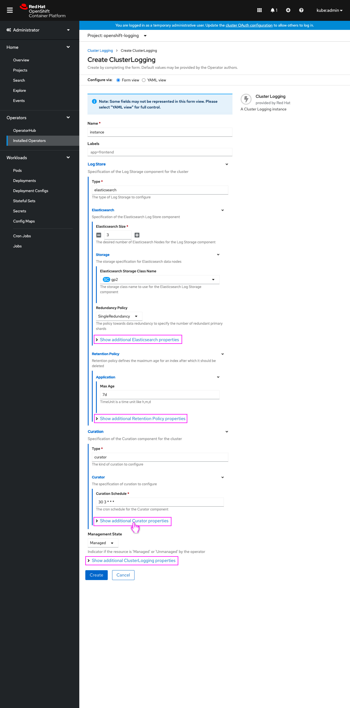
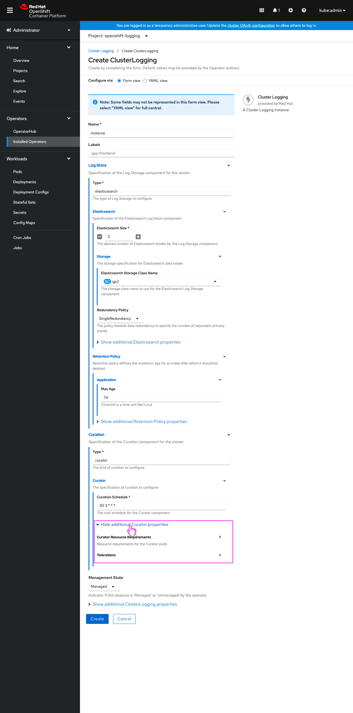
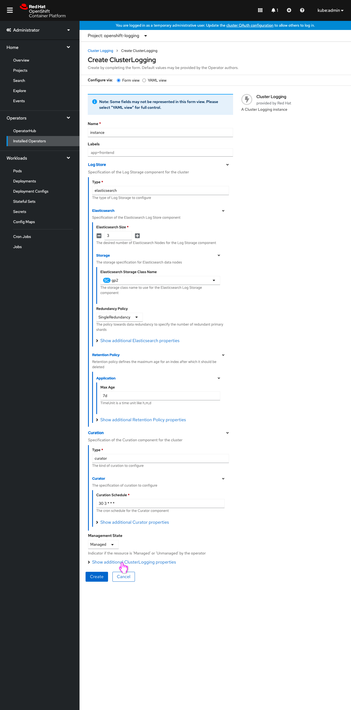
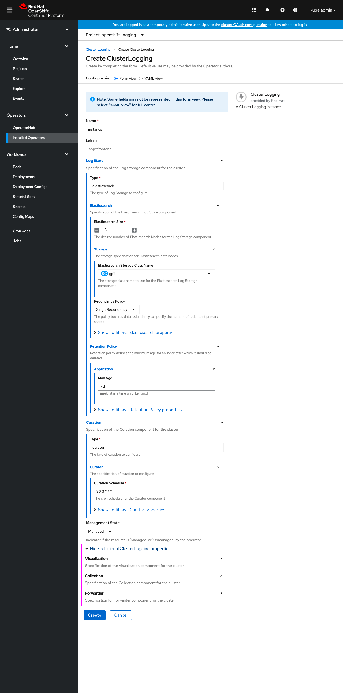
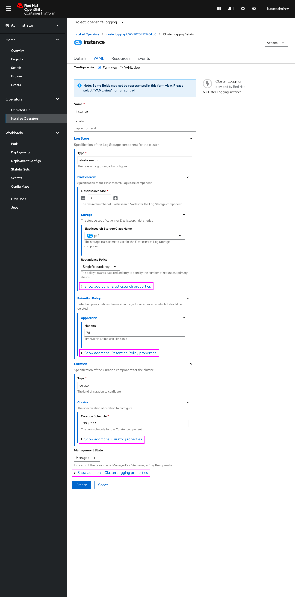

# Default operand forms to showing fields in the YAML template

As of OpenShift 4.5, forms for creating operands have been prioritized and are now the default creation method. Because the forms are programmatically generated based on the operand's schema, they can occasionally be very long and it’s not always apparent which fields are most important for the user.

Switching to the YAML view of the operand shows the fields that are included in the YAML template, which is a strong indication that those fields are more important to have values for (and are perhaps marked as required) for the operand. It can be cumbersome however to keep switching between the form and YAML views to identify these fields, then find them in the form when they may be in nested and collapsed components.

This design conveys a new interaction for these programmatically generated operand forms, where the fields in the YAML template are fully expanded to and therefore immediately visible, and any other fields not in the YAML template are located in an expandable "Show additional properties" area at the bottom of their related section. These two changes allow the user to quickly review and edit these more important operand fields.

This interaction will also appear for editing operands via their form (when available) so that again the user can quickly review and modify fields in the YAML template.

## Create operand forms

- The create operand form now prioritizes fields with values specified by default from the operator author in the YAML template.
- Any form sections with fields that contain values in the YAML template are expanded so the fields are shown by default.
- Fields in a section that don’t have a value entered in the YAML template are contained in a new Expandable control (collapsed by default) at the bottom each section labeled **Show additional [section name] properties**.
- These two changes allow for the fields in the YAML template to be quickly reviewed and edited, with quick access to the other fields in a section still available.

- Expanding an additional properites sections shows the fields (and their containing sections collapsed by default) that weren’t in the YAML template.

- The user expands the topmost section’s additional properties, which can be named the same as the form (**ClusterLogging** in this example.)

- The additional properties are shown.

## Edit operand forms

In the future, forms will be able to be used to edit operands (via their YAML tab) and this interaction will also appear. The edit forms will appear the same as the Create case, with only fields with values from the YAML template will be shown (not user-entered values.)

- When the user can edit the operand using the form via its YAML tab, the exact same fields will be shown by default as the create case, only those with values in the YAML template, and expanded by default.
- “Additional” properties that the user entered values for (either when creating or editing previously) will still be collapsed by default, so the form does not change appearance based on the user's past input, which may be disorienting. 
