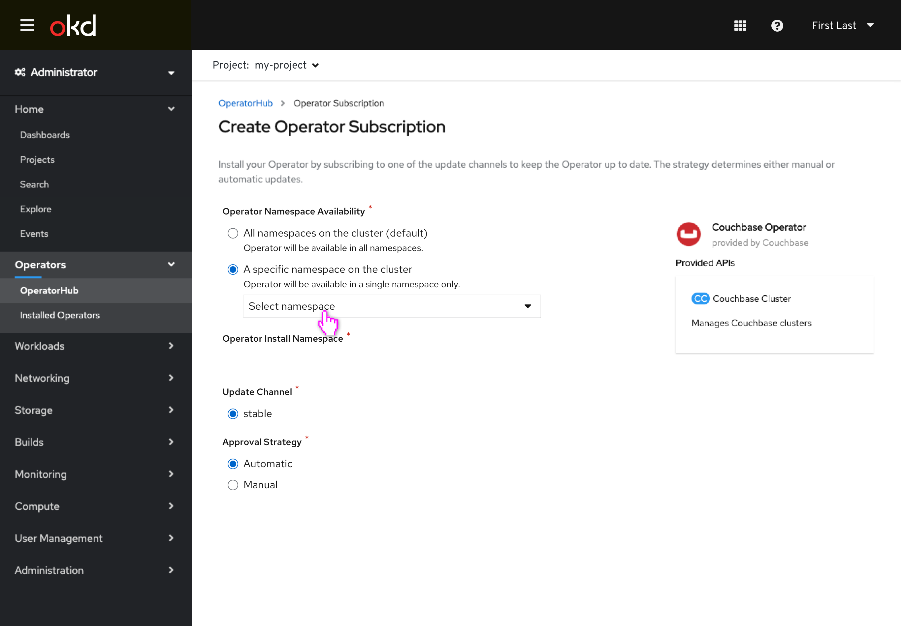
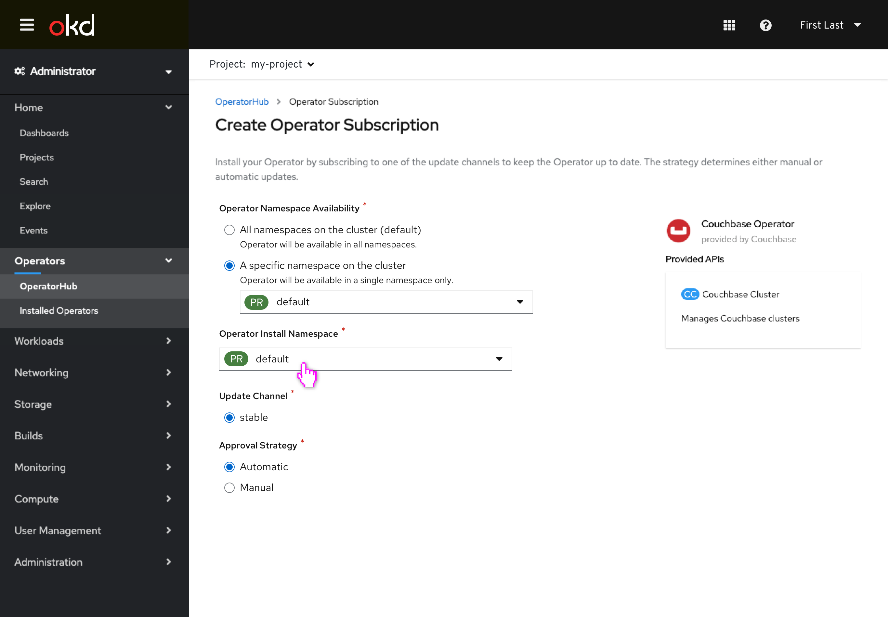
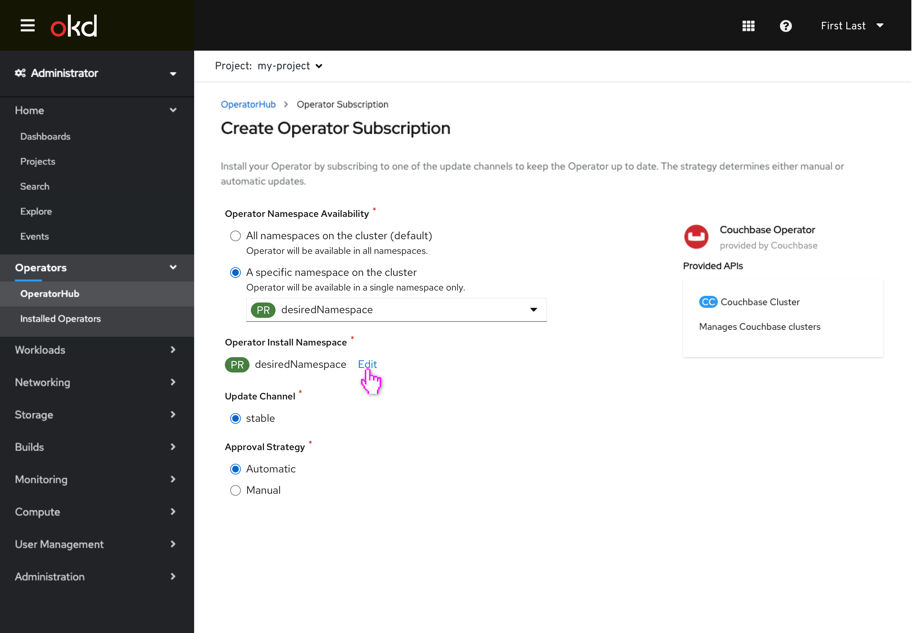
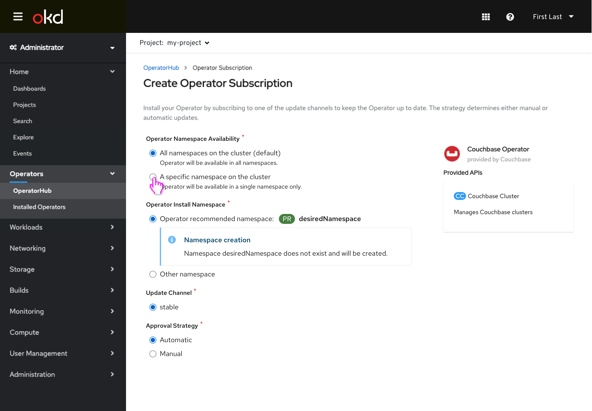
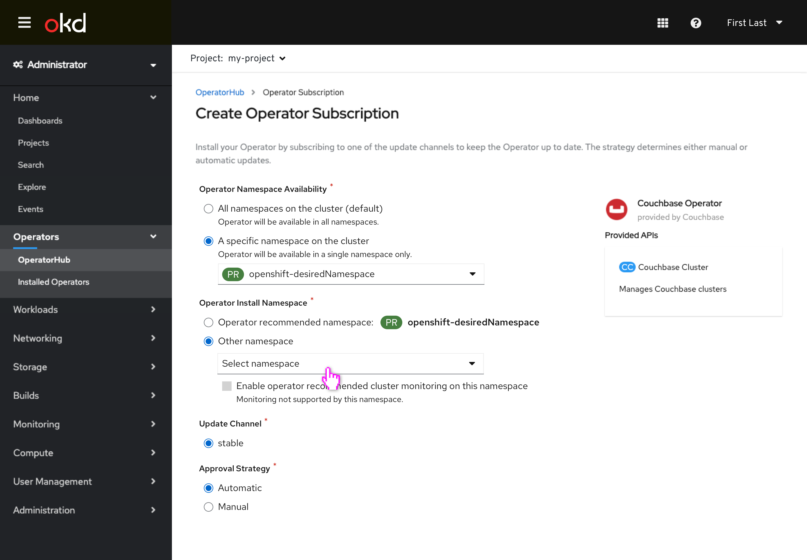
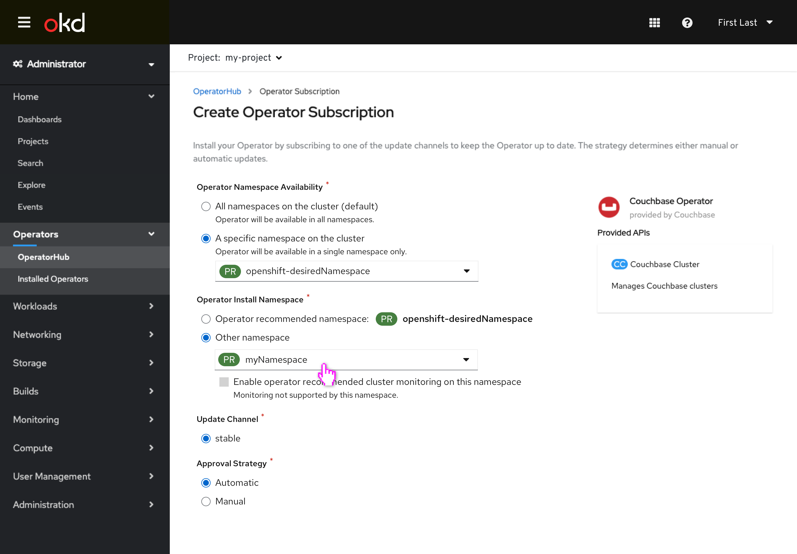
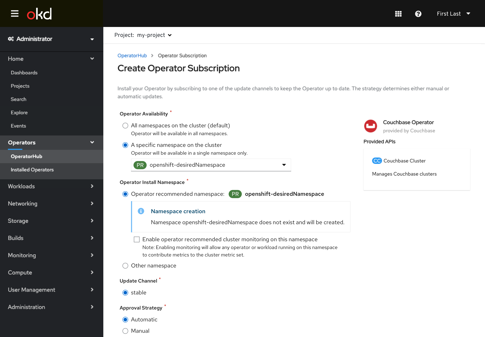
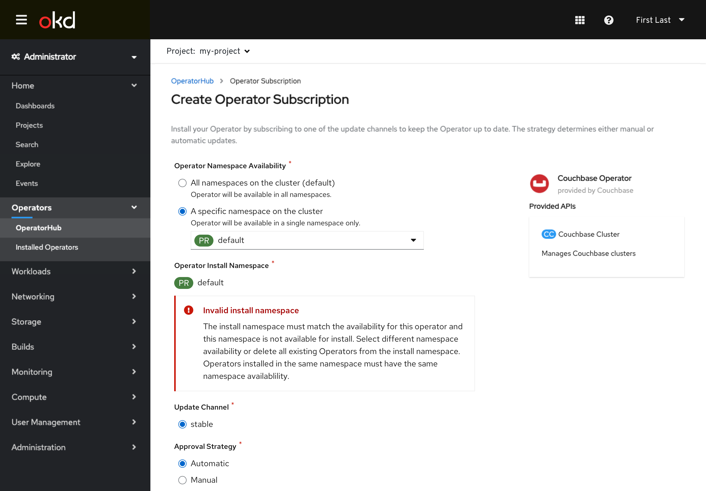

# Operator-defined Installation Namespace

Operator bundles can define what namespace they should be installed to, so that namespace is recommended as the default to the user. The user can still change the installation namespace if desired.

This design is now surfacing both the watch (availability) namespace and the install namespaces to the user. The installed namespace is initially read-only and defaults to **openshift-operators** when the availability namespace is **all namespaces**, and defaults to the **value from watch namespace dropdown** when the availability namespace is **single** & has a namespace selected. The user has the option to **Edit** the installation namespace if desired (and the operator allows.)

This design is not intended to convey every combination of controls that is possible via operator InstallModes, that information is available via [this spreadsheet](https://docs.google.com/spreadsheets/d/19J7IEjORg4-U6nQEwQkxPwe3SJazgpobN2HFKE2rFcc/edit?folder=1y5NhdQNm8b-NeX1I0uN6PHQzhp_NJPh0#gid=0). Controls in this design will be enabled/disabled/hidden as described in the spreadsheet and as conveyed in the screens below and the existing UI’s paradigms. This design is intended to show the location of controls and the interactions between them.

This design also captures the ability to enable cluster monitoring on namespaces that are installed to and the operator requests it. This setting applies to only certain whitelisted namespaces, and the user should be warned of the implications of doing so. Operators can request monitoring be enabled on their install namespace but we will also present this option.

## Installing with no operator-defined namespace (existing behavior)

- Installing an operator without a operator-defined namespace now conveys that by default the operator would be installed on the **openshift-operators** namespace with the option to **Edit**.
- Namespaces available to install to would not yet have an OperatorGroup object present configured to watch all namespaces.
- The new **Operator Namespace Availability** header will include the hint text: "The namespaces that will be able to instantiate custom resources for this operator."
- The new **Operator Install Namespace** header will include the hint text: "The namespace that this operator will be installed in."

-A specific namespace may be chosen for the operator to be available to (and installed to.)

-The install namespace will match the specific namespace the operator is available to, until the install namespace is manually changed.

- The user can **Edit** to modify the namespace the operator is installed to.

- The user manually sets an alternative namespace to install to.

- Changing the availability namespace no longer has any affect on the install namespace, as it has been manually changed.

## Installing with an operator-defined namespace

- When an operator-defined installation namespace exists, that namespace will be the default install namespace for the operator.
- The operator-defined namespace can be used for **all namespace** availability, or **specific namespace** availability, as the operator's InstallModes allow.
- If the user **Edit** the install namespace, the namespaces available for selection besides the operator-defined namespace would be namespaces that not yet have an OperatorGroup object present configured to watch all namespaces.

- The availability of this operator is changed to **specific namespace** and the operator-defined namespace is used as the default.
- Changing the availability namespace in this case would not affect the install namespace as it is the operator-defined namespace. The only way the install namespace would be changed is if the user manually changes it.

- The user chooses to **Edit** and can select a different namespace other than the operator-defined.

- The user selects another install namespace.

- This operator will now be installed in namespace **abc** and available to namespace **desiredNamespace**.

## When an operator-defined namespace doesn’t exist

- When an operator-defined namespace doesn't exist, the user is notified via an inline alert that it will be created when the operator is installed.
- The **Edit** control would not appear in this case so that the user is always aware of the additional alert.

- **Specific namespace** option is also supported.

## Enabling cluster monitoring on a namespace

- Operators can also request cluster monitoring be enabled on the namespaces they are installed on.
- This operator has a defined namespace of **openshift-desiredNamespace** and is requesting cluster monitoring be enabled on it.
- The **Edit** control would not appear in this case so that the user is always aware of the additional option.

- **Specific namespace** option is also supported.

- Cluster monitoring can only be enabled on certain namespaces. If a not supported install namespace is selected, the option is disabled.
- Supported namespaces include: openshift-* (excluding operators), kube-*, default, logging

- The selected namespace is not supported so the monitoring checkbox is not enabled.

- The selected install namespace is changed to a supported namespace and the user is able to enable cluster monitoring on it.

- Monitoring can be enabled on supported namespaces that are not yet created, as well.

## Warnings and Errors

- If an operator-defined install namespace has different availability already associated with it, the user will recieve an error and not be able to continue installation until changing the install namespace or availability.

- If an operator has a fixed watch and install namespace based on install plans and the namespace has different availability already associated with it, the user will recieve an error and not be able to continue installation until changing the namespace.