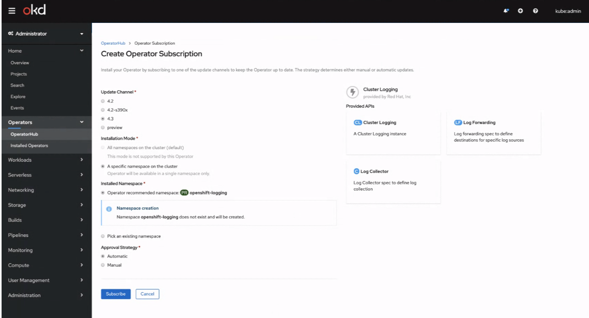
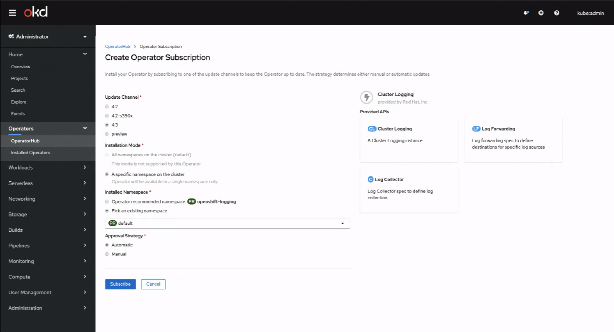
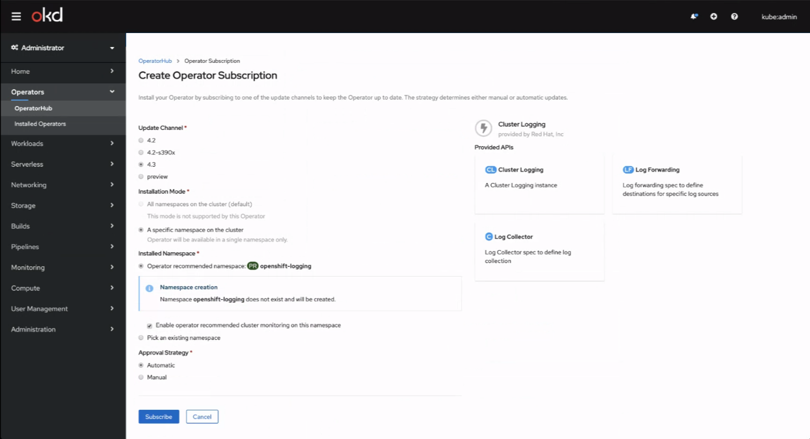

# Operator-defined Installation Namespace

Operator bundles can now define what namespace they should be installed to, so that namespace is recommended as the default to the user. The user can still change the installation namespace if desired.

Operators also now have the ability to request the user to enable cluster monitoring on namespaces they are installed to. This setting applies to only certain whitelisted namespaces, and the user should be warned of the implications of doing so.

## Installing an operator to a predefined namespace

- Certain operators benefit from being installed to a particular namespace, which has previously been conveyed through that operator’s documentation.
- Operator developers can now encode that information into their operator using a specific annotation for even easier installation by the cluster admins.
- This user is installing the **Cluster Logging** operator which indicates it has a recommended installation namespace of **openshift-logging**. This namespace is selected as the installation namespace by default.
- In this example, the **openshift-logging** namespace doesn’t yet exist, and the console indicates that it will be created for the operator to be installed in.

- If an admin needs to install the operator to another namespace, they can flip the toggle and choose from an existing namespace. 

## Monitoring a new installation namespace

- Operator developers may also suggest that admins allow the namespace their operator is installed in to be monitored by logging, which is helpful for keeping track of metrics exposed by the operator. 
- This option is presented right along with the newly created namespace, which is deselected by default so that the user can deliberately opt in.