# Operator Installing with Long Running Component

Shortly after the new screen to [Convey an operator is installing](http://openshift.github.io/openshift-origin-design/designs/administrator/olm/convey-installing-operator/) was developed, it was realized that other actions in the console could make use of a similar interaction. This design conveys a more generic version of the operator installing screen, and examples of perhaps how other actions could use a similar interaction.

## Operator Installation

These screens show how the existing Installing Operator feature could appear using newer, more generic, visuals, that could perhaps be made into a common component.

### Installing an operator
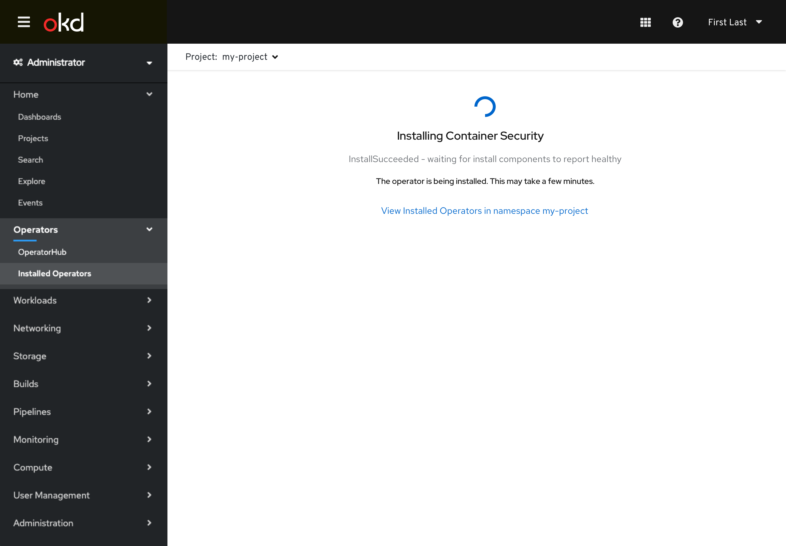

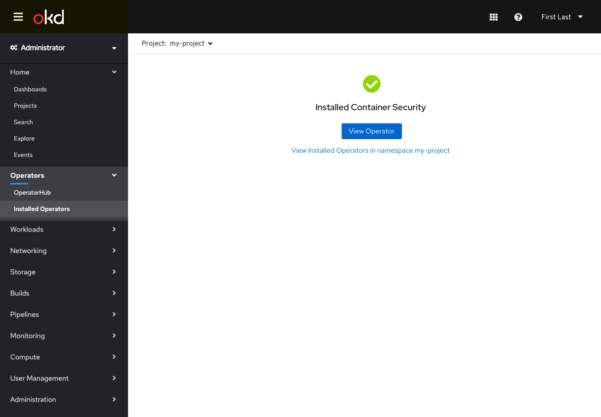

### Installing an operator with required custom resource

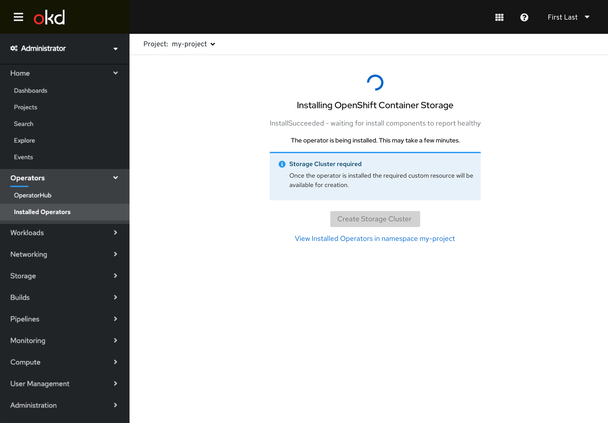

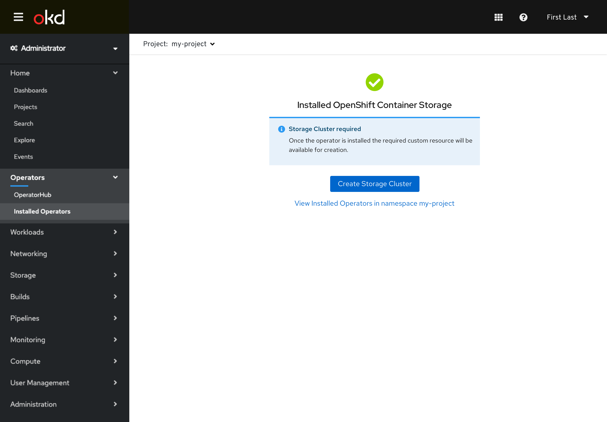

### Manual approval required

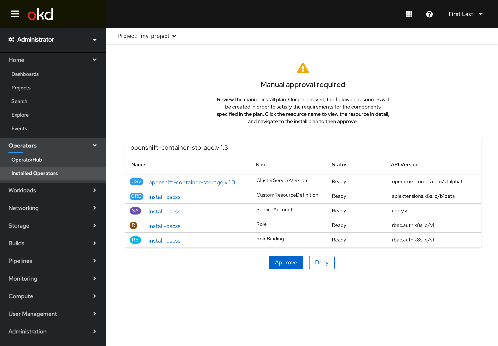

### Error occured

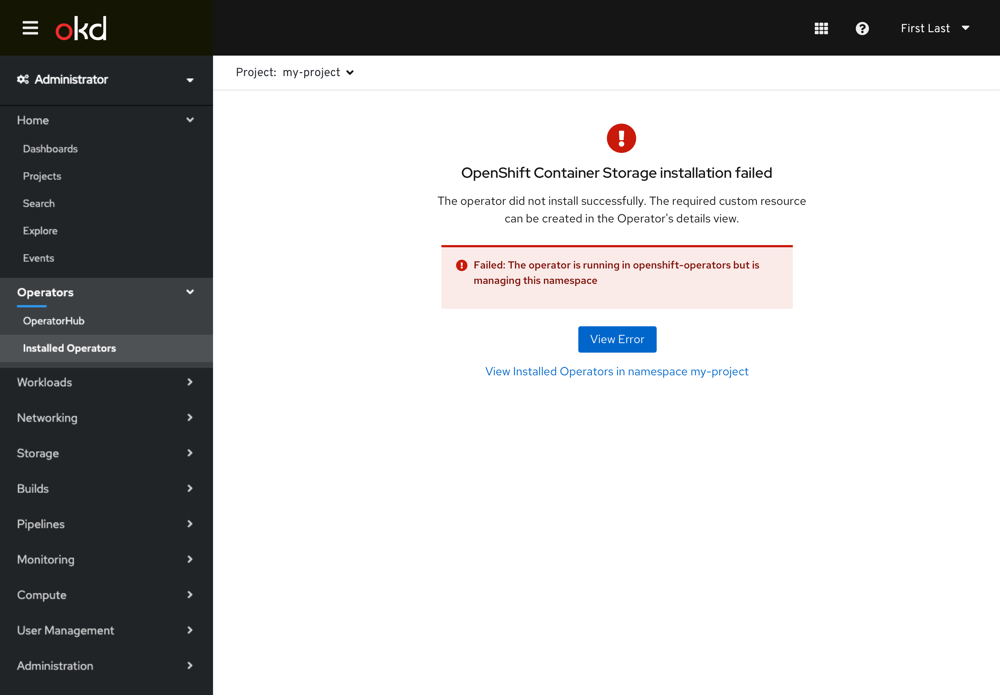

## Long Running Component

This portion of the design describes what common elements the component may have, as well as some sample screens of how interactions using it might appear.

Note: The features shown in the examples are not finalized and are only for conveying possible uses of the component.

### Component Elements
- Spinner, progress bar, or status icon
- Title
- Message text
- Inline alerts (as needed)
- Primary and secondary actions (as buttons or links, max 2 per line)

### Other Full Page Examples

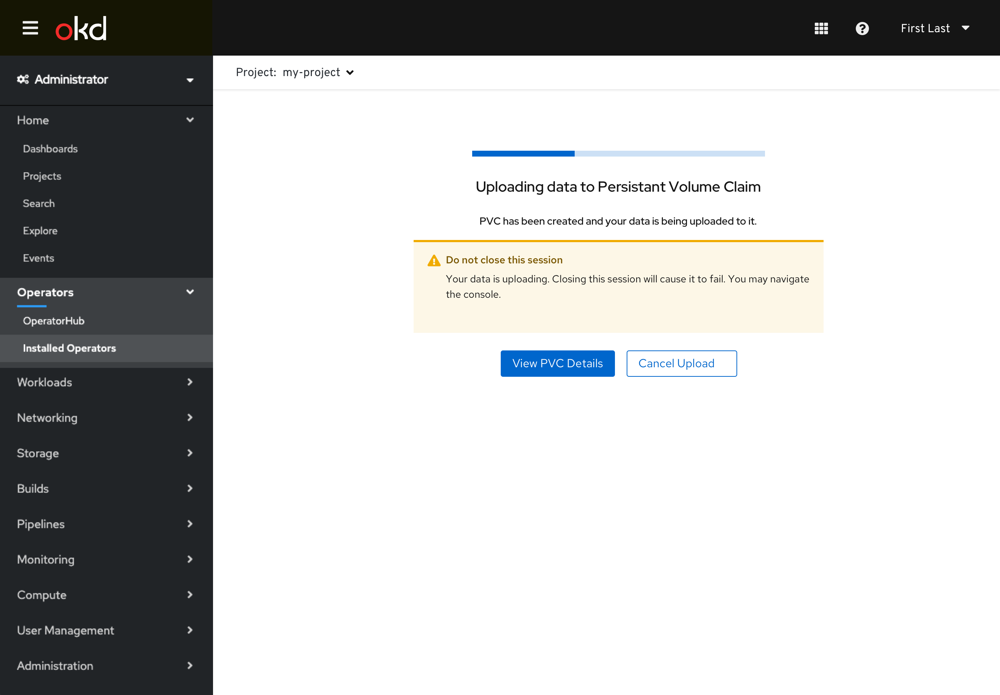

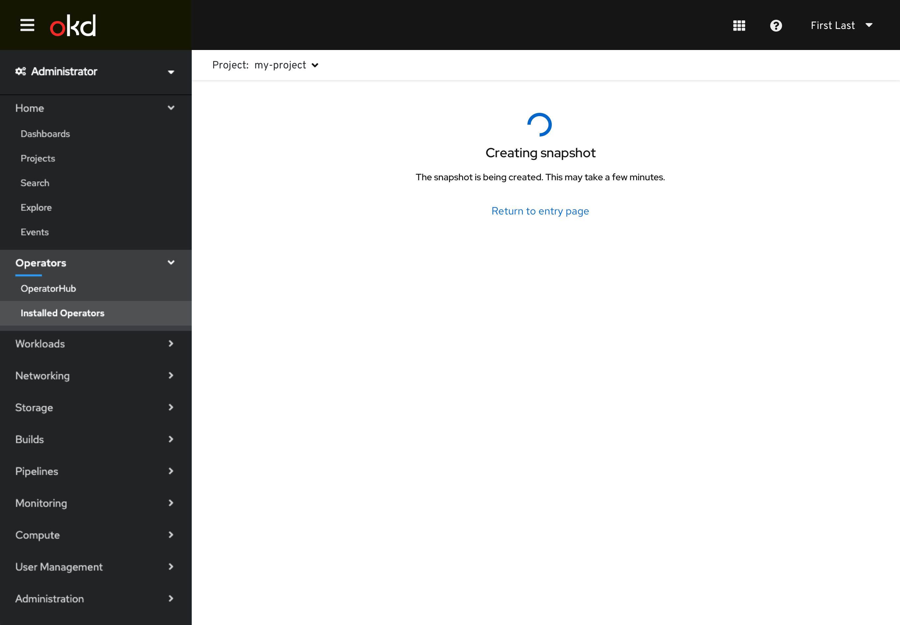

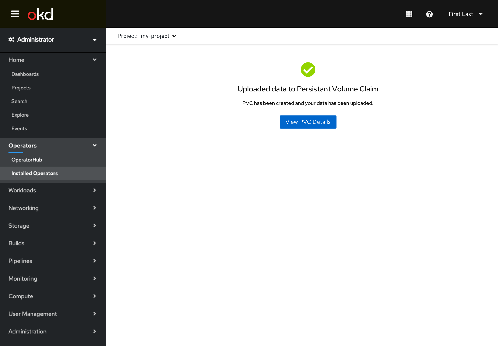

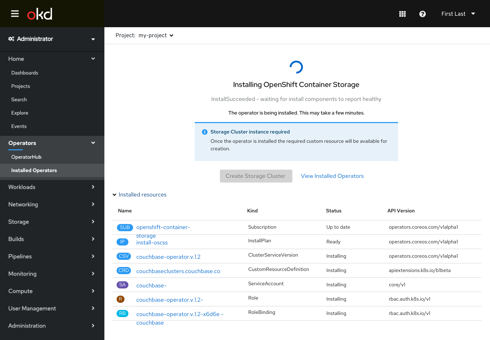
- Table could be separate from component.

### Modal Examples

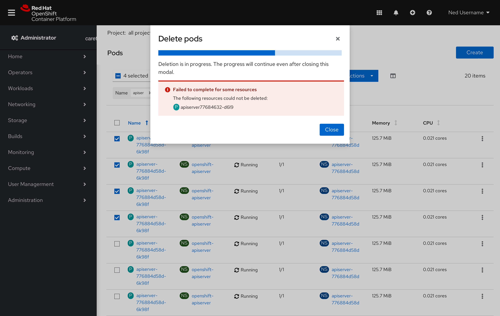

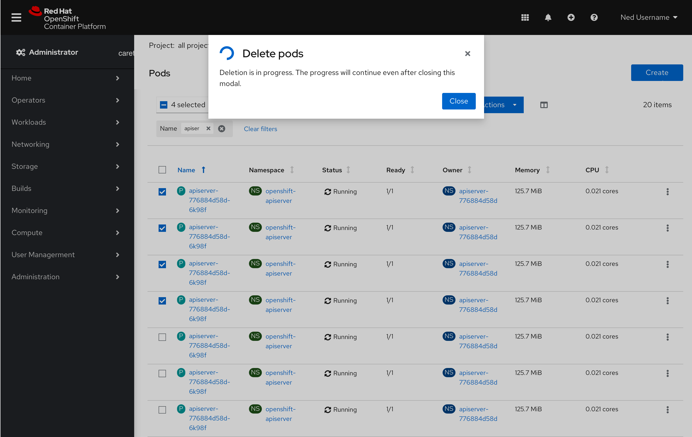

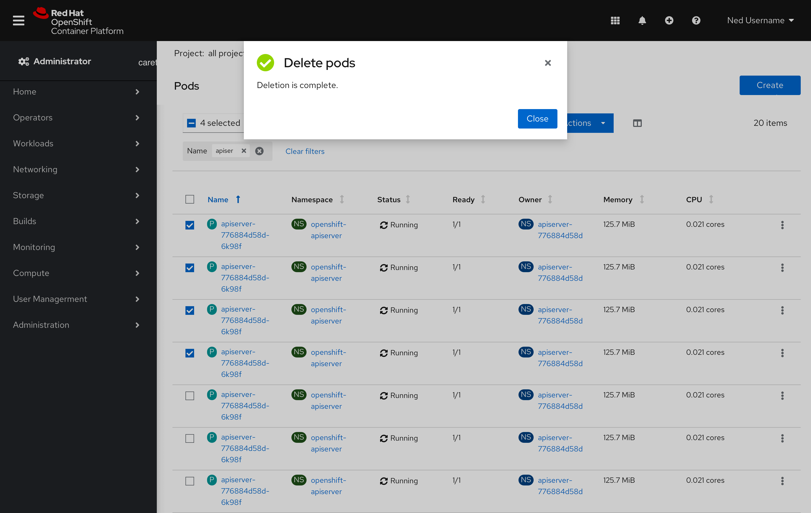