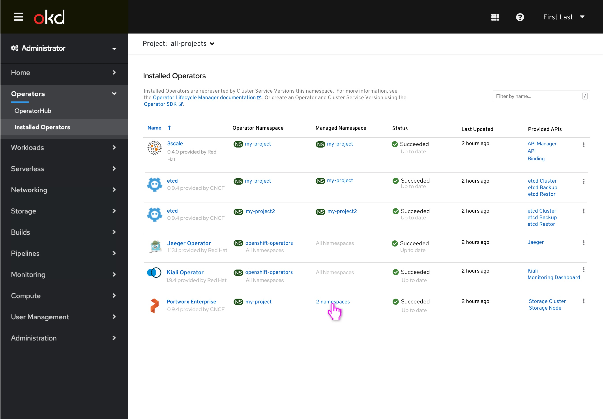
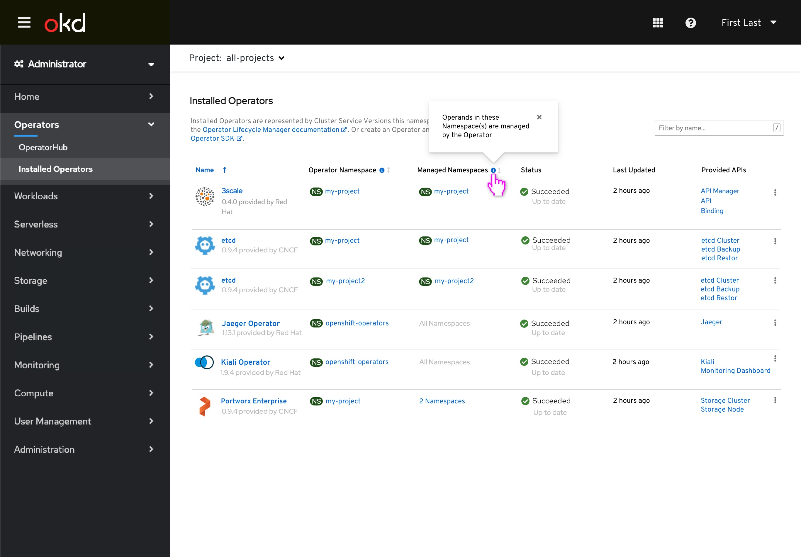
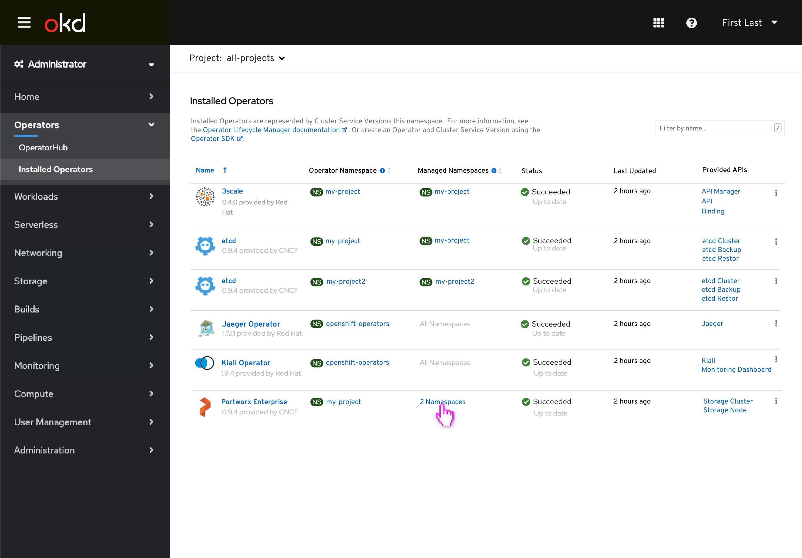
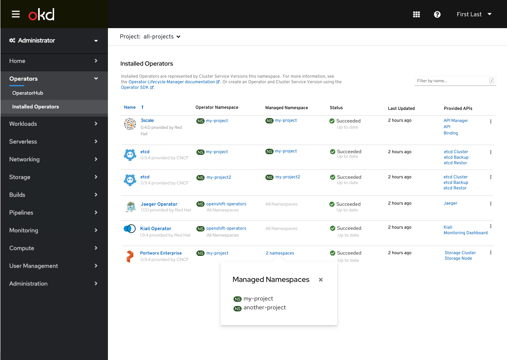
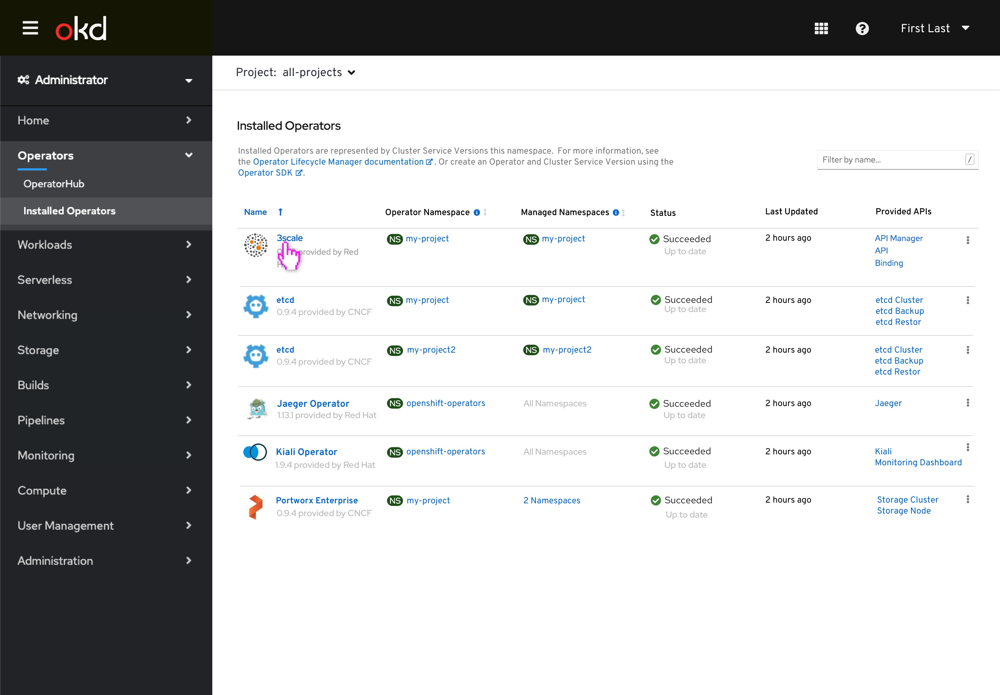
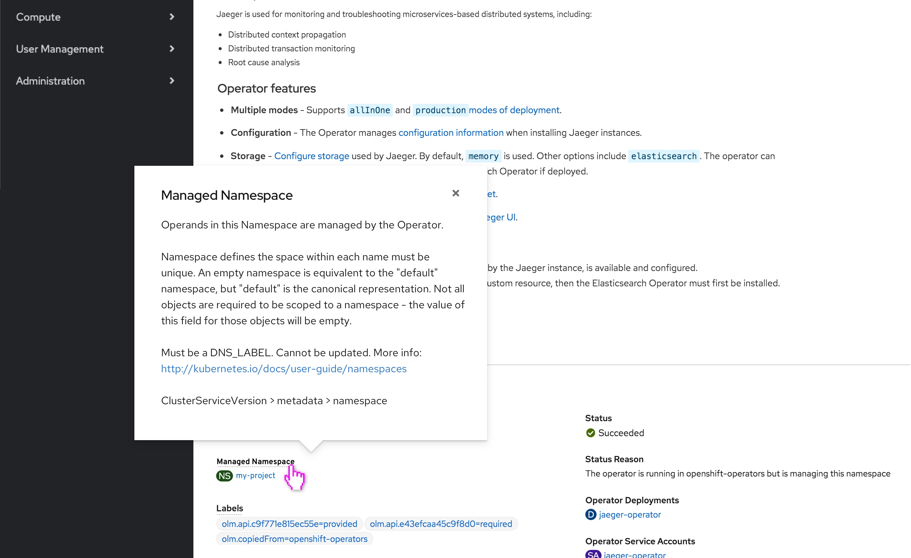
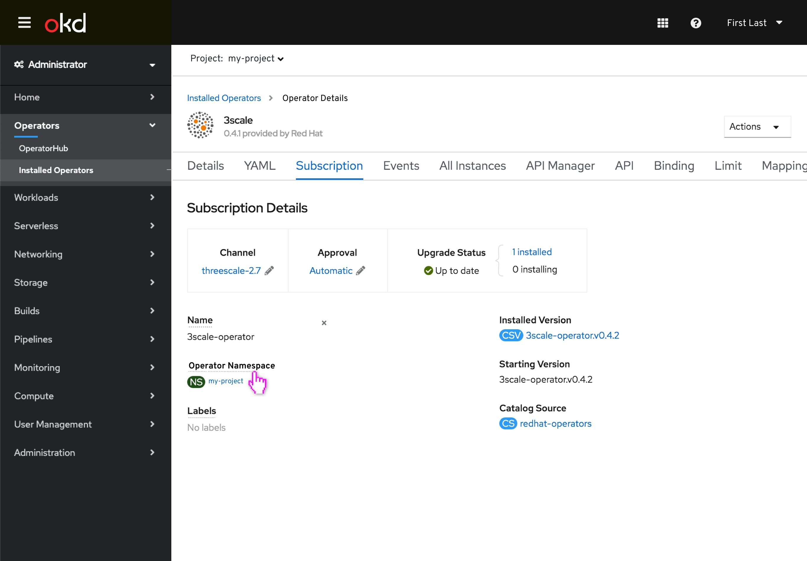
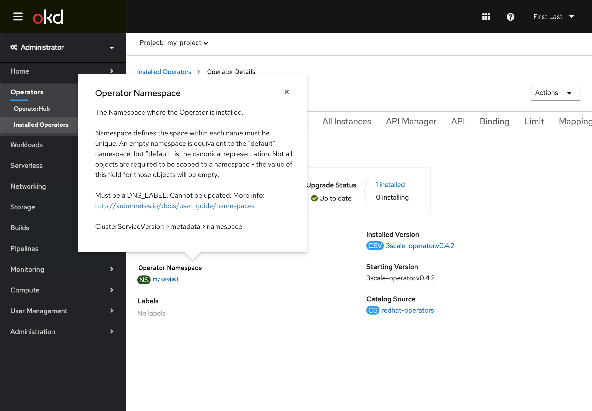

# List of Operators

## All-projects view
This is the Installed Operators page where “all-projects” has been selected from the project-selector. Info icons have been added next to the Operator Namespace and Managed Namespaces columns to provide the user more information about what these column titles mean.The user can sort the column via the sort icon (which looks like an arrow). This icon currently lives in the UI and is pre-existing functionality as part of the Namespace column.
There are a few additions to the flow:

1. We have introduced the Operator Namespace column. The Operator Namespace column lists the Namespace per Operator where the Operator is installed.

2. In the Managed Namespaces column there are three different ways the Namespace information can appear.

  a. “My-project” is representative of a single Namespace.

   b. “All Namespaces” is a text only link that is associated with the Namespaces that fall across all Namespaces.

   c. Thirdly, there is a multi-project view. For example, the Portworx Operator falls across multiple projects but not all projects, so in this example the Managed Namespaces column will have a popover on click. The Namespace names should be listed underneath as seen in the mockup.

On the Operator Namespace column, when the user clicks on the blue information icon, a popover should appear that reads “The Namespace where the Operator is installed”.

On the Managed Namespaces column, when the user clicks the the tooltip it should read “Operands in these Namespace(s) are managed by the Operator”.

On this screen the Portworx Operator falls across multiple projects but not all projects, so in this example the Managed Namespaces column will have a popover on click.

Clicking into the 2 Namespaces field, the popover will appear. The Namespace names should be listed underneath as seen in the mockup.

On the all-projects view when the user clicks into the 3scale Operator they will be taken to the Operator Details page.

If the user clicked on an Operator in the list view while the project selector is 'all-projects,' the details view would have the project selector = to that Operator's "Operator Namespace" since we wouldn't have the context of a single Managed Namespace to use. The Namespace field will read Managed Namespace. Zooming in on the interaction of the popover on the CSV Overview section on the Operator Details page:

## Single Project view

On the single project view, the Operator Namespace column does not appear here because the user who has access to “single project” view doesn’t necessarily have the access to “Operator Namespace” but will have access to the “Managed Namespaces” column. This is how this view will look on a single-project view:

Clicking into 3scale Operator, on the my-project Installed Operators page, if the user clicked on an Operator in the list view while the project selector is a single Namespace, the details view would also be that same single Namespace.

Here is the in-line Managed Namespace field under the CSV information. The ClusterServiceVersion Overview will always show the "Managed Namespace".

## Subscription page

On the Subscription page, we’ve updated the copy to say Operator Namespace. Subscription Overview would always show the "Operator Namespace."

When user clicks on info icon, the tooltip appears:

## Select Operator with All Namespaces under Managed Namespaces

User selects Jaeger Operator:

In the second example, when a user clicks into the Jaeger Operator they will be taken to the Operator Details page, and the Namespace field should read Managed Namespace.

## Edge case design - What if there are more than 10 namespaces?

In the event that there are more than 10 namespaces for an associated Operator in the Managed Namespaces column, the Managed Namespaces should appear in a modal. The PF modal behavior allows for scrolling, so scrolling through the list of Managed Namespaces will suffice for viewing a long list of Managed Namespaces. In this example, we have clicked into the 20 namespaces link associated with the Portworx Operator.

