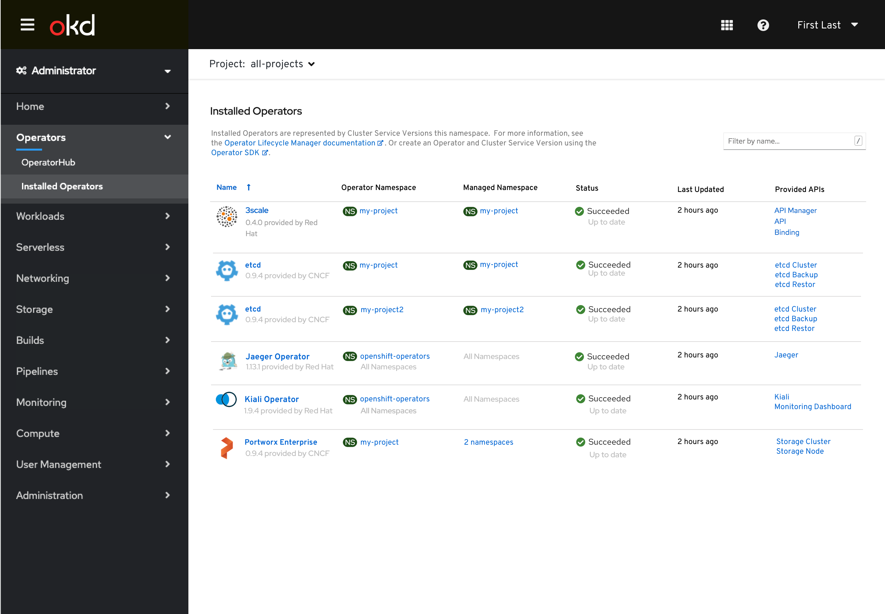
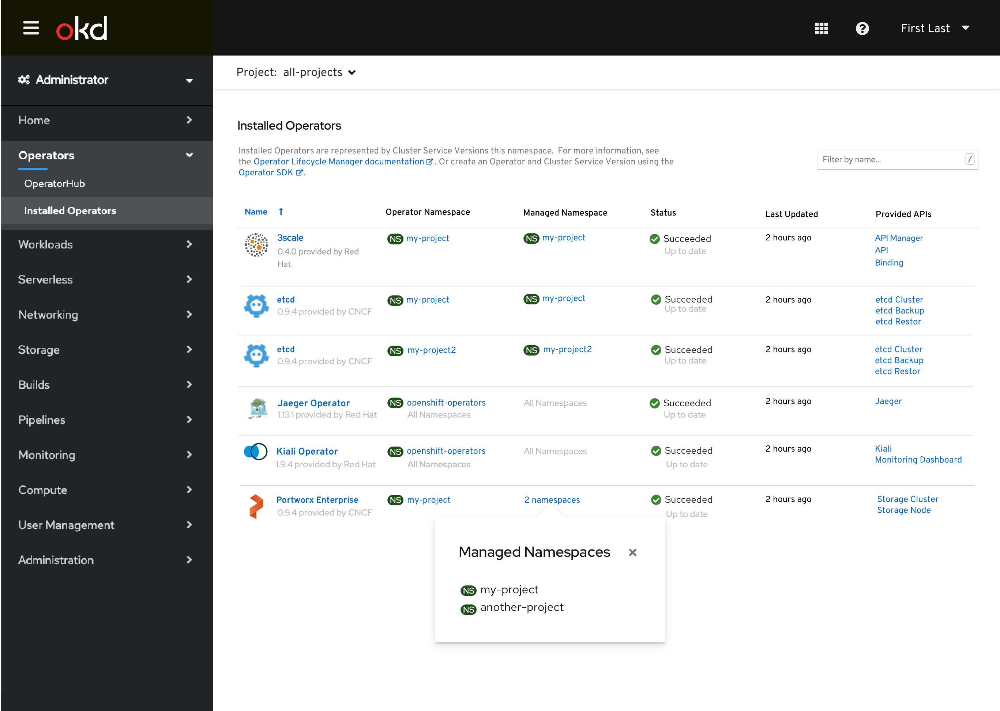
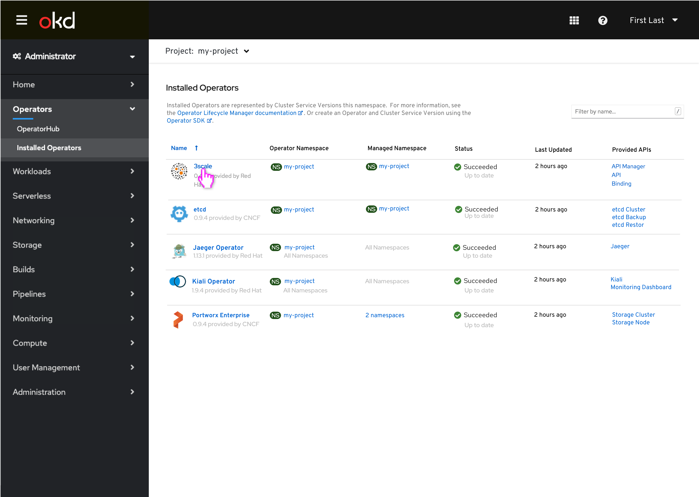
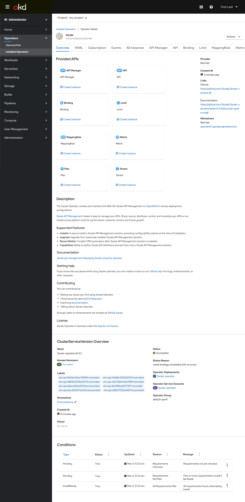
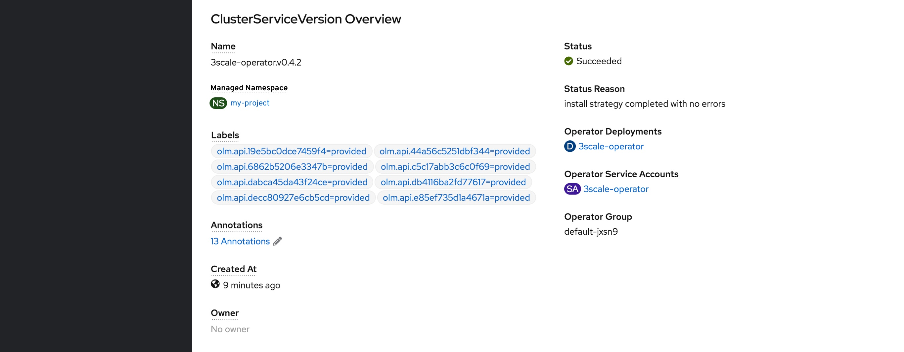
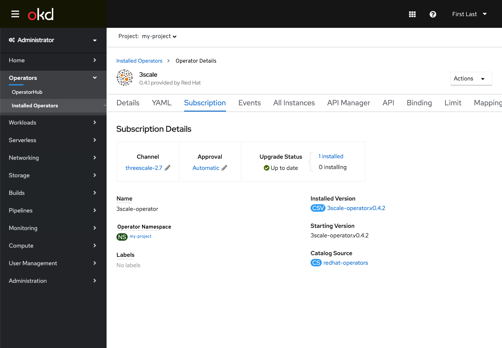
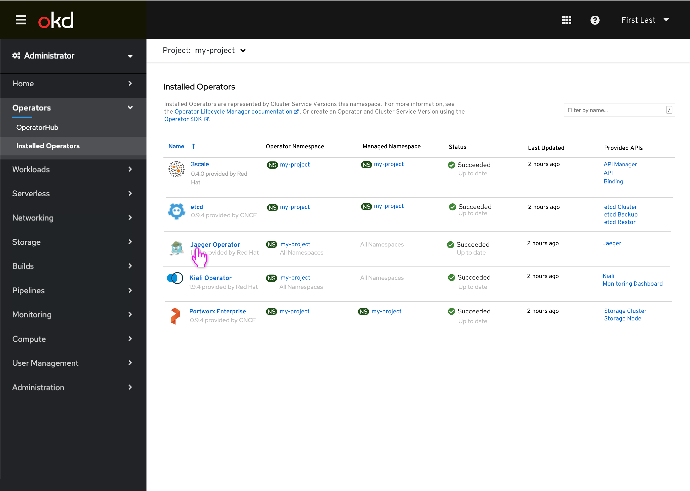
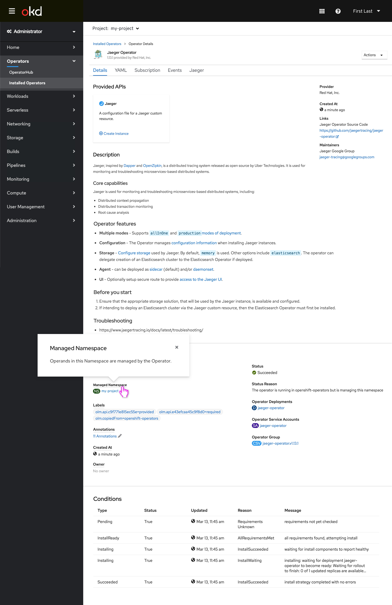
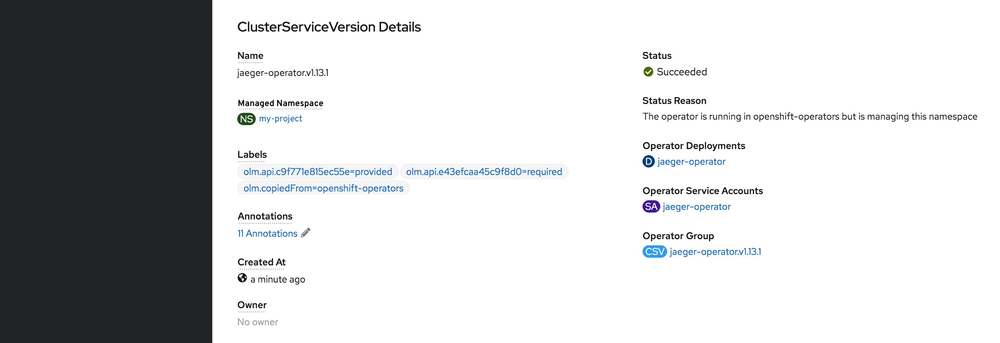

# List of Operators

## All projects view
This is the “all-projects” view which has been modified to now expose more information about the namespaces and without listing out every CSV. The goal of this view is to consolidate the list of operators. There are a few additions to the flow:

1. We have introduced the Operator Namespace column. The Operator Namespace column has 2 descriptors that can live in each row; the first is a single project like “my-project” that is associated with an operator like 3scale. If a namespace appears across All Namespaces it will appear as All Namespaces. In the example of an operator like Jaeger, the text underneath has the namespace name and All Namespaces underneath.

2. In the Managed Namespace column there are three different ways the Namespace information can appear. “My-project” is representative of a single namespace. “All namespaces” is a text only link that is associated with the namespaces that fall across all Namespaces. Thirdly, there is a multi-project view. For example, the Portworx operator falls across multiple projects but not all projects, so in this example the Managed Namespace column will have a popover on click. The namespace names should be listed underneath as seen in the mockup.

Clicking into the 2 namespaces field, the popover will appear:

## Single Project view

For the first example, 3Scale, when a user clicks into an operator that is associated with a single namespace, on the Operator Details page, the Namespace will read Managed Namespace. This is how this view will look on a single-project view.

When the user selects the 3scale operator, we land on the Operator Details page:

Here is the in-line Managed Namespace field:

## Subscription page

On the Subscription page, we’ve updated the copy to say Operator Namespace.

## Select Operator in All Namespaces view

User selects Jaeger Operator:

In the second example, when a user clicks into the Jaeger Operator they will be taken to the Operator Details page, and the Namespace field should read Managed Namespace.

And here is the cropped CSV details view.

