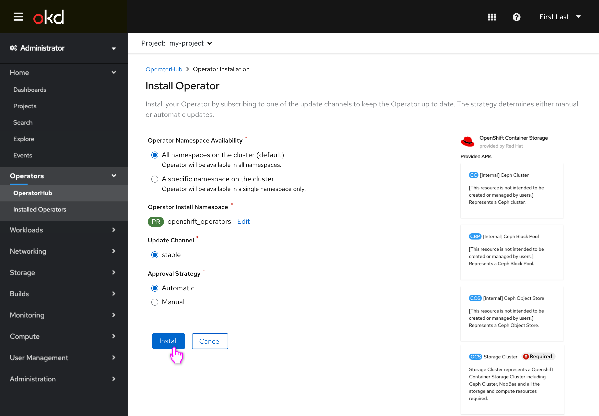
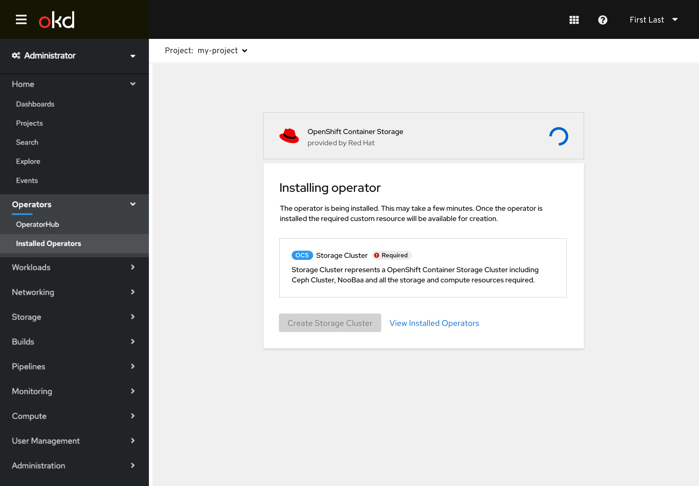
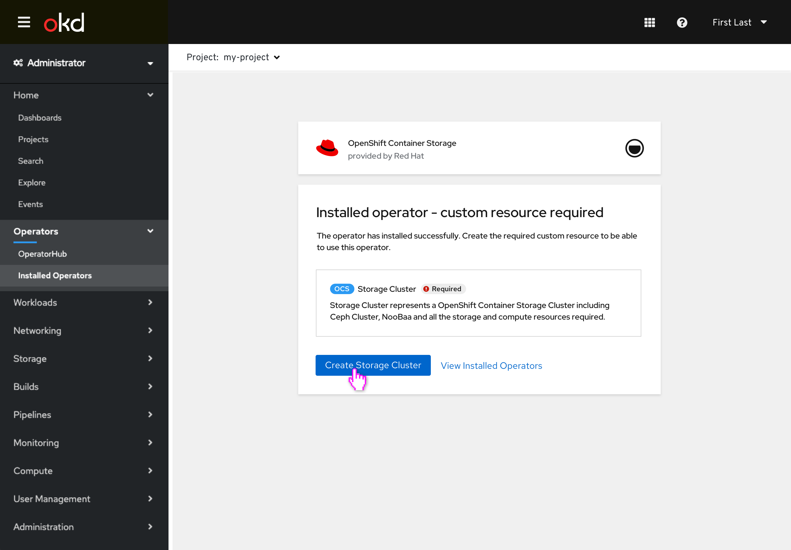
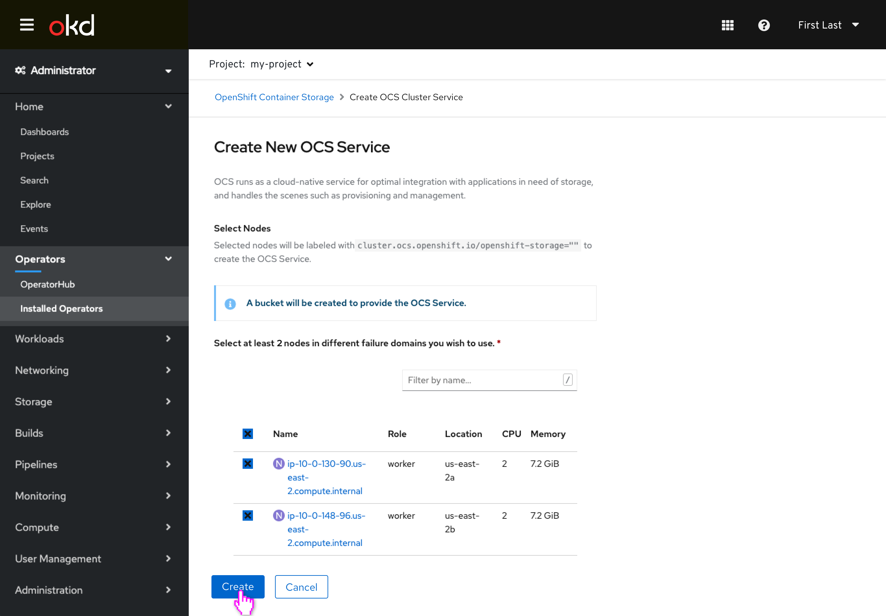
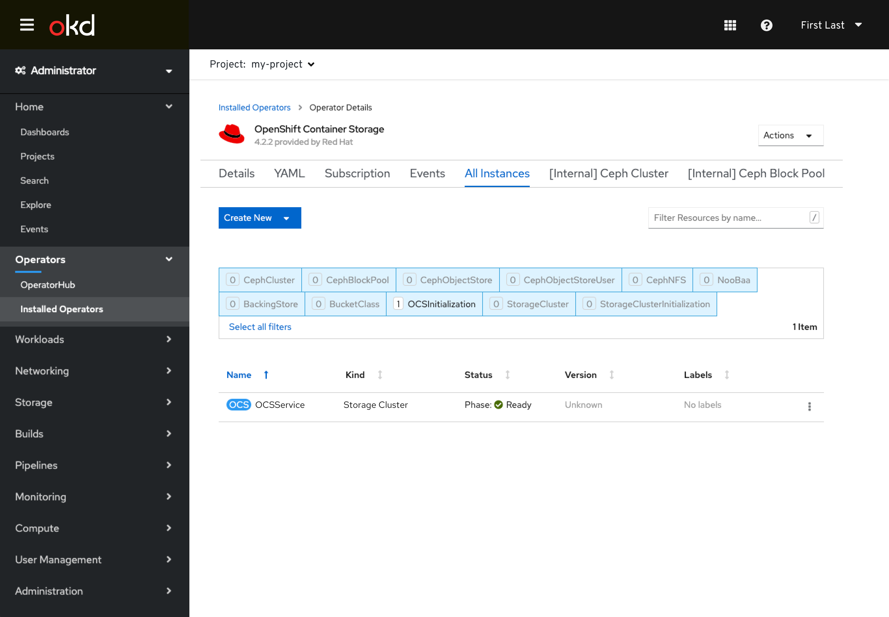
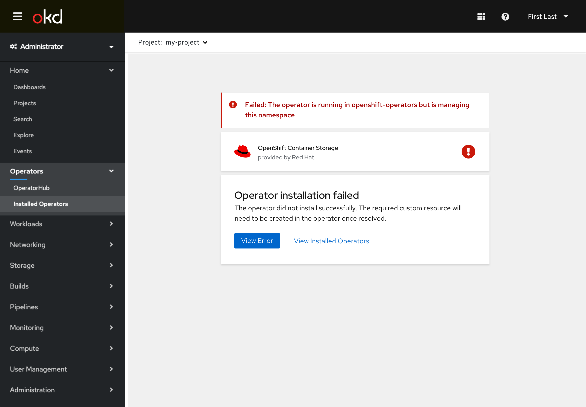
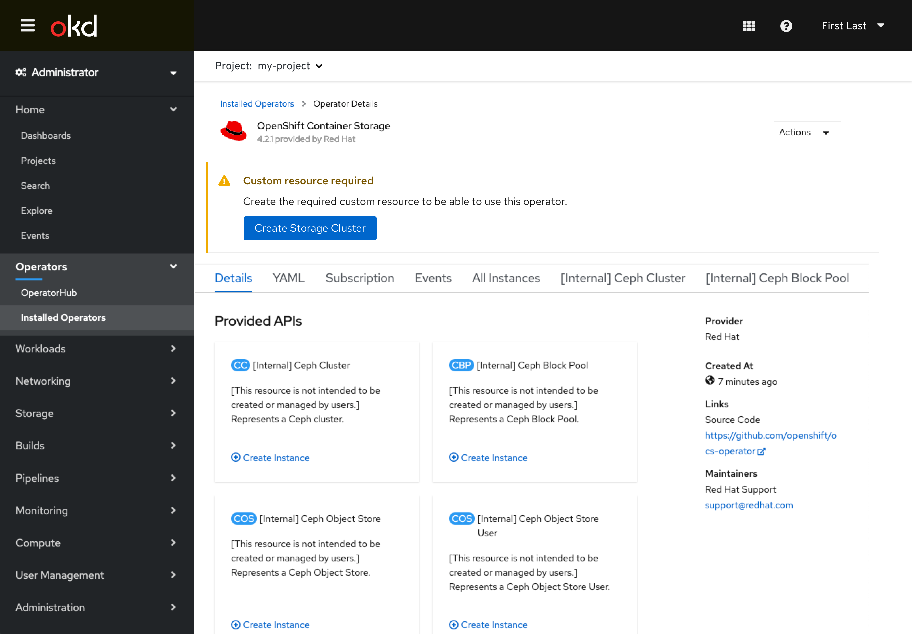

# Allow Operand (Custom Resource) to be Created During Operator Installation

Currently some operators need the user to instantiate a custom resource for the operator to be fully functional, but it is challenging for the user to determine they need to do so today. This design allows the operator developer to specify a single required custom resource that should be created at the same time as the operator is installed.

## Installing an Operator with a Required Operand Specified

- The user selects the operator they'd like to install and selected installation options.
- The required custom resource is marked with a badge as **Required**.

- The ‘Installing’ screen appears, though the required custom resource is now shown with the **Create [Custom Resource]** button not yet enabled.
- The user can navigate away from this screen, but they may be more inclined to stay seeing that the custom resource creation is next.

- Once the operator has successfully installed, the user is notified that they still need to create the required custom resource to use the operator.

- Existing interactions are used to create the required custom resource.

- Once the required custom resource has been created, the user is taken to the **All Instances** tab in the operator details where they can see the CR has been created.

## Warnings and Errors

- Assuming any of the following occur while the user is still viewing the ‘installing’ screen: Subscription creation fails, InstallPlan creation fails, CSV, CRD, Deployment, RBAC creation fails or requirements are not met, like MinKubeVersion, the error is presented on the failure screen and the user is notified they still need to create the required custom resource.
- The user can view the resource that generated the error (or its parent resource) via the **View Error** button.

- If the user exited the install flow before the creation of the required CR occurs, or an error occurred that didn’t allow for it, the details view of the operator would convey that it is still required, and offer the same button to create the custom resource.