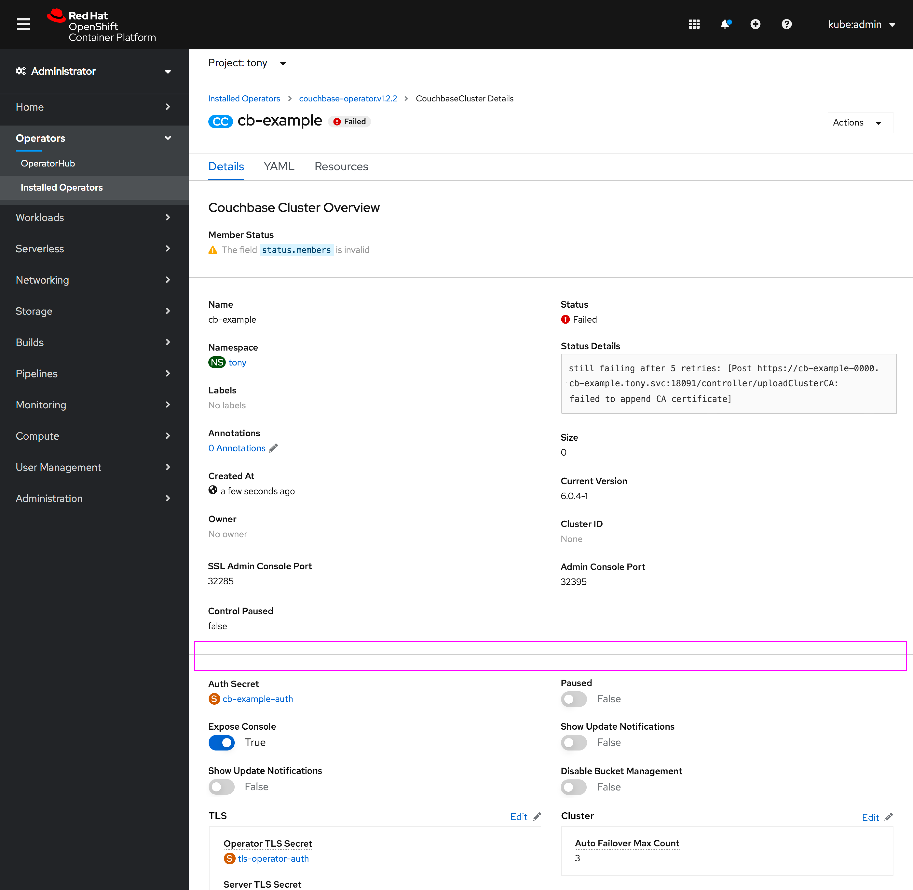
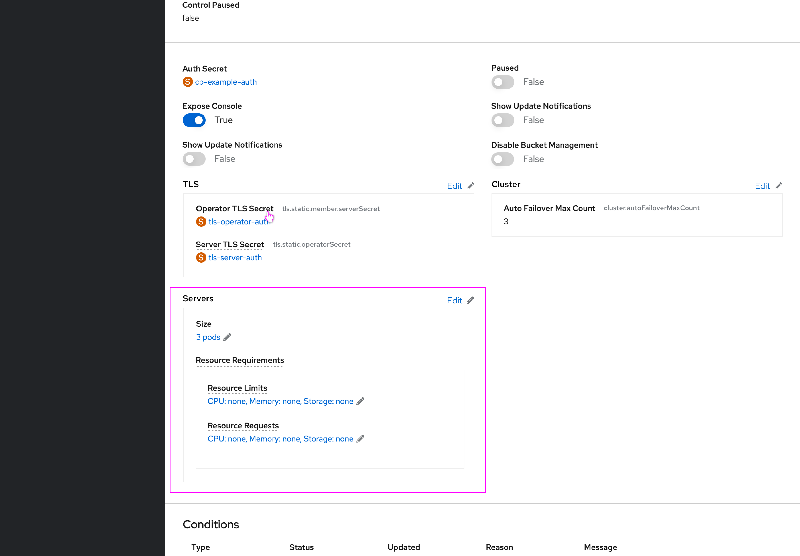
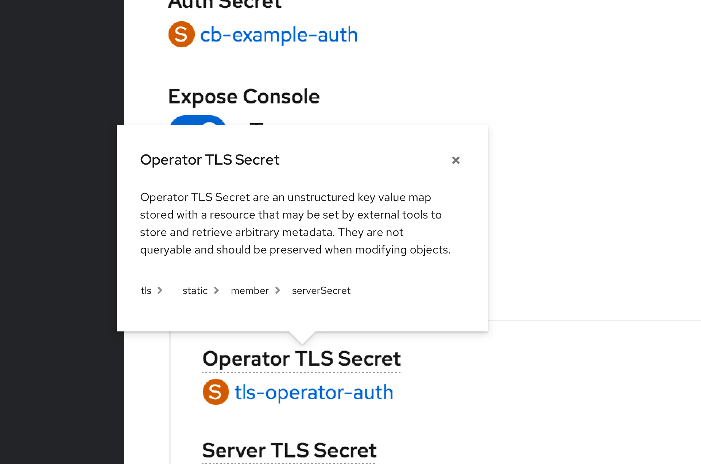
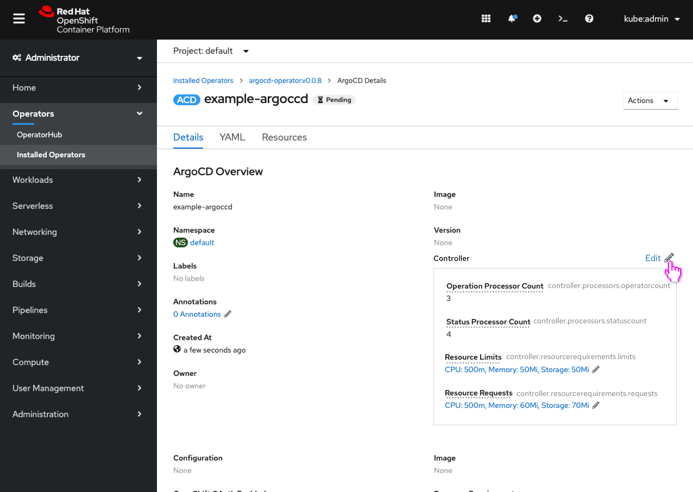
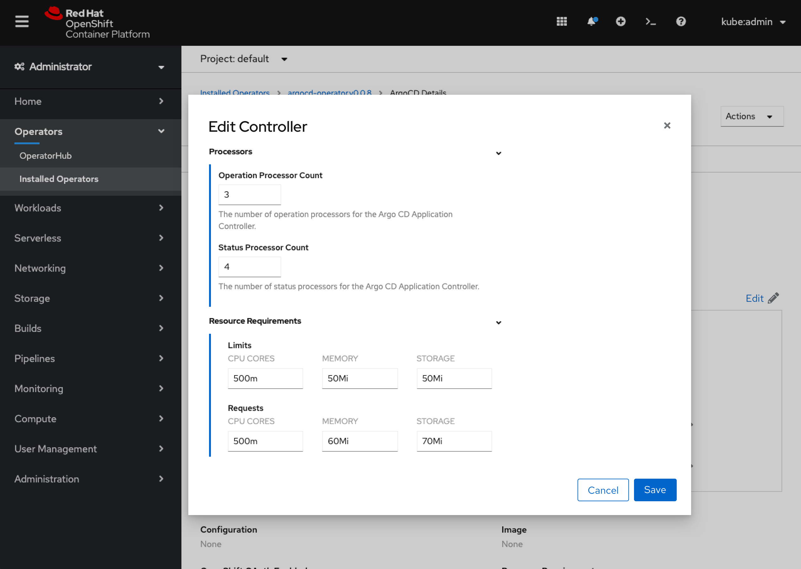
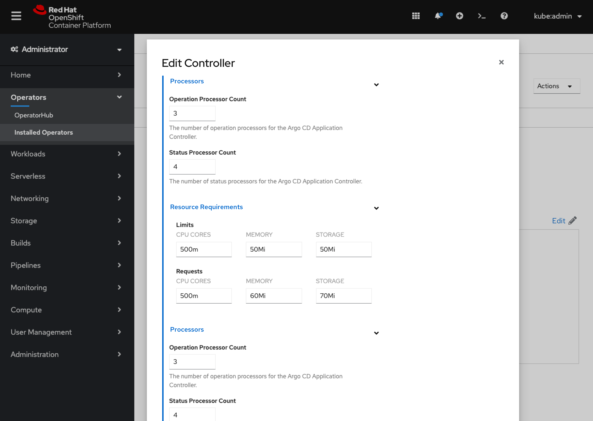

# Improve grouping and editing on Operand Details view

When creating an operand, fairly complex nesting and hierarchy of fields is used to set values on the operand. Once created however, the Details tab for that operand does not show this hierarchy and all fields are shown at the same flat level, with somewhat of a mix of spec and status descriptors, with some hierarchical section headers missing as well. This can make this view challenging to interpret.

This design describes surfacing the common spec descriptors first, the status descriptors next, then the rest of the spec descriptors, with a divider separating them. Groups of spec descriptors will now have their grouping reflected using a box for the first level, with the common `DetailsItem` popover to surface the full hierarchy. An option to edit these groups using their existing form view will also be available.

## Separating Spec and Status descriptors

- A new divider will be added between the status and spec descriptor sections to visually separate them.

## Grouping Spec descriptors

- The top level of spec descriptors' hierarchy will now be shown grouped in a box.

- Each descriptor will support the common `DetailsItem` popover style that shows more information on the header click, including the description and full hierarchy level path.

## Allowing quick access to edit form from a Spec group

- Each top level group will include an **Edit** link, following the common [group edit convention](http://openshift.github.io/openshift-origin-design/conventions/documentation/edit.html#edit-links), allowing the user to quickly view the full form view of that group, and edit all of its fields.

- A modal is opened that shows the portion of the form view for that particular group.
- The form view allows for the full hierarchy of that group to be seen, along with the ability to edit each field.

- If the group is very long, the modal will expand to allow for a full view.