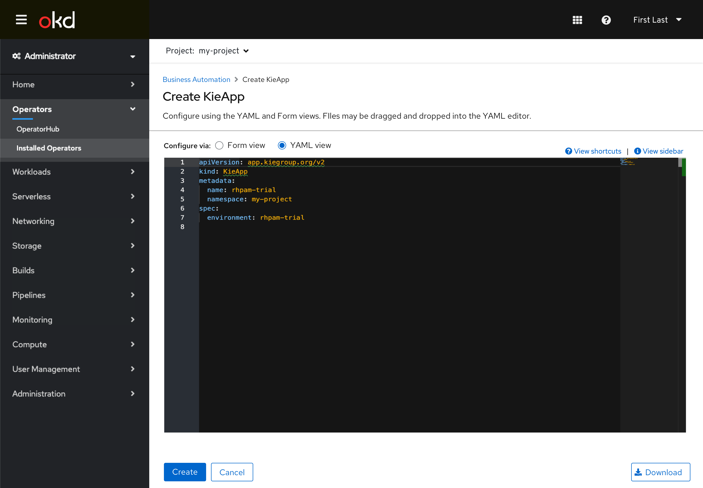
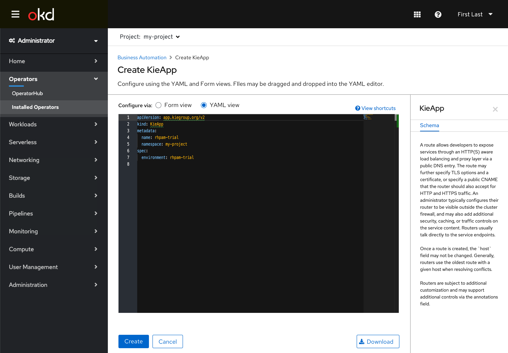

# Operand (Custom Resource) Creation via Form/YAML Switching Interaction

The existing **Edit Form** and **Edit YAML** links that have been used to switch between views have been changed to a radio control to better convey that the user can freely switch between the two without losing changes between them. The controls are located immediately above the editors to aid discovery, and the use of radios with a label improves accessibility. This new create interaction can be seen in the [Creating Resource Conventions](http://openshift.github.io/openshift-origin-design/conventions/documentation/create.html).

## Creating Operands

- Creating an operand now includes a radio button switching interaction that replaces the previous **Edit** links.
- The form view is defaulted to when the user is creating an operand, with the option to switch to the YAML.
- The inline alert conveying that all fields may not be represented in the form view still is present.

- Users can switch to the YAML view. Any data that was entered in the form would be reflected in the YAML view, as well as any data entered in the YAML would be reflected in the form if it is switched back to (as its fields support.)

- The **View sidebar** interaction is still supported in the YAML view.
