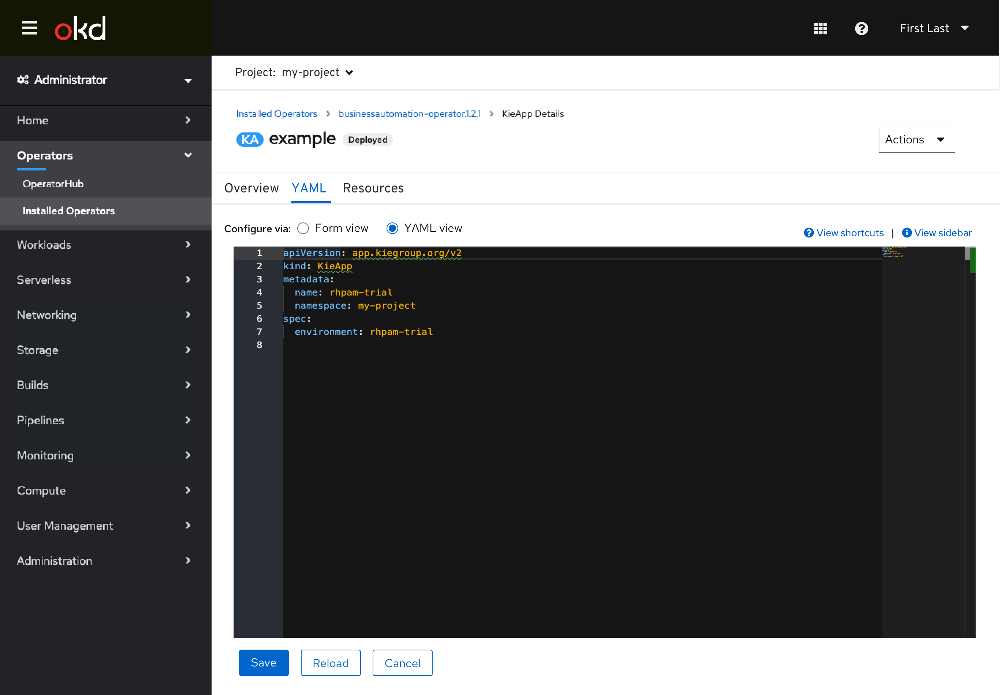
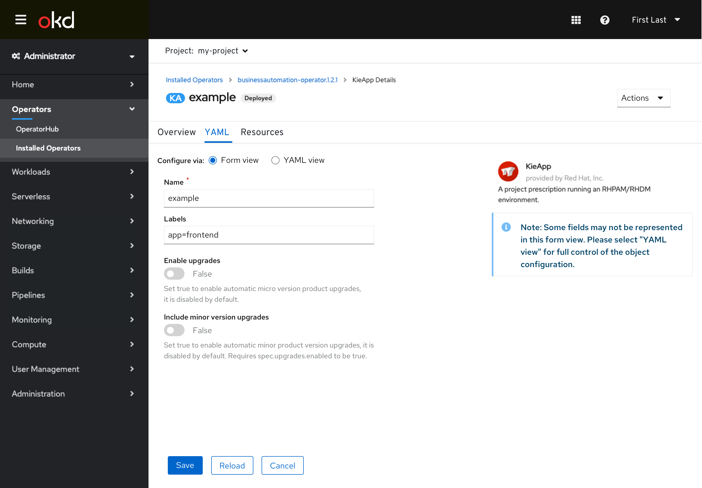

# Operand (Custom Resource) Creation and Editing Form/YAML Switching

The existing **Edit Form** and **Edit YAML** links that have been used to switch between views have been changed to a toggle control to better convey that the user can freely switch between the two without losing changes between them. The controls are also located immediately above the editors to aid discovery, and the use of radios with a label improves accessibility.

Since this interaction is shared between the admin and dev consoles, they will both likely see this change simultaneously. The intent is that this interaction can then be used elsewhere in both consoles to replace existing **Edit Form** and **Edit YAML** link uses in the future.

Some resources do not support form editing yet in which case the creation and editing for those resources would be similar to the existing YAML-only behavior with no radio controls to switch to form.

Note: The footer (Create/Cancel buttons) is intended to always appear on the screen in either the YAML or Form views, in a sticky footer. There is a current dev console story intending to make this change for the form view.

## Creating Operands in Admin Console

- Creating an operand now includes a radio button switching interaction that replaces the previous **Edit** links.
- The form view is defaulted to when the user is creating an operand, with the option to switch to the YAML.
- The inline alert conveying that all fields may not be represented in the form view still is present.

- Users can switch to the YAML view. Any data that was entered in the form would be reflected in the YAML view, as well as any data entered in the YAML would be reflected in the form if it is switched back to (as its fields support.)

- The **View sidebar** interaction is still supported in the YAML view.

## Editing Operands in Admin Console

- Editing an operand still occurs in the **YAML** tab in the details view, though now the view switching interaction is present in the tab as well.
- The user can freely switch between the two views and **Save**, **Reload**, and **Cancel** as needed.
- The YAML view is defaulted to to remain consistant with existing user expectations, and allow for easy reference of YAML that might not be reflected in the form view (Statuses, etc.)

- The form view can be switched to, with all value changes from the YAML view reflected (as fields support.)
- **Reload** and **Cancel** would revert any changes that occured in either the form or YAML view.
