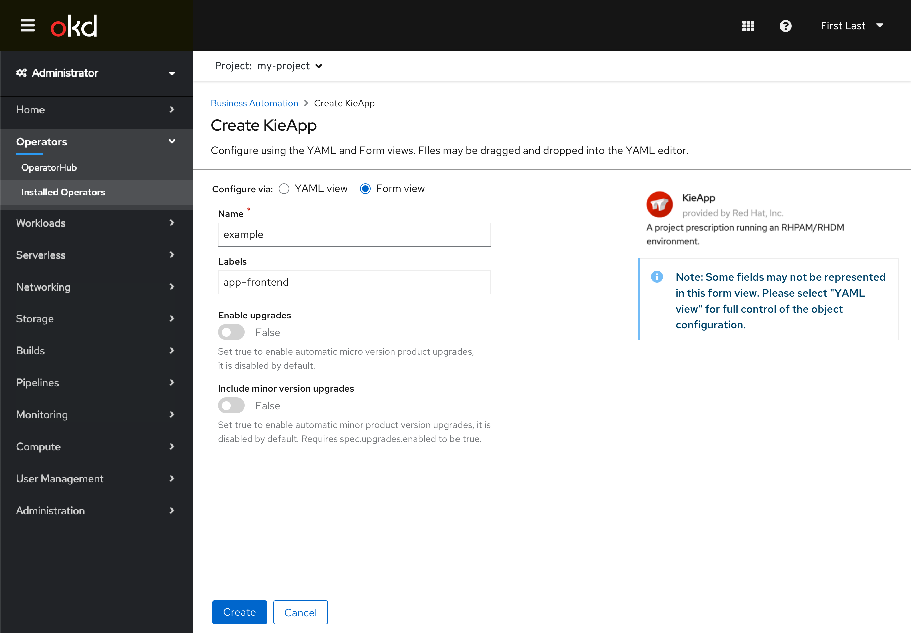

# Operand (CR) Creation Form/YAML Switching

The existing “Edit Form” and “Edit YAML” links have been changed to a toggle control to better convey that the user can freely switch between the two without losing changes between them. The control is also moved to immediately above the editors to aid discovery. The use of radios with a label also improves accessibility.

Since this **Create Operand** (or **Create Custom Resource**) UI is shared between the Admin and Dev consoles, they will both likely see this change simultaneously. The intent is that this interaction can then be used elsewhere in both consoles to replace existing “Edit Form” and “Edit YAML” link uses in the future.

Some objects do not support form editing yet in which case the creation/editing for those resources would be similar to the existing YAML-only behavior with no radio controls to switch to form.

Note: The footer (Create/Cancel buttons) is intended to always appear on the screen in either the YAML or Form views, in a sticky footer. There is a current dev console story intending to make this change for the form view.

## Creating Operands in Admin Console

- Creating an operand in the Admin console now includes the radio button switching interaction that replaces the "Edit" links.

- The **View sidebar** interaction is still supported in the YAML view.

- Users can switch to the form view. Any data entered in the YAML view will be reflected (as the form supports,) and any data entered in the form will be reflected in the YAML.
- The note conveying that all fields may not be represented in the form view still is present.